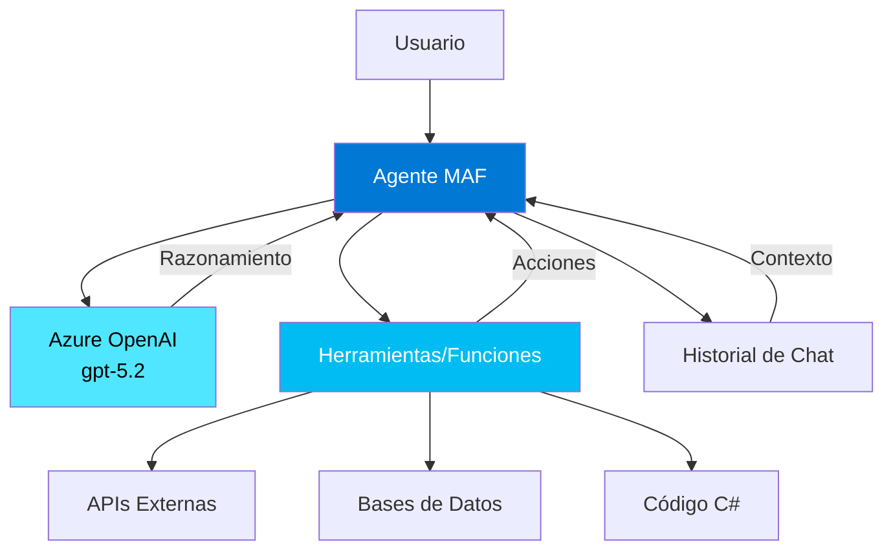
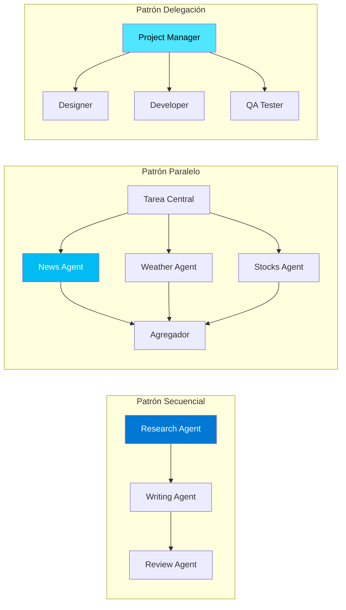

# Módulo 1: Fundamentos de Microsoft Agent Framework

**Duración**: 60 minutos  
**Nivel**: Principiante  
**Prerequisitos**: Ninguno

## Objetivos de Aprendizaje

Al completar este módulo, serás capaz de:

1. Explicar qué es Microsoft Agent Framework y sus casos de uso
2. Identificar los diferentes tipos de agentes disponibles
3. Configurar un entorno de desarrollo con Azure OpenAI
4. Crear y ejecutar tu primer agente conversacional

## Contenido Teórico

### ¿Qué es Microsoft Agent Framework (MAF)?

Microsoft Agent Framework es un framework de desarrollo para construir agentes inteligentes que pueden:
- Mantener conversaciones naturales con usuarios
- Ejecutar tareas complejas mediante function tools
- Orquestar múltiples agentes para resolver problemas
- Integrarse con servicios de Azure y terceros

**Conceptos clave**:
- **Agente**: Entidad autónoma que puede razonar, actuar y comunicarse
- **Orquestación**: Coordinación de múltiples agentes para lograr un objetivo
- **Function Calling**: Capacidad del agente para invocar funciones de C# automáticamente
- **Persistencia**: Guardar el estado de conversaciones para continuarlas más tarde

### Tipos de Agentes

1. **ChatCompletionAgent**: 
   - Agente básico para conversaciones
   - Usa modelos de completion (GPT-5.2, GPT-5.2-chat)
   - Sin estado persistente por defecto
   - Ideal para: Chatbots, asistentes, Q&A

2. **OpenAI Assistants Agent**:
   - Agente con estado persistente
   - Capacidades integradas: retrieval, code interpreter
   - Requiere Azure AI Agent Service
   - Ideal para: Workflows largos, análisis de documentos

### Arquitectura Básica



**Componentes clave**:
- **Kernel**: Contenedor de dependencias que gestiona servicios, plugins y configuración
- **ChatCompletionAgent**: Tipo de agente conversacional que usa modelos de chat
- **Plugins**: Colecciones de funciones que el agente puede invocar
- **ChatHistory**: Almacena el contexto de la conversación
- **Execution Settings**: Configuración de parámetros (temperatura, max tokens, etc.)

### Patrones de Orquestación Multi-Agente



**Patrones que aprenderás en Módulo 3**:
- **Secuencial**: Agente A → Agente B → Agente C (cadena de procesamiento)
- **Paralelo**: Múltiples agentes trabajan simultáneamente
- **Delegación**: Coordinador asigna tareas a especialistas
- **Group Chat**: Agentes colaboran en conversación abierta

### Model Context Protocol (MCP) y Agent-to-Agent (A2A)

**Model Context Protocol (MCP)** es un protocolo abierto para que agentes de diferentes frameworks (MAF, LangChain, AutoGen) intercambien recursos y colaboren.

**Beneficios de MCP**:
- **Interoperabilidad**: Agentes de diferentes plataformas se comunican
- **Reutilización**: Servidores MCP exponen herramientas que cualquier cliente puede usar
- **Ecosistema**: Comunidad puede crear servidores MCP (bases de datos, APIs, servicios)

**Agent-to-Agent (A2A) Communication** permite que agentes MAF se invoquen entre sí como herramientas (patrón "Agent as Tool").

**Ejemplo**: 
```
Usuario: "Analiza las ventas de enero y crea un resumen ejecutivo"

→ Agente Coordinador:
  1. Llama a AnalyticsAgent (extrae datos de ventas)
  2. Llama a ReportAgent (genera resumen ejecutivo con datos)
  3. Devuelve informe al usuario
```

*Nota: MCP se cubre en detalle en Módulo 7.*

### Configuración de Azure OpenAI

Para que los agentes funcionen, necesitas:

1. **Recurso de Azure OpenAI**
   - Crear en portal.azure.com
   - Región recomendada: East US 2 o Sweden Central

2. **Modelo desplegado**
   - gpt-5.2 (principal)
   - gpt-5.2-chat (conversacional)

3. **Credenciales**
   - Endpoint: `https://tu-recurso.openai.azure.com/`
   - API Key: desde "Keys and Endpoint"
   - Deployment Name: nombre que le diste al modelo

### Anatomía de un Agente Simple

```csharp
using Microsoft.Agents.AI;
using Azure.AI.OpenAI;

// 1. Configurar el cliente de Azure OpenAI
var builder = Kernel.CreateBuilder();
builder.AddAzureOpenAIChatCompletion(
    deploymentName: "gpt-5.2",
    endpoint: "https://tu-recurso.openai.azure.com/",
    apiKey: "tu-api-key"
);

var kernel = builder.Build();

// 2. Crear el agente
var agent = new ChatCompletionAgent()
{
    Name = "AsistenteGeneral",
    Instructions = "Eres un asistente útil y amigable.",
    Kernel = kernel
};

// 3. Mantener historial de conversación
var chatHistory = new ChatHistory();

// 4. Interactuar con el agente
chatHistory.AddUserMessage("Hola, ¿cómo estás?");
var response = await agent.InvokeAsync(chatHistory);
chatHistory.Add(response);

Console.WriteLine($"🤖 {response.Content}");
```

## Labs Prácticos

### [Lab 01: Hello Agent](labs/01-hello-agent/)
**Duración**: 15 minutos

Crea tu primer agente conversacional que puede:
- Responder a saludos
- Mantener contexto de conversación
- Demostrar configuración básica de Azure OpenAI

**Habilidades que practicarás**:
- Configurar Azure OpenAI SDK
- Crear un ChatCompletionAgent
- Manejar el historial de conversación

## Checkpoint de Validación

**Criterio de éxito**: El agente responde a "Hola" con una respuesta coherente y mantiene contexto en conversaciones de 2-3 turnos.

**Meta de éxito**: 90% de participantes completan exitosamente

## Recursos Adicionales

- [Documentación oficial de MAF](https://learn.microsoft.com/microsoft-agent-framework)
- [Azure OpenAI Service Quickstart](https://learn.microsoft.com/azure/ai-services/openai/quickstart)
- [Ejemplos de código en GitHub](https://github.com/microsoft/agent-framework-samples)

## Siguiente Módulo

Continúa con [Módulo 2: Function Tools y Composición](../modulo-02-function-tools/) para aprender a extender las capacidades de tus agentes.
