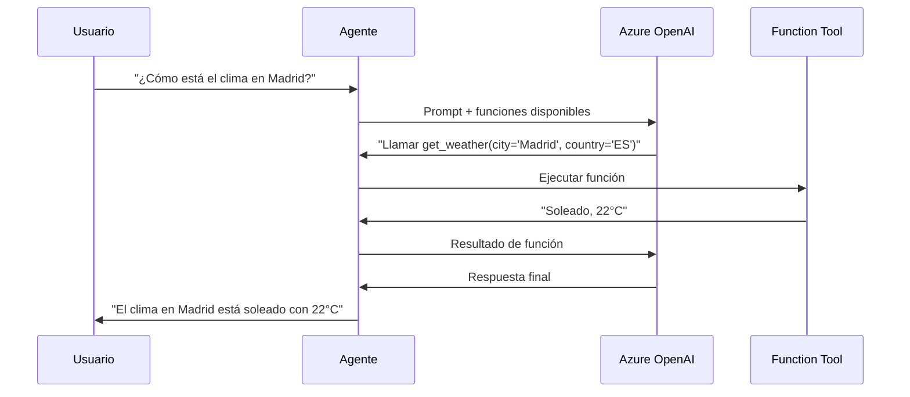

# Módulo 2: Function Tools y Composición de Agentes

**Duración**: 75 minutos  
**Nivel**: Intermedio  
**Prerequisitos**: Módulo 1 - Fundamentos

## Objetivos de Aprendizaje

Al completar este módulo, serás capaz de:

1. Definir y registrar function tools en C# usando atributos
2. Implementar function calling automático
3. Usar un agente como herramienta dentro de otro agente
4. Implementar patrones de aprobación humana (human-in-the-loop)

## Contenido Teórico

### ¿Qué son las Function Tools?

Las **function tools** son métodos de C# que los agentes pueden invocar automáticamente para:
- Obtener información externa (APIs, bases de datos)
- Realizar cálculos o transformaciones
- Ejecutar acciones (enviar emails, crear tickets)
- Delegar a sistemas especializados

**Ventaja clave**: El modelo decide **cuándo y con qué parámetros** llamar la función basándose en la conversación.

### Definir Function Tools

```csharp
using Microsoft.SemanticKernel;
using System.ComponentModel;

public class WeatherService
{
    [KernelFunction("get_weather")]
    [Description("Obtiene el clima actual para una ubicación")]
    public string GetWeather(
        [Description("El nombre de la ciudad")] string city,
        [Description("Código de país (ej: ES, US)")] string country = "ES")
    {
        // Simular llamada a API de clima
        return $"El clima en {city}, {country}: Soleado, 22°C";
    }
}
```

**Elementos clave**:
- `[KernelFunction]`: Marca el método como invocable por el agente
- `[Description]`: Ayuda al modelo a entender qué hace la función
- Parámetros con descripciones claras: El modelo usa estas descripciones para decidir qué valores pasar

### Registrar Function Tools

```csharp
var builder = Kernel.CreateBuilder();
builder.AddAzureOpenAIChatCompletion(...);

// Registrar servicio como plugin
builder.Plugins.AddFromType<WeatherService>();

var kernel = builder.Build();

var agent = new ChatCompletionAgent()
{
    Kernel = kernel,  // Agente tiene acceso a las funciones
    Instructions = "Eres un asistente que puede proporcionar información del clima."
};
```

### Function Calling Flow



### Composición de Agentes

**Patrón**: Usar un agente completo como función tool de otro agente.

**Casos de uso**:
- Especialización: Delegar matemáticas a un agente calculadora
- Modularidad: Separar responsabilidades (investigación, escritura, revisión)
- Escalabilidad: Reutilizar agentes en diferentes contextos

```csharp
// Agente especializado
var calculatorAgent = new ChatCompletionAgent()
{
    Name = "CalculatorAgent",
    Instructions = "Eres un experto en cálculos matemáticos."
};

// Crear función que invoca al agente especializado
var calculatorFunction = KernelFunctionFactory.CreateFromMethod(
    async (string question) => {
        var result = await calculatorAgent.InvokeAsync(question);
        return result.Content;
    },
    "calculate",
    "Realiza cálculos matemáticos complejos"
);

// Registrar en el agente principal
mainAgent.Kernel.Plugins.AddFromFunctions("calculator", new[] { calculatorFunction });
```

### Human-in-the-Loop Approval

Para acciones sensibles (eliminar datos, enviar emails, gastos), **pausar ejecución** para pedir confirmación humana.

```csharp
[KernelFunction("delete_file")]
[Description("Elimina un archivo del sistema")]
public async Task<string> DeleteFile(
    [Description("Ruta del archivo")] string filePath)
{
    // PAUSA: Pedir aprobación humana
    Console.WriteLine($"⚠️ El agente quiere eliminar: {filePath}");
    Console.WriteLine("¿Aprobar? (s/n): ");
    var approval = Console.ReadLine();
    
    if (approval?.ToLower() == "s")
    {
        // Ejecutar acción
        File.Delete(filePath);
        return "Archivo eliminado exitosamente";
    }
    else
    {
        return "Acción cancelada por el usuario";
    }
}
```

## Labs Prácticos

### [Lab 01: Custom Function Tool](labs/01-custom-tool/)
**Duración**: 20 minutos

Implementa un agente con una función personalizada para obtener información del clima.

**Habilidades**:
- Definir función con `[KernelFunction]`
- Registrar plugin en el kernel
- Verificar invocación automática

---

### [Lab 02: Agent-as-Tool](labs/02-agent-as-tool/)
**Duración**: 25 minutos

Crea un agente principal que delega tareas matemáticas a un agente especializado.

**Habilidades**:
- Composición de agentes
- Creación de funciones desde agentes
- Routing de tareas

---

### [Lab 03: Human Approval](labs/03-human-approval/)
**Duración**: 20 minutos

Implementa un workflow donde el agente debe obtener aprobación humana antes de ejecutar acciones sensibles.

**Habilidades**:
- Implementar gates de aprobación
- Manejo de flujos condicionales
- Cancelación de operaciones

## Checkpoint de Validación

**Módulo completo cuando**:
- ✅ El agente llama automáticamente a `GetWeather()` cuando se pregunta sobre clima
- ✅ El agente principal delega matemáticas al agente calculadora
- ✅ El workflow de aprobación pausa y espera confirmación del usuario

**Meta de éxito**: 85% de participantes completan los 3 labs

## Troubleshooting Común

### "El agente no llama mi función"

**Causa**: Descripción ambigua o faltante  
**Solución**: Asegurar que `[Description]` explica claramente QUÉ hace y CUÁNDO usarla

### "Error: función no encontrada"

**Causa**: Función no registrada en el kernel  
**Solución**: Verificar `builder.Plugins.AddFromType<TuServicio>()`

### "Función se llama con parámetros incorrectos"

**Causa**: Descripciones de parámetros poco claras  
**Solución**: Ser explícito: `[Description("Nombre de la ciudad en español, ej: Madrid")]`

## Recursos Adicionales

- [Semantic Kernel Functions Guide](https://learn.microsoft.com/semantic-kernel/agents/plugins)
- [Function Calling Best Practices](https://learn.microsoft.com/azure/ai-services/openai/how-to/function-calling)

## Siguiente Módulo

Continúa con [Módulo 3: Workflows y Orquestación](../modulo-03-workflows/) para aprender patrones avanzados de coordinación multi-agente.
