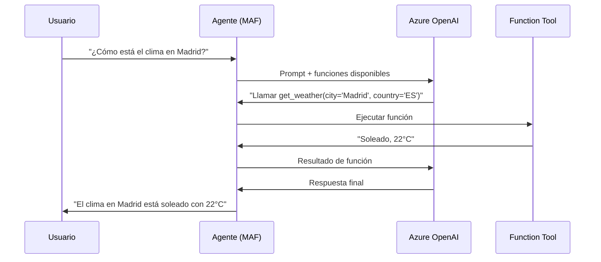

# Módulo 2: Function Tools y Composición de Agentes

**Duración**: 75 minutos  
**Nivel**: Intermedio  
**Prerequisitos**: Módulo 1 - Fundamentos

## Objetivos de Aprendizaje

Al completar este módulo, serás capaz de:

1. Definir y registrar function tools usando Microsoft Agent Framework
2. Implementar function calling automático con `ChatCompletionAgent`
3. Usar un agente como herramienta dentro de otro agente
4. Implementar patrones de aprobación humana (human-in-the-loop)

## Contenido Teórico

### ¿Qué son las Function Tools?

Las **function tools** son funciones que los agentes pueden invocar automáticamente para:
- Obtener información externa (APIs, bases de datos)
- Realizar cálculos o transformaciones
- Ejecutar acciones (enviar emails, crear tickets)
- Delegar a sistemas especializados

**Ventaja clave**: El modelo decide **cuándo y con qué parámetros** llamar la función basándose en la conversación.

### Definir Function Tools con MAF

En Microsoft Agent Framework, las function tools se definen usando `AIFunction` y `AIFunctionFactory`:

```csharp
using Microsoft.Agents.AI;
using Microsoft.Agents.AI.Abstractions;

// Crear una función que el agente puede invocar
var getWeatherFunction = AIFunctionFactory.Create(
    (string city, string country = "ES") =>
    {
        // Simular llamada a API de clima
        return $"El clima en {city}, {country}: Soleado, 22°C";
    },
    name: "get_weather",
    description: "Obtiene el clima actual para una ubicación. Úsala cuando el usuario pregunte sobre el clima de una ciudad."
);
```

**Elementos clave**:
- `AIFunctionFactory.Create`: Crea una función invocable por el agente
- `name`: Identificador que usa el modelo para referirse a la función
- `description`: Ayuda al modelo a entender qué hace y cuándo usarla

### Registrar Function Tools en el Agente

```csharp
using Microsoft.Agents.AI;
using Microsoft.Agents.AI.Chat;

// Crear el agente con las herramientas registradas
var agent = new ChatCompletionAgent(
    name: "AgenteDelClima",
    instructions: "Eres un asistente que puede proporcionar información del clima.",
    endpoint: new Uri(endpoint),
    modelId: deploymentName,
    apiKey: apiKey,
    tools: new[] { getWeatherFunction }  // Registrar las funciones
);
```

### Function Calling Flow



### Múltiples Function Tools

Puedes registrar múltiples funciones en un agente:

```csharp
// Función para clima actual
var getWeatherFunction = AIFunctionFactory.Create(
    (string city) => $"Clima en {city}: Soleado, 22°C",
    name: "get_weather",
    description: "Obtiene el clima actual de una ciudad"
);

// Función para pronóstico
var getForecastFunction = AIFunctionFactory.Create(
    (string city, int days = 3) => $"Pronóstico para {city}: {days} días soleados",
    name: "get_forecast",
    description: "Obtiene el pronóstico del clima para los próximos días"
);

// Registrar ambas funciones en el agente
var agent = new ChatCompletionAgent(
    name: "AgenteDelClima",
    instructions: "Eres un asistente experto en clima.",
    endpoint: new Uri(endpoint),
    modelId: deploymentName,
    apiKey: apiKey,
    tools: new[] { getWeatherFunction, getForecastFunction }
);
```

### Composición de Agentes

**Patrón**: Usar un agente completo como función tool de otro agente.

**Casos de uso**:
- Especialización: Delegar matemáticas a un agente calculadora
- Modularidad: Separar responsabilidades (investigación, escritura, revisión)
- Escalabilidad: Reutilizar agentes en diferentes contextos

```csharp
// Agente especializado en cálculos
var calculatorAgent = new ChatCompletionAgent(
    name: "CalculatorAgent",
    instructions: "Eres un experto en cálculos matemáticos. Solo respondes preguntas de matemáticas.",
    endpoint: new Uri(endpoint),
    modelId: deploymentName,
    apiKey: apiKey
);

// Crear función que invoca al agente especializado
var calculateFunction = AIFunctionFactory.Create(
    async (string mathQuestion) =>
    {
        var chat = new ChatHistory();
        chat.AddUserMessage(mathQuestion);
        
        string result = "";
        await foreach (var message in calculatorAgent.InvokeAsync(chat))
        {
            result += message.Content;
        }
        return result;
    },
    name: "calculate",
    description: "Resuelve problemas matemáticos complejos. Usa esta función para cálculos."
);

// Agente principal que usa al calculador como herramienta
var mainAgent = new ChatCompletionAgent(
    name: "AsistenteGeneral",
    instructions: "Eres un asistente general. Para matemáticas, usa la función calculate.",
    endpoint: new Uri(endpoint),
    modelId: deploymentName,
    apiKey: apiKey,
    tools: new[] { calculateFunction }
);
```

### Human-in-the-Loop Approval

Para acciones sensibles (eliminar datos, enviar emails, gastos), **pausar ejecución** para pedir confirmación humana:

```csharp
// Función con aprobación humana
var deleteFileFunction = AIFunctionFactory.Create(
    (string filePath) =>
    {
        // PAUSA: Pedir aprobación humana
        Console.WriteLine($"⚠️ El agente quiere eliminar: {filePath}");
        Console.Write("¿Aprobar? (s/n): ");
        var approval = Console.ReadLine();
        
        if (approval?.ToLower() == "s")
        {
            // Simular eliminación
            return $"✅ Archivo '{filePath}' eliminado exitosamente";
        }
        else
        {
            return "🚫 Acción cancelada por el usuario";
        }
    },
    name: "delete_file",
    description: "Elimina un archivo del sistema. REQUIERE aprobación del usuario."
);
```

## Labs Prácticos

### [Lab 01: Custom Function Tool](labs/01-custom-tool/)
**Duración**: 20 minutos

Implementa un agente con una función personalizada para obtener información del clima.

**Habilidades**:
- Crear funciones con `AIFunctionFactory.Create`
- Registrar tools en `ChatCompletionAgent`
- Verificar invocación automática

---

### [Lab 02: Agent-as-Tool](labs/02-agent-as-tool/)
**Duración**: 25 minutos

Crea un agente principal que delega tareas matemáticas a un agente especializado.

**Habilidades**:
- Composición de agentes
- Creación de funciones desde agentes
- Routing de tareas

---

### [Lab 03: Human Approval](labs/03-human-approval/)
**Duración**: 20 minutos

Implementa un workflow donde el agente debe obtener aprobación humana antes de ejecutar acciones sensibles.

**Habilidades**:
- Implementar gates de aprobación
- Manejo de flujos condicionales
- Cancelación de operaciones

## Checkpoint de Validación

**Módulo completo cuando**:
- ✅ El agente llama automáticamente a la función de clima cuando se pregunta sobre el tiempo
- ✅ El agente principal delega matemáticas al agente calculadora
- ✅ El workflow de aprobación pausa y espera confirmación del usuario

**Meta de éxito**: 85% de participantes completan los 3 labs

## Troubleshooting Común

### "El agente no llama mi función"

**Causa**: Descripción ambigua o faltante  
**Solución**: Asegurar que la descripción en `AIFunctionFactory.Create` explica claramente QUÉ hace y CUÁNDO usarla

### "Error: función no encontrada"

**Causa**: Función no registrada en el agente  
**Solución**: Verificar que la función está en el array `tools` del constructor de `ChatCompletionAgent`

### "Función se llama con parámetros incorrectos"

**Causa**: Descripciones de parámetros poco claras  
**Solución**: Ser explícito en la descripción: "Obtiene el clima para una CIUDAD (no país), ejemplo: Madrid, Barcelona"

## Recursos Adicionales

- [Microsoft Agent Framework Documentation](https://learn.microsoft.com/microsoft-agents)
- [Function Calling Best Practices](https://learn.microsoft.com/azure/ai-services/openai/how-to/function-calling)
- [Azure OpenAI Service](https://learn.microsoft.com/azure/ai-services/openai/)

## Siguiente Módulo

Continúa con [Módulo 3: Workflows y Orquestación](../modulo-03-workflows/) para aprender patrones avanzados de coordinación multi-agente.
