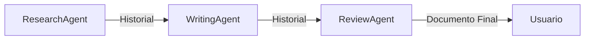
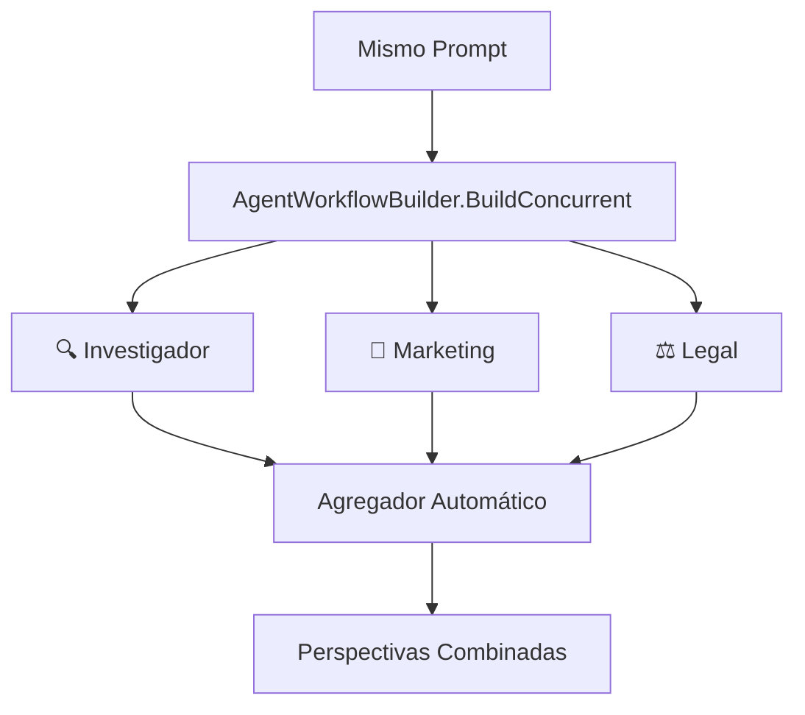
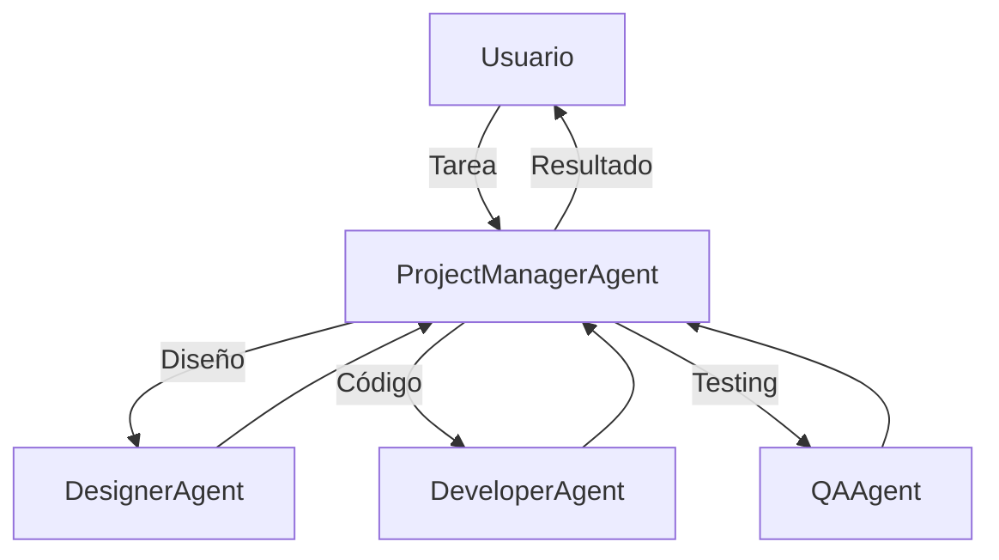
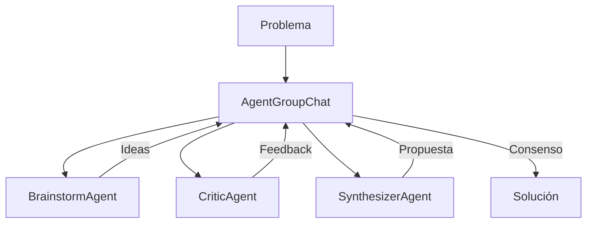
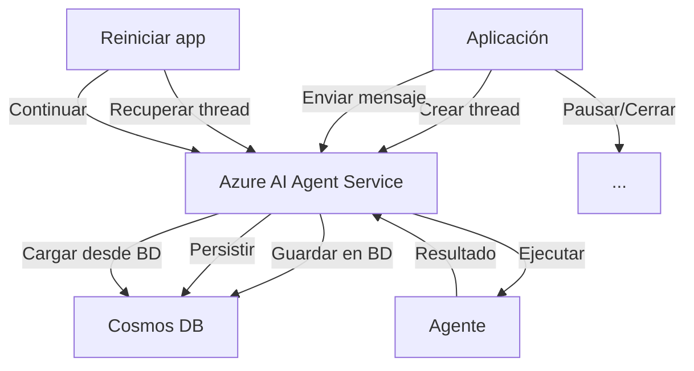

# Módulo 3: Workflows y Orquestación Multi-Agente

**Duración**: 90 minutos  
**Nivel**: Intermedio-Avanzado  
**Prerequisitos**: Módulos 1 y 2

## Objetivos de Aprendizaje

Al completar este módulo, serás capaz de:

1. Implementar workflows secuenciales, paralelos y de delegación usando MAF
2. Usar `AgentWorkflowBuilder` para orquestar pipelines de agentes
3. Configurar AgentGroupChat para colaboración multi-agente
4. Persistir estado de workflows con Azure AI Agent Service
5. Diseñar estrategias de terminación para conversaciones multi-agente

## Contenido Teórico

### Tipos de Workflows en MAF

Microsoft Agent Framework proporciona orquestaciones integradas para diferentes patrones de workflows:

#### 1. Workflow Secuencial (`AgentWorkflowBuilder.BuildSequential()`)

Agentes ejecutan tareas **en orden**, cada uno recibe el historial completo de la conversación.



**Casos de uso**: Pipelines de procesamiento, tareas con dependencias, revisiones en cadena

---

#### 2. Workflow Concurrente (`AgentWorkflowBuilder.BuildConcurrent()`)

Múltiples agentes trabajan en la **misma tarea simultáneamente**, cada uno aportando su perspectiva única. Los resultados se agregan automáticamente.



**Casos de uso**: Análisis multi-perspectiva, brainstorming, ensemble reasoning, voting systems

📚 **Referencia**: [Concurrent Orchestration - MAF Docs](https://learn.microsoft.com/en-us/agent-framework/user-guide/workflows/orchestrations/concurrent)

---

#### 3. Workflow de Delegación

Un **coordinator agent** analiza la tarea y delega al especialista apropiado.



**Casos de uso**: Routing inteligente, especialización por dominio

---

#### 4. Group Chat

Múltiples agentes **colaboran** en una conversación hasta resolver el problema.



**Casos de uso**: Brainstorming, toma de decisiones, análisis multi-perspectiva

---

### Implementación de Workflows con MAF

#### Workflow Concurrente con AgentWorkflowBuilder

```csharp
using Azure.AI.OpenAI;
using Azure.Identity;
using Microsoft.Agents.AI.Workflows;
using Microsoft.Extensions.AI;

// Crear cliente de Azure OpenAI
var client = new AzureOpenAIClient(new Uri(endpoint), new AzureCliCredential())
    .GetChatClient(deploymentName)
    .AsIChatClient();

// Crear agentes con diferentes perspectivas
var researcherAgent = new ChatClientAgent(client,
    "Eres un investigador de mercado. Analiza oportunidades y riesgos.");

var marketerAgent = new ChatClientAgent(client,
    "Eres un estratega de marketing. Crea propuestas de valor y mensajes.");

var legalAgent = new ChatClientAgent(client,
    "Eres un asesor legal. Identifica restricciones y riesgos regulatorios.");

// Construir workflow concurrente - todos procesan el MISMO prompt
var workflow = AgentWorkflowBuilder.BuildConcurrent([researcherAgent, marketerAgent, legalAgent]);

// Ejecutar con streaming
var messages = new List<ChatMessage> { new(ChatRole.User, "Lanzamos una bicicleta eléctrica...") };
StreamingRun run = await InProcessExecution.StreamAsync(workflow, messages);
await run.TrySendMessageAsync(new TurnToken(emitEvents: true));

// Procesar eventos de todos los agentes
List<ChatMessage> results = new();
await foreach (WorkflowEvent evt in run.WatchStreamAsync())
{
    if (evt is AgentRunUpdateEvent e)
        Console.WriteLine($"[{e.ExecutorId}]: {e.Data}");  // Progreso por agente
    else if (evt is WorkflowOutputEvent output)
    {
        results = (List<ChatMessage>)output.Data!;
        break;
    }
}
```

**Conceptos clave**:
- `AgentWorkflowBuilder.BuildConcurrent()`: Todos los agentes procesan la misma entrada en paralelo
- Agregación automática de resultados en `WorkflowOutputEvent`
- Cada agente aporta su perspectiva única al mismo problema

#### Workflow Secuencial con AgentWorkflowBuilder

```csharp
using Azure.AI.OpenAI;
using Azure.Identity;
using Microsoft.Agents.AI.Workflows;
using Microsoft.Extensions.AI;

// Crear cliente de Azure OpenAI
var client = new AzureOpenAIClient(new Uri(endpoint), new DefaultAzureCredential())
    .GetChatClient(deploymentName)
    .AsIChatClient();

// Crear agentes con ChatClientAgent
var researchAgent = new ChatClientAgent(client, "Eres un investigador...", "ResearchAgent");
var writingAgent = new ChatClientAgent(client, "Eres un escritor...", "WritingAgent");
var reviewAgent = new ChatClientAgent(client, "Eres un editor...", "ReviewAgent");

// Construir workflow secuencial
var workflow = AgentWorkflowBuilder.BuildSequential([researchAgent, writingAgent, reviewAgent]);

// Ejecutar con streaming
var messages = new List<ChatMessage> { new(ChatRole.User, "Investiga sobre IA...") };
StreamingRun run = await InProcessExecution.StreamAsync(workflow, messages);
await run.TrySendMessageAsync(new TurnToken(emitEvents: true));

// Procesar eventos
await foreach (WorkflowEvent evt in run.WatchStreamAsync())
{
    if (evt is AgentRunUpdateEvent e)
        Console.Write(e.Data);  // Streaming de cada agente
    else if (evt is WorkflowOutputEvent output)
        break;  // Workflow completado
}
```

**Conceptos clave**:
- `ChatClientAgent`: Agente respaldado por un cliente de chat con instrucciones
- `AgentWorkflowBuilder.BuildSequential()`: Crea pipeline donde cada agente procesa en orden
- `InProcessExecution.StreamAsync()`: Ejecuta el workflow con streaming
- `AgentRunUpdateEvent`: Fragmentos de respuesta en tiempo real
- `WorkflowOutputEvent`: Resultado final con todos los mensajes

---

### Referencia Rápida: APIs de Workflow

| Método | Descripción |
|--------|-------------|
| `AgentWorkflowBuilder.BuildSequential()` | Pipeline en orden: A → B → C |
| `AgentWorkflowBuilder.BuildConcurrent()` | Todos en paralelo: A ‖ B ‖ C |
| `InProcessExecution.StreamAsync()` | Ejecutar con eventos de streaming |
| `TurnToken(emitEvents: true)` | Habilitar emisión de eventos |
| `AgentRunUpdateEvent` | Progreso de cada agente |
| `WorkflowOutputEvent` | Resultado final agregado |

---

#### Group Chat

```csharp
using Microsoft.Agents.AI;

var groupChat = new AgentGroupChat(
    agents: new[] { brainstormAgent, criticAgent, synthesizerAgent },
    terminationCondition: new MaxTurnsTerminationCondition(10)
);

// Iniciar conversación colaborativa
await groupChat.InvokeAsync("¿Cómo mejorar la experiencia del usuario?");
```

---

### Azure AI Agent Service: Persistencia de Estado

**Problema**: Los workflows pueden ser largos (>30 segundos). Si el proceso se interrumpe, perdemos todo el progreso.

**Solución**: Azure AI Agent Service persiste:
- Historial de conversación
- Estado de cada agente
- Threads (hilos de conversación)
- Runs (ejecuciones)

#### Arquitectura con Persistencia



---

### Estrategias de Terminación

En group chats, define **cuándo parar**:

1. **Max Turns**: Límite de turnos de conversación
   ```csharp
   new MaxTurnsTerminationCondition(10)
   ```

2. **Keyword Termination**: Termina si un agente dice "FINALIZADO"
   ```csharp
   new KeywordTerminationCondition("FINALIZADO")
   ```

3. **Custom Logic**: Lógica personalizada
   ```csharp
   new CustomTerminationCondition(chatHistory => 
       chatHistory.Count > 5 && chatHistory.Last().Content.Contains("consenso alcanzado")
   )
   ```

---

## Labs Prácticos

### [Lab 01: Sequential Workflow](labs/01-sequential/)
**Duración**: 20 minutos  
Pipeline de 3 pasos usando `AgentWorkflowBuilder.BuildSequential()`: Research → Write → Review

### [Lab 02: Concurrent Workflow](labs/02-parallel/)
**Duración**: 25 minutos  
Orquestación concurrente con `AgentWorkflowBuilder.BuildConcurrent()`: 3 agentes (Investigador, Marketing, Legal) analizan el mismo prompt simultáneamente

### [Lab 03: Delegation Workflow](labs/03-delegation/)
**Duración**: 25 minutos  
ProjectManager delega a Designer, Developer o QA según tipo de tarea

### [Lab 04: Group Chat](labs/04-group-chat/)
**Duración**: 30 minutos  
Brainstorm colaborativo entre 3 agentes con terminación por consenso

### [Lab 05: Azure AI Agent Service](labs/05-azure-agent-service/)
**Duración**: 35 minutos  
Workflow persistente: pausar ejecución, cerrar programa, reanudar

---

## Checkpoint de Validación

**Criterios de éxito**:
- ✅ Workflow secuencial usa `AgentWorkflowBuilder.BuildSequential()`
- ✅ Workflow concurrente usa `AgentWorkflowBuilder.BuildConcurrent()`
- ✅ Streaming de eventos funciona con `WatchStreamAsync()`
- ✅ Delegation router selecciona agente correcto basado en tarea
- ✅ Group chat alcanza terminación después de colaboración
- ✅ Thread persiste y se puede reanudar después de cerrar aplicación

**Meta**: 80% de participantes completan labs 1-4, 75% completan lab 5

---

## Troubleshooting Común

### "ChatClientAgent no existe"

**Causa**: Falta el paquete de workflows  
**Solución**: 
```bash
dotnet add package Microsoft.Agents.AI.Workflows --version 1.0.0-preview.260108.1
```

### "DefaultAzureCredential authentication failed"

**Causa**: No hay sesión activa de Azure CLI  
**Solución**: 
```bash
az login
```

### "Task.WhenAll arroja error"

**Causa**: Una de las tareas falló  
**Solución**: Envolver cada tarea en try-catch o usar Task.WhenAll con continuaciones

### "Group chat no termina"

**Causa**: Condición de terminación nunca se cumple  
**Solución**: Agregar MaxTurns como fallback: `new MaxTurnsTerminationCondition(20)`

---

## Recursos Adicionales

- [Sequential Orchestration - MAF Docs](https://learn.microsoft.com/en-us/agent-framework/user-guide/workflows/orchestrations/sequential)
- [Concurrent Orchestration - MAF Docs](https://learn.microsoft.com/en-us/agent-framework/user-guide/workflows/orchestrations/concurrent)
- [Agent Orchestration Patterns](https://learn.microsoft.com/microsoft-agent-framework/orchestration)
- [Azure AI Agent Service Docs](https://learn.microsoft.com/azure/ai-services/agents)

---

## Siguiente Módulo

Continúa con [Módulo 4: Observabilidad](../modulo-04-observability/) para aprender a monitorear y diagnosticar tus workflows multi-agente.
