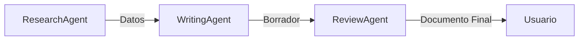
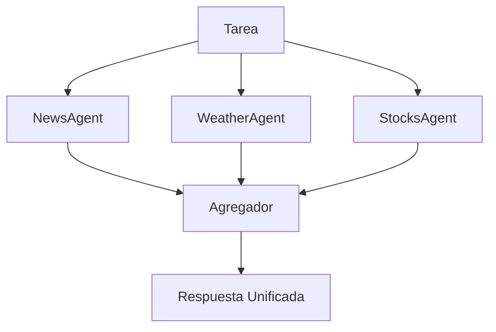
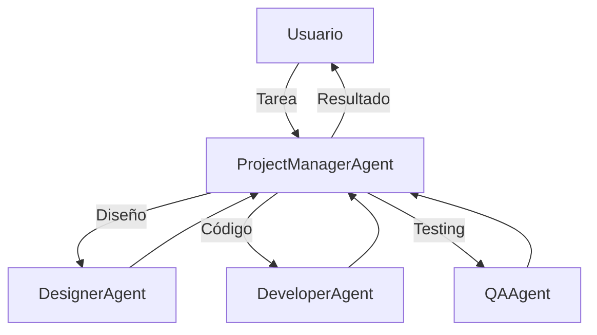
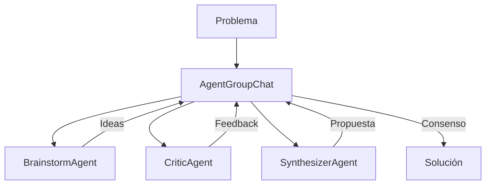
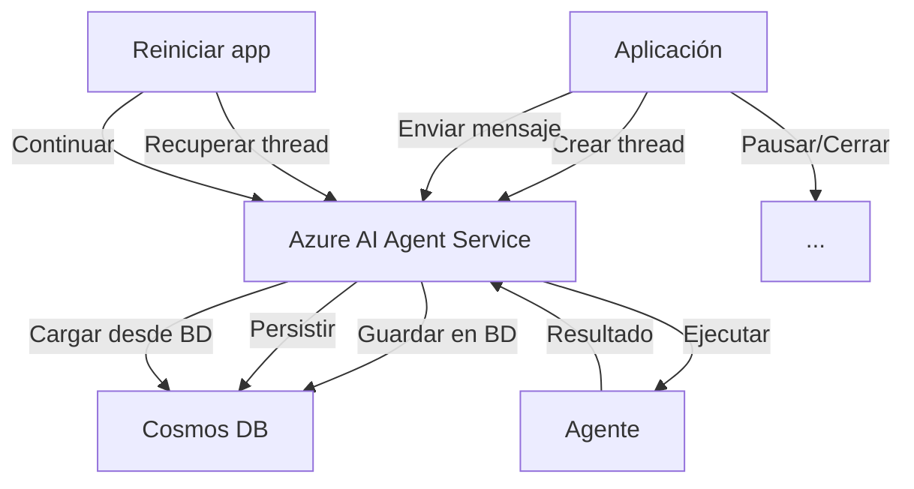

# Módulo 3: Workflows y Orquestación Multi-Agente

**Duración**: 90 minutos  
**Nivel**: Intermedio-Avanzado  
**Prerequisitos**: Módulos 1 y 2

## Objetivos de Aprendizaje

Al completar este módulo, serás capaz de:

1. Implementar workflows secuenciales, paralelos y de delegación
2. Configurar y usar AgentGroupChat para colaboración multi-agente
3. Persistir estado de workflows con Azure AI Agent Service
4. Diseñar estrategias de terminación para conversaciones multi-agente

## Contenido Teórico

### Tipos de Workflows

#### 1. Workflow Secuencial

Agentes ejecutan tareas **en orden**, pasando resultados de uno al siguiente.



**Casos de uso**: Pipelines de procesamiento, tareas con dependencias

---

#### 2. Workflow Paralelo

Agentes ejecutan tareas **simultáneamente**, resultados se agregan al final.



**Casos de uso**: Búsquedas independientes, análisis multi-fuente

---

#### 3. Workflow de Delegación

Un **coordinator agent** analiza la tarea y delega al especialista apropiado.



**Casos de uso**: Routing inteligente, especialización por dominio

---

#### 4. Group Chat

Múltiples agentes **colaboran** en una conversación hasta resolver el problema.



**Casos de uso**: Brainstorming, toma de decisiones, análisis multi-perspectiva

---

### Implementación de Workflows

#### Workflow Secuencial

```csharp
// Paso 1: Research
var researchResult = await researchAgent.InvokeAsync("Investigar tendencias de IA");

// Paso 2: Write (usa resultado del paso 1)
var draftResult = await writingAgent.InvokeAsync($"Escribir artículo basado en: {researchResult.Content}");

// Paso 3: Review (usa resultado del paso 2)
var finalResult = await reviewAgent.InvokeAsync($"Revisar y mejorar: {draftResult.Content}");
```

#### Workflow Paralelo

```csharp
// Ejecutar en paralelo
var tasks = new[]
{
    newsAgent.InvokeAsync("Últimas noticias de IA"),
    weatherAgent.InvokeAsync("Clima en Madrid"),
    stocksAgent.InvokeAsync("Precio de MSFT")
};

var results = await Task.WhenAll(tasks);

// Agregar resultados
var aggregated = string.Join("\n\n", results.Select(r => r.Content));
```

#### Group Chat

```csharp
using Microsoft.AI.Agents;

var groupChat = new AgentGroupChat(
    agents: new[] { brainstormAgent, criticAgent, synthesizerAgent },
    terminationCondition: new MaxTurnsTerminationCondition(10)
);

// Iniciar conversación
await groupChat.InvokeAsync("¿Cómo mejorar la experiencia del usuario en nuestra app?");

// El framework maneja los turnos automáticamente
```

---

### Azure AI Agent Service: Persistencia de Estado

**Problema**: Los workflows pueden ser largos (>30 segundos). Si el proceso se interrumpe, perdemos todo el progreso.

**Solución**: Azure AI Agent Service persiste:
- Historial de conversación
- Estado de cada agente
- Threads (hilos de conversación)
- Runs (ejecuciones)

#### Arquitectura con Persistencia



#### Código de Ejemplo

```csharp
using Azure.AI.Projects;

// Crear cliente de AI Projects
var client = new AIProjectClient(
    new Uri("https://tu-proyecto.azure.com"),
    new DefaultAzureCredential()
);

// Crear agente persistente
var agent = await client.CreateAgentAsync(
    model: "gpt-5.2",
    name: "PersistentAgent",
    instructions: "Eres un asistente para workflows largos",
    tools: new[] { weatherTool }
);

// Crear thread (conversación persistente)
var thread = await client.CreateThreadAsync();

// Enviar mensaje
await client.CreateMessageAsync(thread.Id, "Analizar datos de ventas Q4");

// Crear run (ejecución)
var run = await client.CreateRunAsync(thread.Id, agent.Id);

// Esperar completado (puede pausar aquí y reanudar después)
while (run.Status == RunStatus.InProgress)
{
    await Task.Delay(1000);
    run = await client.GetRunAsync(thread.Id, run.Id);
}

// --- PAUSAR: Cerrar aplicación, guardar thread.Id ---

// --- REANUDAR: Abrir aplicación ---
var resumedThread = await client.GetThreadAsync(thread.Id);
// Continuar conversación donde quedó
```

---

### Estrategias de Terminación

En group chats, define **cuándo parar**:

1. **Max Turns**: Límite de turnos de conversación
   ```csharp
   new MaxTurnsTerminationCondition(10)
   ```

2. **Keyword Termination**: Termina si un agente dice "FINALIZADO"
   ```csharp
   new KeywordTerminationCondition("FINALIZADO")
   ```

3. **Custom Logic**: Lógica personalizada
   ```csharp
   new CustomTerminationCondition(chatHistory => 
       chatHistory.Count > 5 && chatHistory.Last().Content.Contains("consenso alcanzado")
   )
   ```

---

## Labs Prácticos

### [Lab 01: Sequential Workflow](labs/01-sequential/)
**Duración**: 20 minutos  
Pipeline de 3 pasos: Research → Write → Review

### [Lab 02: Parallel Workflow](labs/02-parallel/)
**Duración**: 25 minutos  
Ejecución paralela de 3 agentes independientes + agregación

### [Lab 03: Delegation Workflow](labs/03-delegation/)
**Duración**: 25 minutos  
ProjectManager delega a Designer, Developer o QA según tipo de tarea

### [Lab 04: Group Chat](labs/04-group-chat/)
**Duración**: 30 minutos  
Brainstorm colaborativo entre 3 agentes con terminación por consenso

### [Lab 05: Azure AI Agent Service](labs/05-azure-agent-service/)
**Duración**: 35 minutos  
Workflow persistente: pausar ejecución, cerrar programa, reanudar

---

## Checkpoint de Validación

**Criterios de éxito**:
- ✅ Workflow secuencial ejecuta 3 pasos en orden
- ✅ Workflow paralelo ejecuta tareas simultáneamente (Task.WhenAll)
- ✅ Delegation router selecciona agente correcto basado en tarea
- ✅ Group chat alcanza terminación después de colaboración
- ✅ Thread persiste y se puede reanudar después de cerrar aplicación

**Meta**: 80% de participantes completan labs 1-4, 75% completan lab 5

---

## Troubleshooting Común

### "Workflow secuencial no pasa datos entre pasos"

**Solución**: Asegurar que el output de Paso N se incluye en el prompt de Paso N+1

### "Task.WhenAll arroja error"

**Causa**: Una de las tareas falló  
**Solución**: Envolver cada tarea en try-catch o usar Task.WhenAll con continuaciones

### "Group chat no termina"

**Causa**: Condición de terminación nunca se cumple  
**Solución**: Agregar MaxTurns como fallback: `new MaxTurnsTerminationCondition(20)`

### "Azure AI Agent Service: authentication fails"

**Causa**: Credenciales de Azure no configuradas  
**Solución**: `az login` o configurar variables de entorno para DefaultAzureCredential

---

## Recursos Adicionales

- [Agent Orchestration Patterns](https://learn.microsoft.com/microsoft-agent-framework/orchestration)
- [Azure AI Agent Service Docs](https://learn.microsoft.com/azure/ai-services/agents)

---

## Siguiente Módulo

Continúa con [Módulo 4: Observabilidad](../modulo-04-observability/) para aprender a monitorear y diagnosticar tus workflows multi-agente.
