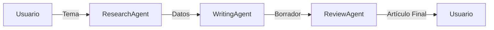

# Lab 01: Workflow Secuencial

**Duración**: 20 minutos  
**Nivel**: Intermedio  
**Objetivo**: Implementar un pipeline de 3 agentes donde cada uno procesa el resultado del anterior

## Descripción

En este lab implementarás un workflow secuencial clásico usando el patrón **Research → Write → Review**:

1. **ResearchAgent**: Investiga un tema y recopila información clave
2. **WritingAgent**: Transforma la investigación en un artículo estructurado
3. **ReviewAgent**: Revisa, mejora y produce la versión final

Este patrón es fundamental para procesos donde cada paso depende del resultado del anterior.



## Prerequisitos

- ✅ .NET 10 SDK instalado
- ✅ Azure OpenAI configurado con modelo `gpt-5.2`
- ✅ Completar Módulo 1: Hello Agent

## Pasos del Lab

### Paso 1: Crear el Proyecto

Crea un nuevo proyecto de consola usando .NET CLI:

```bash
# Crear carpeta del proyecto
mkdir -p docs/modulo-03-workflows/labs/01-sequential
cd docs/modulo-03-workflows/labs/01-sequential

# Crear proyecto de consola
dotnet new console -n SequentialWorkflow

# Moverse a la carpeta del proyecto (si se creó subcarpeta)
# O quedarte en el directorio actual si usaste el parámetro -o .
```

### Paso 2: Instalar Paquetes de Microsoft Agent Framework

Instala los paquetes NuGet necesarios para trabajar con Microsoft Agent Framework:

```bash
# Paquete principal de Microsoft Agent Framework
dotnet add package Microsoft.Agents.AI --version 1.0.0-preview.260108.1

# Abstracciones de MAF
dotnet add package Microsoft.Agents.AI.Abstractions --version 1.0.0-preview.260108.1

# Configuración de .NET
dotnet add package Microsoft.Extensions.Configuration --version 10.0.0
dotnet add package Microsoft.Extensions.Configuration.Json --version 10.0.0
dotnet add package Microsoft.Extensions.Configuration.UserSecrets --version 10.0.0
```

**¿Qué instalan estos paquetes?**
- `Microsoft.Agents.AI`: API principal de MAF incluyendo `ChatCompletionAgent`
- `Microsoft.Agents.AI.Abstractions`: Interfaces y tipos base para agentes
- `Microsoft.Extensions.Configuration.*`: Sistema de configuración de .NET

### Paso 3: Crear Archivo de Configuración

Crea el archivo `appsettings.json` con la configuración de Azure OpenAI:

```json
{
  "AzureOpenAI": {
    "Endpoint": "https://TU-RECURSO.openai.azure.com/",
    "DeploymentName": "gpt-5.2"
  }
}
```

**Importante**: Reemplaza `TU-RECURSO` con el nombre de tu recurso de Azure OpenAI.

### Paso 4: Configurar API Key con User Secrets

Usa User Secrets para almacenar tu API Key de forma segura (nunca en el código):

```bash
# Inicializar user secrets para el proyecto
dotnet user-secrets init

# Configurar la API key de Azure OpenAI
dotnet user-secrets set "AzureOpenAI:ApiKey" "TU-API-KEY-AQUI"
```

**¿Por qué usar User Secrets?**
- La API Key nunca se guarda en archivos del proyecto
- No se sube accidentalmente a control de versiones
- Cada desarrollador puede tener su propia key

### Paso 5: Implementar el Workflow Secuencial

Reemplaza el contenido de `Program.cs` con el siguiente código que implementa el workflow de 3 agentes usando **Microsoft Agent Framework**:

```csharp
// =============================================================================
// Program.cs - Workflow Secuencial con Microsoft Agent Framework
// =============================================================================
// Descripción: Pipeline de 3 pasos donde cada agente procesa el resultado
// del agente anterior: ResearchAgent → WritingAgent → ReviewAgent
//
// Conceptos de MAF demostrados:
// - ChatCompletionAgent: Agente que usa modelos de chat para completar tareas
// - ChatHistory: Historial de conversación para cada agente
// - InvokeAsync: Invocación asíncrona con streaming de respuestas
// =============================================================================

using Microsoft.Agents.AI;
using Microsoft.Agents.AI.Chat;
using Microsoft.Extensions.Configuration;

// =============================================================================
// CONFIGURACIÓN
// =============================================================================

// Cargar configuración desde appsettings.json y user secrets
var configuration = new ConfigurationBuilder()
    .SetBasePath(Directory.GetCurrentDirectory())
    .AddJsonFile("appsettings.json", optional: false)
    .AddUserSecrets<Program>()
    .Build();

// Obtener configuración de Azure OpenAI
var endpoint = configuration["AzureOpenAI:Endpoint"] 
    ?? throw new InvalidOperationException("Falta configuración: AzureOpenAI:Endpoint");
var deploymentName = configuration["AzureOpenAI:DeploymentName"] 
    ?? throw new InvalidOperationException("Falta configuración: AzureOpenAI:DeploymentName");
var apiKey = configuration["AzureOpenAI:ApiKey"] 
    ?? throw new InvalidOperationException("Falta configuración: AzureOpenAI:ApiKey. Use 'dotnet user-secrets set AzureOpenAI:ApiKey TU-API-KEY'");

Console.WriteLine("═══════════════════════════════════════════════════════════════════");
Console.WriteLine("         WORKFLOW SECUENCIAL: Research → Write → Review");
Console.WriteLine("           Usando Microsoft Agent Framework (MAF)");
Console.WriteLine("═══════════════════════════════════════════════════════════════════");
Console.WriteLine();

// =============================================================================
// CREAR AGENTES CON MICROSOFT AGENT FRAMEWORK
// =============================================================================
// ChatCompletionAgent es el tipo principal de agente en MAF.
// Cada agente tiene:
// - name: Identificador único del agente
// - instructions: Prompt del sistema que define su comportamiento
// - endpoint: URL del servicio Azure OpenAI
// - modelId: Nombre del deployment del modelo
// - apiKey: Clave de API para autenticación
// =============================================================================

// Agente 1: Investigador - Recopila información sobre un tema
var researchAgent = new ChatCompletionAgent(
    name: "ResearchAgent",
    instructions: """
        Eres un investigador experto. Tu trabajo es:
        1. Analizar el tema solicitado
        2. Identificar 3-5 puntos clave importantes
        3. Proporcionar datos concretos y ejemplos relevantes
        4. Mantener un formato estructurado con viñetas
        
        Responde en español, de forma concisa pero informativa.
        Enfócate en información práctica y actualizada.
        """,
    endpoint: new Uri(endpoint),
    modelId: deploymentName,
    apiKey: apiKey
);

Console.WriteLine("✓ ResearchAgent creado - Especialista en investigación");

// Agente 2: Escritor - Transforma la investigación en un artículo
var writingAgent = new ChatCompletionAgent(
    name: "WritingAgent",
    instructions: """
        Eres un escritor profesional de contenido técnico. Tu trabajo es:
        1. Tomar la información de investigación proporcionada
        2. Transformarla en un artículo bien estructurado
        3. Agregar una introducción atractiva y conclusión clara
        4. Usar un tono profesional pero accesible
        5. Incluir títulos y subtítulos apropiados
        
        Responde en español. El artículo debe tener:
        - Introducción (1 párrafo)
        - Cuerpo (2-3 secciones con subtítulos)
        - Conclusión (1 párrafo)
        """,
    endpoint: new Uri(endpoint),
    modelId: deploymentName,
    apiKey: apiKey
);

Console.WriteLine("✓ WritingAgent creado - Especialista en redacción");

// Agente 3: Revisor - Mejora y valida el artículo final
var reviewAgent = new ChatCompletionAgent(
    name: "ReviewAgent",
    instructions: """
        Eres un editor profesional con experiencia en contenido técnico. Tu trabajo es:
        1. Revisar el artículo proporcionado
        2. Mejorar claridad y fluidez de lectura
        3. Corregir errores gramaticales o de estilo
        4. Agregar sugerencias de mejora al final
        5. Proporcionar la versión final pulida
        
        Responde en español. Proporciona:
        - El artículo final mejorado
        - Un breve resumen de cambios realizados (máximo 3 puntos)
        """,
    endpoint: new Uri(endpoint),
    modelId: deploymentName,
    apiKey: apiKey
);

Console.WriteLine("✓ ReviewAgent creado - Especialista en edición");
Console.WriteLine();

// =============================================================================
// DEFINIR TEMA A PROCESAR
// =============================================================================

var topic = "El impacto de la inteligencia artificial generativa en el desarrollo de software moderno";

Console.WriteLine("═══════════════════════════════════════════════════════════════════");
Console.WriteLine($"TEMA: {topic}");
Console.WriteLine("═══════════════════════════════════════════════════════════════════");
Console.WriteLine();

// =============================================================================
// EJECUTAR WORKFLOW SECUENCIAL
// =============================================================================
// En MAF, cada agente se invoca con InvokeAsync() pasando un ChatHistory.
// El workflow secuencial pasa el resultado de un agente al siguiente
// incluyéndolo en el prompt del siguiente ChatHistory.
// =============================================================================

// --- PASO 1: Research ---
Console.WriteLine("┌─────────────────────────────────────────────────────────────────┐");
Console.WriteLine("│ PASO 1/3: ResearchAgent - Investigando tema...                  │");
Console.WriteLine("└─────────────────────────────────────────────────────────────────┘");

// ChatHistory almacena la conversación con el agente
var researchChat = new ChatHistory();
researchChat.AddUserMessage($"Investiga el siguiente tema: {topic}");

// InvokeAsync retorna un IAsyncEnumerable para streaming de respuestas
string researchResult = "";
await foreach (var message in researchAgent.InvokeAsync(researchChat))
{
    researchResult += message.Content;
}

Console.WriteLine();
Console.WriteLine("📊 RESULTADO DE INVESTIGACIÓN:");
Console.WriteLine("─────────────────────────────────────────────────────────────────");
Console.WriteLine(researchResult);
Console.WriteLine();

// --- PASO 2: Writing ---
Console.WriteLine("┌─────────────────────────────────────────────────────────────────┐");
Console.WriteLine("│ PASO 2/3: WritingAgent - Escribiendo artículo...                │");
Console.WriteLine("└─────────────────────────────────────────────────────────────────┘");

// Nuevo ChatHistory para el escritor, pasando el resultado anterior en el prompt
var writingChat = new ChatHistory();
writingChat.AddUserMessage($"""
    Basándote en la siguiente investigación, escribe un artículo completo:
    
    --- INVESTIGACIÓN ---
    {researchResult}
    --- FIN INVESTIGACIÓN ---
    
    Escribe el artículo ahora.
    """);

string writingResult = "";
await foreach (var message in writingAgent.InvokeAsync(writingChat))
{
    writingResult += message.Content;
}

Console.WriteLine();
Console.WriteLine("📝 BORRADOR DEL ARTÍCULO:");
Console.WriteLine("─────────────────────────────────────────────────────────────────");
Console.WriteLine(writingResult);
Console.WriteLine();

// --- PASO 3: Review ---
Console.WriteLine("┌─────────────────────────────────────────────────────────────────┐");
Console.WriteLine("│ PASO 3/3: ReviewAgent - Revisando y mejorando...                │");
Console.WriteLine("└─────────────────────────────────────────────────────────────────┘");

// Nuevo ChatHistory para el revisor, pasando el artículo en el prompt
var reviewChat = new ChatHistory();
reviewChat.AddUserMessage($"""
    Revisa y mejora el siguiente artículo:
    
    --- ARTÍCULO ---
    {writingResult}
    --- FIN ARTÍCULO ---
    
    Proporciona la versión final mejorada y un resumen de cambios.
    """);

string reviewResult = "";
await foreach (var message in reviewAgent.InvokeAsync(reviewChat))
{
    reviewResult += message.Content;
}

Console.WriteLine();
Console.WriteLine("✅ ARTÍCULO FINAL (REVISADO):");
Console.WriteLine("─────────────────────────────────────────────────────────────────");
Console.WriteLine(reviewResult);
Console.WriteLine();

// =============================================================================
// RESUMEN DEL WORKFLOW
// =============================================================================

Console.WriteLine("═══════════════════════════════════════════════════════════════════");
Console.WriteLine("                    WORKFLOW COMPLETADO");
Console.WriteLine("═══════════════════════════════════════════════════════════════════");
Console.WriteLine();
Console.WriteLine("📋 Resumen de ejecución:");
Console.WriteLine($"   • Paso 1 (Research): {researchResult.Length} caracteres generados");
Console.WriteLine($"   • Paso 2 (Writing):  {writingResult.Length} caracteres generados");
Console.WriteLine($"   • Paso 3 (Review):   {reviewResult.Length} caracteres generados");
Console.WriteLine();
Console.WriteLine("✓ El workflow secuencial ejecutó los 3 pasos en orden correcto");
Console.WriteLine("✓ Cada agente recibió el output del agente anterior como input");
Console.WriteLine();
```

**Explicación del Código MAF**:

| Componente | Descripción |
|------------|-------------|
| `ChatCompletionAgent` | Tipo principal de agente en MAF para tareas de chat |
| `instructions` | Prompt del sistema que define el comportamiento del agente |
| `ChatHistory` | Contenedor del historial de conversación |
| `AddUserMessage()` | Agrega un mensaje del usuario al historial |
| `InvokeAsync()` | Invoca al agente de forma asíncrona con streaming |

### Paso 6: Ejecutar el Workflow

```bash
dotnet run
```

**Salida esperada**:

```
═══════════════════════════════════════════════════════════════════
         WORKFLOW SECUENCIAL: Research → Write → Review
═══════════════════════════════════════════════════════════════════

✓ ResearchAgent creado - Especialista en investigación
✓ WritingAgent creado - Especialista en redacción
✓ ReviewAgent creado - Especialista en edición

┌─────────────────────────────────────────────────────────────────┐
│ PASO 1/3: ResearchAgent - Investigando tema...                  │
└─────────────────────────────────────────────────────────────────┘

📊 RESULTADO DE INVESTIGACIÓN:
─────────────────────────────────────────────────────────────────
[Información estructurada con viñetas sobre IA generativa...]

┌─────────────────────────────────────────────────────────────────┐
│ PASO 2/3: WritingAgent - Escribiendo artículo...                │
└─────────────────────────────────────────────────────────────────┘

📝 BORRADOR DEL ARTÍCULO:
─────────────────────────────────────────────────────────────────
[Artículo con introducción, cuerpo y conclusión...]

┌─────────────────────────────────────────────────────────────────┐
│ PASO 3/3: ReviewAgent - Revisando y mejorando...                │
└─────────────────────────────────────────────────────────────────┘

✅ ARTÍCULO FINAL (REVISADO):
─────────────────────────────────────────────────────────────────
[Versión final pulida + resumen de cambios...]

═══════════════════════════════════════════════════════════════════
                    WORKFLOW COMPLETADO
═══════════════════════════════════════════════════════════════════

📋 Resumen de ejecución:
   • Paso 1 (Research): 1234 caracteres generados
   • Paso 2 (Writing):  2345 caracteres generados
   • Paso 3 (Review):   2567 caracteres generados

✓ El workflow secuencial ejecutó los 3 pasos en orden correcto
✓ Cada agente recibió el output del agente anterior como input
```

### Paso 7: Validar Resultados

Verifica que:

1. ✅ Los 3 agentes se ejecutaron en orden: Research → Write → Review
2. ✅ El artículo final contiene información de la investigación
3. ✅ El ReviewAgent identificó mejoras realizadas
4. ✅ El output muestra la cadena de procesamiento completa

## Checkpoint de Validación

**Criterio de éxito**: El workflow secuencial ejecuta 3 pasos en orden, con cada agente procesando el resultado del anterior.

**Validación del instructor**:
- [ ] Los 3 pasos se muestran en orden en la consola
- [ ] El artículo final menciona datos de la investigación
- [ ] El resumen muestra caracteres generados en cada paso

## Troubleshooting

### "El resultado del paso anterior no se pasa correctamente"

**Causa**: La variable del resultado anterior no se incluye en el prompt del siguiente agente.

**Solución**: Asegura que el mensaje incluye el texto completo del paso anterior:
```csharp
writingChat.AddUserMessage($"Basándote en: {researchResult}");
```

### "Los agentes no mantienen contexto entre sí"

**Causa**: Cada agente tiene su propio ChatHistory, esto es intencional.

**Explicación**: En un workflow secuencial, cada agente es independiente. El contexto se pasa explícitamente a través del prompt, no a través de historial compartido. Esto permite:
- Instrucciones especializadas por agente
- Control preciso de qué información pasa entre pasos
- Aislamiento de errores

### "El proceso tarda mucho tiempo"

**Causa**: Los 3 agentes se ejecutan secuencialmente, cada uno haciendo una llamada a Azure OpenAI.

**Solución**: Esto es comportamiento esperado. En el Lab 02 aprenderás workflows paralelos para casos donde los agentes pueden ejecutarse simultáneamente.

## Experimentos Opcionales

Si terminas antes, intenta:

1. **Cambiar el tema**: Modifica la variable `topic` para investigar otro tema
2. **Agregar un cuarto paso**: Crea un `TranslatorAgent` que traduzca el artículo final al inglés
3. **Modificar instrucciones**: Ajusta las instrucciones del `WritingAgent` para generar un formato diferente (por ejemplo, lista de tips en lugar de artículo)

## Siguiente Lab

Continúa con [Lab 02: Parallel Workflow](../02-parallel/) para aprender a ejecutar agentes simultáneamente.
