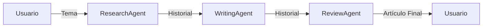

# Lab 01: Workflow Secuencial

**Duración**: 20 minutos  
**Nivel**: Intermedio  
**Objetivo**: Implementar un pipeline de 3 agentes usando Sequential Orchestration de MAF

## Descripción

En este lab implementarás un workflow secuencial usando **`AgentWorkflowBuilder.BuildSequential()`** de Microsoft Agent Framework para el patrón clásico **Research → Write → Review**:

1. **ResearchAgent**: Investiga un tema y recopila información clave
2. **WritingAgent**: Transforma la investigación en un artículo estructurado
3. **ReviewAgent**: Revisa, mejora y produce la versión final

Este patrón es fundamental para procesos donde cada paso depende del resultado del anterior. MAF proporciona una orquestación secuencial integrada que maneja automáticamente el paso de contexto entre agentes.



## Prerequisitos

- ✅ .NET 10 SDK instalado
- ✅ Azure OpenAI configurado con modelo `gpt-4o` o superior
- ✅ Azure CLI instalado (`az login` ejecutado)
- ✅ Completar Módulo 1: Hello Agent

## Conceptos Clave de MAF

| Componente | Descripción |
|------------|-------------|
| `ChatClientAgent` | Agente respaldado por un cliente de chat con instrucciones específicas |
| `AgentWorkflowBuilder.BuildSequential()` | Construye un pipeline donde los agentes se ejecutan en orden |
| `InProcessExecution.StreamAsync()` | Ejecuta el workflow con streaming en tiempo real |
| `StreamingRun` | Proporciona ejecución con capacidades de streaming de eventos |
| `AgentRunUpdateEvent` | Evento con fragmentos de respuesta de cada agente |
| `WorkflowOutputEvent` | Evento con el resultado final de todos los mensajes |

## Pasos del Lab

### Paso 1: Crear el Proyecto

```bash
# Crear carpeta del proyecto
mkdir -p docs/modulo-03-workflows/labs/01-sequential
cd docs/modulo-03-workflows/labs/01-sequential

# Crear proyecto de consola
dotnet new console -n SequentialWorkflow
```

### Paso 2: Instalar Paquetes de Microsoft Agent Framework

```bash
# Paquetes de Microsoft Agent Framework
dotnet add package Microsoft.Agents.AI --version 1.0.0-preview.260108.1
dotnet add package Microsoft.Agents.AI.OpenAI --version 1.0.0-preview.260108.1
dotnet add package Microsoft.Agents.AI.Workflows --version 1.0.0-preview.260108.1

# Azure OpenAI SDK
dotnet add package Azure.AI.OpenAI --version 2.1.0

# Azure Identity para autenticación
dotnet add package Azure.Identity --version 1.13.0

# Configuración
dotnet add package Microsoft.Extensions.Configuration --version 10.0.0
dotnet add package Microsoft.Extensions.Configuration.Json --version 10.0.0
dotnet add package Microsoft.Extensions.Configuration.UserSecrets --version 10.0.0
```

**¿Qué instalan estos paquetes?**
- `Microsoft.Agents.AI`: API principal de MAF
- `Microsoft.Agents.AI.OpenAI`: Extensiones para Azure OpenAI
- `Microsoft.Agents.AI.Workflows`: Orquestación de workflows (`AgentWorkflowBuilder`, `ChatClientAgent`)
- `Azure.AI.OpenAI`: SDK oficial de Azure OpenAI
- `Azure.Identity`: Autenticación con `DefaultAzureCredential`

### Paso 3: Crear Archivo de Configuración

Crea el archivo `appsettings.json`:

```json
{
  "AzureOpenAI": {
    "Endpoint": "https://TU-RECURSO.openai.azure.com/",
    "DeploymentName": "gpt-4o"
  }
}
```

**Importante**: Reemplaza `TU-RECURSO` con el nombre de tu recurso de Azure OpenAI.

### Paso 4: Configurar Autenticación con Azure CLI

Este lab usa `DefaultAzureCredential` que automáticamente usa tu sesión de Azure CLI:

```bash
# Iniciar sesión en Azure
az login

# Verificar que estás en la suscripción correcta
az account show
```

### Paso 5: Implementar el Workflow Secuencial

Reemplaza el contenido de `Program.cs` con el siguiente código que implementa Sequential Orchestration:

```csharp
// =============================================================================
// Program.cs - Workflow Secuencial con Microsoft Agent Framework
// =============================================================================
// Conceptos de MAF demostrados:
// - ChatClientAgent: Agente respaldado por cliente de chat con instrucciones
// - AgentWorkflowBuilder.BuildSequential(): Crea pipeline de agentes
// - StreamingRun: Ejecución en tiempo real con streaming de eventos
// - WorkflowEvent: Eventos para monitorear progreso del workflow
// =============================================================================

using Azure.AI.OpenAI;
using Azure.Identity;
using Microsoft.Agents.AI.Workflows;
using Microsoft.Extensions.AI;
using Microsoft.Extensions.Configuration;

// PASO 1: Configuración
var configuration = new ConfigurationBuilder()
    .SetBasePath(Directory.GetCurrentDirectory())
    .AddJsonFile("appsettings.json", optional: false)
    .AddUserSecrets<Program>()
    .Build();

var endpoint = configuration["AzureOpenAI:Endpoint"] 
    ?? throw new InvalidOperationException("Falta: AzureOpenAI:Endpoint");
var deploymentName = configuration["AzureOpenAI:DeploymentName"] 
    ?? throw new InvalidOperationException("Falta: AzureOpenAI:DeploymentName");

Console.WriteLine("═══════════════════════════════════════════════════════════════════");
Console.WriteLine("         WORKFLOW SECUENCIAL: Research → Write → Review");
Console.WriteLine("           Usando Microsoft Agent Framework (MAF)");
Console.WriteLine("═══════════════════════════════════════════════════════════════════\n");

// PASO 2: Crear cliente de Azure OpenAI
// Se convierte a IChatClient usando AsIChatClient() para compatibilidad con workflows
var client = new AzureOpenAIClient(new Uri(endpoint), new DefaultAzureCredential())
    .GetChatClient(deploymentName)
    .AsIChatClient();

Console.WriteLine("✓ Cliente Azure OpenAI configurado\n");

// PASO 3: Crear agentes con ChatClientAgent
// Cada agente recibe el historial completo y agrega su respuesta

var researchAgent = new ChatClientAgent(client, """
    Eres un investigador experto. Tu trabajo es:
    1. Analizar el tema solicitado por el usuario
    2. Identificar 3-5 puntos clave importantes
    3. Proporcionar datos concretos y ejemplos relevantes
    
    Responde en español, de forma concisa pero informativa.
    """, "ResearchAgent");

var writingAgent = new ChatClientAgent(client, """
    Eres un escritor profesional. Tu trabajo es:
    1. Tomar la información del mensaje anterior (investigación)
    2. Transformarla en un artículo bien estructurado
    3. Incluir introducción, cuerpo y conclusión
    
    Responde en español con tono profesional.
    """, "WritingAgent");

var reviewAgent = new ChatClientAgent(client, """
    Eres un editor profesional. Tu trabajo es:
    1. Revisar el artículo proporcionado en el mensaje anterior
    2. Mejorar claridad y corregir errores
    3. Proporcionar la versión final pulida
    
    Responde en español con un breve resumen de cambios.
    """, "ReviewAgent");

Console.WriteLine("✓ Agentes creados: ResearchAgent, WritingAgent, ReviewAgent\n");

// PASO 4: Construir workflow secuencial con AgentWorkflowBuilder
// BuildSequential() crea un pipeline donde cada agente procesa en orden
var workflow = AgentWorkflowBuilder.BuildSequential([researchAgent, writingAgent, reviewAgent]);

Console.WriteLine("✓ Workflow secuencial construido\n");

// PASO 5: Ejecutar workflow con streaming
var topic = "El impacto de la inteligencia artificial generativa en el desarrollo de software";

Console.WriteLine($"TEMA: {topic}\n");
Console.WriteLine("─────────────────────────────────────────────────────────────────\n");

var messages = new List<ChatMessage> 
{ 
    new(ChatRole.User, $"Investiga y crea un artículo sobre: {topic}") 
};

// InProcessExecution.StreamAsync() ejecuta el workflow y retorna StreamingRun
StreamingRun run = await InProcessExecution.StreamAsync(workflow, messages);
await run.TrySendMessageAsync(new TurnToken(emitEvents: true));

string currentAgent = "";
List<ChatMessage> finalResult = [];

// Procesar eventos del workflow en tiempo real
await foreach (WorkflowEvent evt in run.WatchStreamAsync().ConfigureAwait(false))
{
    if (evt is AgentRunUpdateEvent agentEvent)
    {
        if (agentEvent.ExecutorId != currentAgent)
        {
            currentAgent = agentEvent.ExecutorId;
            Console.WriteLine($"\n🤖 {currentAgent}:\n");
        }
        Console.Write(agentEvent.Data);  // Streaming de respuesta
    }
    else if (evt is WorkflowOutputEvent outputEvt)
    {
        finalResult = (List<ChatMessage>)outputEvt.Data!;
        break;
    }
}

Console.WriteLine("\n\n═══════════════════════════════════════════════════════════════════");
Console.WriteLine("                    WORKFLOW COMPLETADO");
Console.WriteLine("═══════════════════════════════════════════════════════════════════\n");

Console.WriteLine($"📋 Mensajes procesados: {finalResult.Count}");
Console.WriteLine($"   • Usuario: {finalResult.Count(m => m.Role == ChatRole.User)}");
Console.WriteLine($"   • Agentes: {finalResult.Count(m => m.Role == ChatRole.Assistant)}\n");

Console.WriteLine("✓ Cada agente recibió el historial completo de la conversación");
Console.WriteLine("✓ El output fluyó de un agente al siguiente en el pipeline\n");
```

### Paso 6: Ejecutar el Workflow

```bash
dotnet run
```

**Salida esperada**:

```
═══════════════════════════════════════════════════════════════════
         WORKFLOW SECUENCIAL: Research → Write → Review
           Usando Microsoft Agent Framework (MAF)
═══════════════════════════════════════════════════════════════════

✓ Cliente Azure OpenAI configurado

✓ Agentes creados: ResearchAgent, WritingAgent, ReviewAgent

✓ Workflow secuencial construido

TEMA: El impacto de la inteligencia artificial generativa...
─────────────────────────────────────────────────────────────────

🤖 ResearchAgent:
[Información estructurada sobre IA generativa...]

🤖 WritingAgent:
[Artículo con introducción, cuerpo y conclusión...]

🤖 ReviewAgent:
[Versión final pulida + resumen de cambios...]

═══════════════════════════════════════════════════════════════════
                    WORKFLOW COMPLETADO
═══════════════════════════════════════════════════════════════════

📋 Mensajes procesados: 4
   • Usuario: 1
   • Agentes: 3

✓ Cada agente recibió el historial completo de la conversación
✓ El output fluyó de un agente al siguiente en el pipeline
```

### Paso 7: Validar Resultados

Verifica que:

1. ✅ Los 3 agentes se ejecutaron en orden: Research → Write → Review
2. ✅ Cada agente mostró su nombre antes de responder (streaming)
3. ✅ El artículo final contiene información de la investigación
4. ✅ El conteo final muestra 4 mensajes (1 usuario + 3 agentes)

## Checkpoint de Validación

**Criterio de éxito**: El workflow secuencial ejecuta 3 pasos usando `AgentWorkflowBuilder.BuildSequential()`.

**Validación del instructor**:
- [ ] Los 3 agentes se identifican en la consola (ResearchAgent, WritingAgent, ReviewAgent)
- [ ] El streaming muestra respuestas progresivas
- [ ] El resultado final incluye todos los mensajes del historial

## Troubleshooting

### "DefaultAzureCredential authentication failed"

**Causa**: No hay sesión activa de Azure CLI.

**Solución**: 
```bash
az login
```

### "ChatClientAgent no existe"

**Causa**: Falta el paquete `Microsoft.Agents.AI.Workflows`.

**Solución**: 
```bash
dotnet add package Microsoft.Agents.AI.Workflows --version 1.0.0-preview.260108.1
```

### "El streaming no muestra nada"

**Causa**: Posible problema con el modelo o deployment.

**Solución**: Verifica que el deployment existe y está disponible en Azure OpenAI.

## Diferencias con Implementación Manual

| Aspecto | Manual | Con AgentWorkflowBuilder |
|---------|--------|-------------------------|
| Paso de contexto | Explícito en cada prompt | Automático (historial compartido) |
| Manejo de errores | Manual en cada paso | Integrado en el framework |
| Streaming | Implementación propia | `WatchStreamAsync()` integrado |
| Escalabilidad | Código duplicado | Agregar agentes al array |

## Experimentos Opcionales

1. **Agregar un cuarto agente**: Crea un `TranslatorAgent` y agrégalo al array
2. **Cambiar el orden**: Pon ReviewAgent antes de WritingAgent y observa el resultado
3. **Custom Executor**: Implementa un ejecutor personalizado que no use LLM

## Siguiente Lab

Continúa con [Lab 02: Parallel Workflow](../02-parallel/) para aprender a ejecutar agentes simultáneamente.
