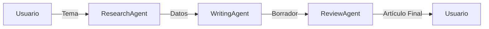

# Lab 01: Workflow Secuencial

**Duración**: 20 minutos  
**Nivel**: Intermedio  
**Objetivo**: Implementar un pipeline de 3 agentes donde cada uno procesa el resultado del anterior

## Descripción

En este lab implementarás un workflow secuencial clásico usando el patrón **Research → Write → Review**:

1. **ResearchAgent**: Investiga un tema y recopila información clave
2. **WritingAgent**: Transforma la investigación en un artículo estructurado
3. **ReviewAgent**: Revisa, mejora y produce la versión final

Este patrón es fundamental para procesos donde cada paso depende del resultado del anterior.



## Prerequisitos

- ✅ .NET 10 SDK instalado
- ✅ Azure OpenAI configurado con modelo `gpt-5.2`
- ✅ Completar Módulo 1: Hello Agent

## Pasos del Lab

### Paso 1: Crear el Proyecto

```bash
# Navegar a la carpeta del lab
cd docs/modulo-03-workflows/labs/01-sequential

# Restaurar paquetes
dotnet restore
```

### Paso 2: Configurar API Key

Usa User Secrets para almacenar tu API Key de forma segura:

```bash
# Inicializar user secrets (si no existe)
dotnet user-secrets init

# Configurar la API key
dotnet user-secrets set "AzureOpenAI:ApiKey" "TU-API-KEY-AQUI"
```

### Paso 3: Configurar Endpoint

Edita `appsettings.json` con tu endpoint de Azure OpenAI:

```json
{
  "AzureOpenAI": {
    "Endpoint": "https://TU-RECURSO.openai.azure.com/",
    "DeploymentName": "gpt-5.2"
  }
}
```

### Paso 4: Revisar el Código

Abre `Program.cs` y observa:

1. **Creación de agentes especializados** (líneas 40-85):
   - Cada agente tiene instrucciones específicas para su rol
   - `ResearchAgent`: Enfocado en recopilar información estructurada
   - `WritingAgent`: Especializado en crear artículos con formato
   - `ReviewAgent`: Experto en edición y mejora

2. **Paso de resultados entre agentes** (líneas 100-150):
   - El output de `ResearchAgent` se incluye en el prompt de `WritingAgent`
   - El output de `WritingAgent` se incluye en el prompt de `ReviewAgent`
   - Esto crea una cadena de procesamiento secuencial

3. **Orquestación manual** (líneas 90-170):
   - El código controla el orden de ejecución
   - Cada paso espera que el anterior termine antes de comenzar

### Paso 5: Ejecutar el Workflow

```bash
dotnet run
```

**Salida esperada**:

```
═══════════════════════════════════════════════════════════════════
         WORKFLOW SECUENCIAL: Research → Write → Review
═══════════════════════════════════════════════════════════════════

✓ ResearchAgent creado - Especialista en investigación
✓ WritingAgent creado - Especialista en redacción
✓ ReviewAgent creado - Especialista en edición

┌─────────────────────────────────────────────────────────────────┐
│ PASO 1/3: ResearchAgent - Investigando tema...                  │
└─────────────────────────────────────────────────────────────────┘

📊 RESULTADO DE INVESTIGACIÓN:
─────────────────────────────────────────────────────────────────
[Información estructurada con viñetas sobre IA generativa...]

┌─────────────────────────────────────────────────────────────────┐
│ PASO 2/3: WritingAgent - Escribiendo artículo...                │
└─────────────────────────────────────────────────────────────────┘

📝 BORRADOR DEL ARTÍCULO:
─────────────────────────────────────────────────────────────────
[Artículo con introducción, cuerpo y conclusión...]

┌─────────────────────────────────────────────────────────────────┐
│ PASO 3/3: ReviewAgent - Revisando y mejorando...                │
└─────────────────────────────────────────────────────────────────┘

✅ ARTÍCULO FINAL (REVISADO):
─────────────────────────────────────────────────────────────────
[Versión final pulida + resumen de cambios...]

═══════════════════════════════════════════════════════════════════
                    WORKFLOW COMPLETADO
═══════════════════════════════════════════════════════════════════

📋 Resumen de ejecución:
   • Paso 1 (Research): 1234 caracteres generados
   • Paso 2 (Writing):  2345 caracteres generados
   • Paso 3 (Review):   2567 caracteres generados

✓ El workflow secuencial ejecutó los 3 pasos en orden correcto
✓ Cada agente recibió el output del agente anterior como input
```

### Paso 6: Validar Resultados

Verifica que:

1. ✅ Los 3 agentes se ejecutaron en orden: Research → Write → Review
2. ✅ El artículo final contiene información de la investigación
3. ✅ El ReviewAgent identificó mejoras realizadas
4. ✅ El output muestra la cadena de procesamiento completa

## Checkpoint de Validación

**Criterio de éxito**: El workflow secuencial ejecuta 3 pasos en orden, con cada agente procesando el resultado del anterior.

**Validación del instructor**:
- [ ] Los 3 pasos se muestran en orden en la consola
- [ ] El artículo final menciona datos de la investigación
- [ ] El resumen muestra caracteres generados en cada paso

## Troubleshooting

### "El resultado del paso anterior no se pasa correctamente"

**Causa**: La variable del resultado anterior no se incluye en el prompt del siguiente agente.

**Solución**: Asegura que el mensaje incluye el texto completo del paso anterior:
```csharp
writingChat.AddUserMessage($"Basándote en: {researchResult}");
```

### "Los agentes no mantienen contexto entre sí"

**Causa**: Cada agente tiene su propio ChatHistory, esto es intencional.

**Explicación**: En un workflow secuencial, cada agente es independiente. El contexto se pasa explícitamente a través del prompt, no a través de historial compartido. Esto permite:
- Instrucciones especializadas por agente
- Control preciso de qué información pasa entre pasos
- Aislamiento de errores

### "El proceso tarda mucho tiempo"

**Causa**: Los 3 agentes se ejecutan secuencialmente, cada uno haciendo una llamada a Azure OpenAI.

**Solución**: Esto es comportamiento esperado. En el Lab 02 aprenderás workflows paralelos para casos donde los agentes pueden ejecutarse simultáneamente.

## Experimentos Opcionales

Si terminas antes, intenta:

1. **Cambiar el tema**: Modifica la variable `topic` para investigar otro tema
2. **Agregar un cuarto paso**: Crea un `TranslatorAgent` que traduzca el artículo final al inglés
3. **Modificar instrucciones**: Ajusta las instrucciones del `WritingAgent` para generar un formato diferente (por ejemplo, lista de tips en lugar de artículo)

## Siguiente Lab

Continúa con [Lab 02: Parallel Workflow](../02-parallel/) para aprender a ejecutar agentes simultáneamente.
