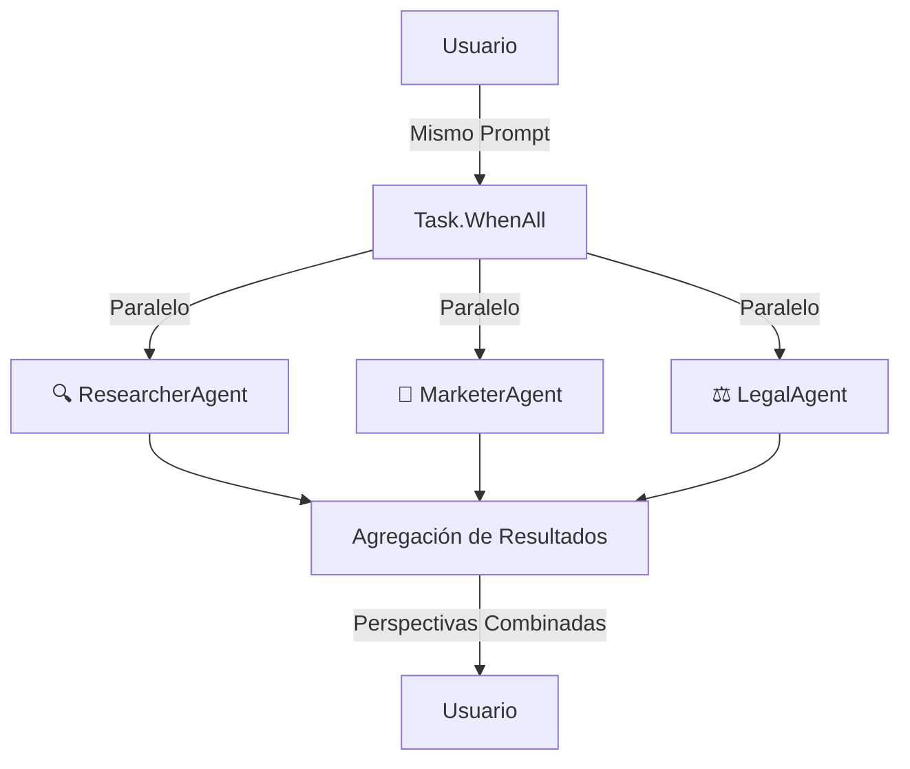

# Lab 02: Workflow Concurrente (Parallel)

**Duración**: 25 minutos  
**Nivel**: Intermedio  
**Objetivo**: Implementar ejecución concurrente donde múltiples agentes trabajan en la misma tarea simultáneamente usando `Task.WhenAll`

## Descripción

En este lab implementarás un **workflow concurrente** usando Microsoft Agent Framework. Múltiples agentes procesarán el mismo prompt simultáneamente, cada uno aportando su perspectiva única:

- **ResearcherAgent**: Perspectiva de investigación y análisis de mercado
- **MarketerAgent**: Perspectiva creativa y estrategia de marketing
- **LegalAgent**: Perspectiva de cumplimiento y regulaciones

**Escenario**: Tres expertos analizarán el lanzamiento de un producto, cada uno desde su área de especialidad.



## Referencia Oficial

📚 **Documentación**: [Microsoft Agent Framework - Concurrent Orchestration](https://learn.microsoft.com/en-us/agent-framework/user-guide/workflows/orchestrations/concurrent?pivots=programming-language-csharp)

## Prerequisitos

- ✅ .NET 10 SDK instalado
- ✅ Azure CLI instalado y autenticado (`az login`)
- ✅ Azure OpenAI configurado con modelo `gpt-4o` o superior
- ✅ Completar Lab 01: Sequential Workflow

## Conceptos Clave

| Concepto | Descripción |
|----------|-------------|
| `AIAgent` | Agente de MAF creado con `CreateAIAgent()` |
| `RunStreamingAsync()` | Invocación asíncrona con streaming de respuestas |
| `Task.WhenAll()` | Ejecuta múltiples tareas en paralelo y espera a todas |
| Concurrencia | Múltiples agentes procesan el mismo input simultáneamente |

## Pasos del Lab

### Paso 1: Crear el Proyecto desde Cero

```bash
# Crear carpeta del proyecto
mkdir -p docs/modulo-03-workflows/labs/02-parallel
cd docs/modulo-03-workflows/labs/02-parallel

# Crear proyecto .NET
dotnet new console -n ParallelWorkflow -o .

# Agregar paquetes necesarios
dotnet add package Microsoft.Agents.AI --version 1.0.0-preview.260108.1
dotnet add package Microsoft.Agents.AI.OpenAI --version 1.0.0-preview.260108.1
dotnet add package Azure.AI.OpenAI --version 2.1.0
dotnet add package Azure.Identity --version 1.13.0
dotnet add package Microsoft.Extensions.Configuration --version 10.0.0
dotnet add package Microsoft.Extensions.Configuration.Json --version 10.0.0
dotnet add package Microsoft.Extensions.Configuration.UserSecrets --version 10.0.0

# Inicializar user secrets
dotnet user-secrets init
```

### Paso 2: Configurar appsettings.json

Crea el archivo `appsettings.json`:

```json
{
  "AzureOpenAI": {
    "Endpoint": "https://TU-RECURSO.openai.azure.com/",
    "DeploymentName": "gpt-4o"
  }
}
```

### Paso 3: Autenticación con Azure CLI

Este lab usa `DefaultAzureCredential` para autenticación (más seguro que API keys):

```bash
# Iniciar sesión en Azure
az login

# Verificar que estás en la suscripción correcta
az account show
```

### Paso 4: Crear el Cliente Azure OpenAI

En `Program.cs`, comienza con la configuración del cliente:

```csharp
using System.Diagnostics;
using Azure.AI.OpenAI;
using Azure.Identity;
using Microsoft.Agents.AI;
using Microsoft.Extensions.Configuration;
using OpenAI.Chat;

// Cargar configuración
var configuration = new ConfigurationBuilder()
    .SetBasePath(Directory.GetCurrentDirectory())
    .AddJsonFile("appsettings.json", optional: false)
    .AddUserSecrets<Program>()
    .Build();

var endpoint = configuration["AzureOpenAI:Endpoint"] 
    ?? throw new InvalidOperationException("Falta: AzureOpenAI:Endpoint");
var deploymentName = configuration["AzureOpenAI:DeploymentName"] 
    ?? throw new InvalidOperationException("Falta: AzureOpenAI:DeploymentName");

// Crear cliente con DefaultAzureCredential (no requiere API key)
var openAIClient = new AzureOpenAIClient(
    new Uri(endpoint),
    new DefaultAzureCredential());
```

### Paso 5: Definir los Agentes Especializados

Crea tres agentes con diferentes perspectivas usando `CreateAIAgent()`:

```csharp
// Agente 1: Investigador de Mercado
var researcherAgent = openAIClient
    .GetChatClient(deploymentName)
    .CreateAIAgent(
        name: "ResearcherAgent",
        instructions: """
            Eres un experto investigador de mercado. Dado un tema:
            1. Proporciona insights basados en hechos
            2. Identifica oportunidades de mercado
            3. Señala riesgos potenciales
            
            Responde en español. Máximo 150 palabras.
            """);

// Agente 2: Estratega de Marketing
var marketerAgent = openAIClient
    .GetChatClient(deploymentName)
    .CreateAIAgent(
        name: "MarketerAgent",
        instructions: """
            Eres un estratega de marketing creativo. Dado un tema:
            1. Crea propuestas de valor convincentes
            2. Define mensajes para el público objetivo
            3. Incluye un slogan o tagline
            
            Responde en español. Máximo 150 palabras.
            """);

// Agente 3: Asesor Legal
var legalAgent = openAIClient
    .GetChatClient(deploymentName)
    .CreateAIAgent(
        name: "LegalAgent",
        instructions: """
            Eres un asesor legal y de cumplimiento. Dado un tema:
            1. Identifica restricciones regulatorias
            2. Señala posibles riesgos legales
            3. Recomienda disclaimers necesarios
            
            Responde en español. Máximo 150 palabras.
            """);
```

### Paso 6: Crear Función Helper para Invocar Agentes

```csharp
async Task<(string AgentName, string Result, long ElapsedMs)> InvokeAgentAsync(
    AIAgent agent,
    string agentName, 
    string prompt)
{
    var stopwatch = Stopwatch.StartNew();
    
    var messages = new List<ChatMessage>
    {
        new UserChatMessage(prompt)
    };
    
    string result = "";
    await foreach (var update in agent.RunStreamingAsync(messages))
    {
        result += update;
    }
    
    stopwatch.Stop();
    return (agentName, result, stopwatch.ElapsedMilliseconds);
}
```

### Paso 7: Ejecutar Concurrentemente con Task.WhenAll

```csharp
var userPrompt = "Lanzamos una bicicleta eléctrica económica para commuters urbanos.";

// Crear tareas para ejecución CONCURRENTE
var researcherTask = InvokeAgentAsync(researcherAgent, "🔍 Investigador", userPrompt);
var marketerTask = InvokeAgentAsync(marketerAgent, "📣 Marketing", userPrompt);
var legalTask = InvokeAgentAsync(legalAgent, "⚖️ Legal", userPrompt);

// Task.WhenAll ejecuta las 3 tareas SIMULTÁNEAMENTE
var results = await Task.WhenAll(researcherTask, marketerTask, legalTask);
```

**🔑 Punto clave**: `Task.WhenAll` inicia las tres tareas al mismo tiempo y espera a que todas terminen.

### Paso 8: Mostrar Resultados y Métricas

```csharp
// Medir tiempo total de ejecución paralela
var parallelStopwatch = Stopwatch.StartNew();

// Task.WhenAll ejecuta las 3 tareas SIMULTÁNEAMENTE
var results = await Task.WhenAll(researcherTask, marketerTask, legalTask);

parallelStopwatch.Stop();

// Mostrar resultados
foreach (var (agentName, result, elapsedMs) in results)
{
    Console.WriteLine($"\n{agentName} ({elapsedMs}ms):");
    Console.WriteLine(result);
}

// Calcular speedup
var totalSequentialTime = results.Sum(r => r.ElapsedMs);
var parallelTime = parallelStopwatch.ElapsedMilliseconds;
var speedup = (double)totalSequentialTime / parallelTime;

Console.WriteLine($"\n🚀 Factor de aceleración: {speedup:F2}x más rápido");
```

### Paso 9: Ejecutar y Validar

```bash
dotnet run
```

**Salida esperada**:

```
═══════════════════════════════════════════════════════════════════
    WORKFLOW CONCURRENTE: Múltiples Perspectivas Simultáneas
═══════════════════════════════════════════════════════════════════

✓ Cliente Azure OpenAI configurado con DefaultAzureCredential
✓ 3 agentes especializados creados

┌─────────────────────────────────────────────────────────────────┐
│ EJECUCIÓN CONCURRENTE: Todos los agentes al mismo tiempo       │
└─────────────────────────────────────────────────────────────────┘

📝 Prompt: "Estamos lanzando una nueva bicicleta eléctrica..."

═══════════════════════════════════════════════════════════════════
            RESULTADOS DE TODOS LOS AGENTES
═══════════════════════════════════════════════════════════════════

┌─── 🔍 Investigador (2340ms) ───
│ **Insights de Mercado:**
│ - El mercado de e-bikes crece 10% anual en LATAM
│ - Segmento económico tiene competencia limitada
│ ...
└────────────────────────────────────────────────────────────────

┌─── 📣 Marketing (2100ms) ───
│ **Propuesta de Valor:**
│ "Muévete verde, muévete inteligente"
│ - Target: Profesionales urbanos 25-45 años
│ ...
└────────────────────────────────────────────────────────────────

┌─── ⚖️ Legal (1890ms) ───
│ **Consideraciones Regulatorias:**
│ - Cumplir NOM-001-SCT (vehículos)
│ - Certificación de batería UL
│ ...
└────────────────────────────────────────────────────────────────

═══════════════════════════════════════════════════════════════════
                    ANÁLISIS DE RENDIMIENTO
═══════════════════════════════════════════════════════════════════

📊 Tiempos individuales de cada agente:
   • 🔍 Investigador: 2340ms
   • 📣 Marketing: 2100ms
   • ⚖️ Legal: 1890ms

⏱️  Tiempo CONCURRENTE (real):     2450ms
⏱️  Tiempo SECUENCIAL (estimado): 6330ms
💨 Tiempo ahorrado:               3880ms
🚀 Factor de aceleración:         2.58x más rápido
```

## Checkpoint de Validación

**Criterio de éxito**: Los 3 agentes ejecutan concurrentemente y el tiempo total es significativamente menor que la suma de tiempos individuales.

**Validación del instructor**:
- [ ] Los 3 agentes generan respuestas con perspectivas diferentes
- [ ] El tiempo concurrente es menor que el tiempo secuencial estimado
- [ ] El factor de aceleración es mayor a 1.5x
- [ ] Cada agente muestra su tiempo individual de ejecución

## Troubleshooting

### "DefaultAzureCredential authentication failed"

**Causa**: No has iniciado sesión en Azure CLI.

**Solución**:
```bash
az login
az account set --subscription "TU-SUSCRIPCION"
```

### "El tiempo concurrente es igual al secuencial"

**Causa posible**: Rate limiting de Azure OpenAI está serializando las llamadas.

**Solución**: 
1. Verificar cuota de TPM en Azure Portal
2. Usar un deployment con mayor capacidad
3. Esperar unos segundos entre ejecuciones

### "Un agente tarda mucho más que los otros"

**Causa**: Esto es esperado. `Task.WhenAll` espera a que TODOS terminen.

**Solución**: El tiempo total será igual al del agente más lento. Esto es normal y aún así es más rápido que secuencial.

### "Timeout o errores intermitentes"

**Causa**: Problemas de conectividad o límites de Azure OpenAI.

**Solución**: Agregar retry logic o reducir el tamaño de las respuestas.

## Experimentos Opcionales

Si terminas antes, intenta:

1. **Agregar un cuarto agente**: Crea un `FinanceAgent` que analice el aspecto financiero
2. **Implementar timeout**: Usa `Task.WhenAll` con `CancellationToken` y timeout de 30s
3. **Manejo de errores**: Implementa lógica para continuar si un agente falla

## Siguiente Lab

Continúa con [Lab 03: Delegation Workflow](../03-delegation/) para aprender routing inteligente de tareas a agentes especializados.
