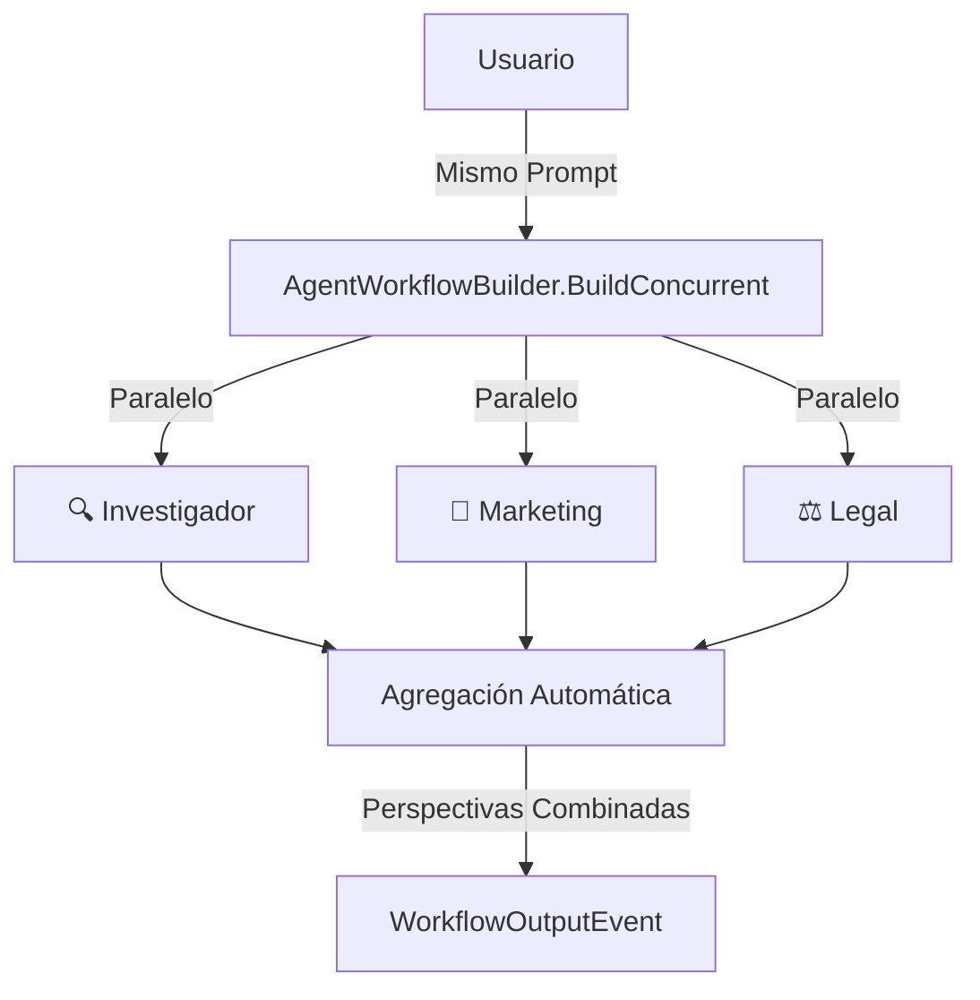

# Lab 02: Workflow Concurrente (Concurrent Orchestration)

**Duración**: 25 minutos  
**Nivel**: Intermedio  
**Objetivo**: Implementar ejecución concurrente donde múltiples agentes trabajan en la misma tarea simultáneamente usando `AgentWorkflowBuilder.BuildConcurrent()`

## Descripción

En este lab implementarás un **workflow concurrente** usando Microsoft Agent Framework Workflows. Múltiples agentes procesarán el mismo prompt simultáneamente, cada uno aportando su perspectiva única:

- **Investigador**: Perspectiva de investigación y análisis de mercado
- **Marketing**: Perspectiva creativa y estrategia de marketing
- **Legal**: Perspectiva de cumplimiento y regulaciones

**Escenario**: Tres expertos analizarán el lanzamiento de un producto, cada uno desde su área de especialidad.



## Referencia Oficial

📚 **Documentación**: [Microsoft Agent Framework - Concurrent Orchestration](https://learn.microsoft.com/en-us/agent-framework/user-guide/workflows/orchestrations/concurrent?pivots=programming-language-csharp)

## Prerequisitos

- ✅ .NET 10 SDK instalado
- ✅ Azure CLI instalado y autenticado (`az login`)
- ✅ Azure OpenAI configurado con modelo `gpt-4o` o superior
- ✅ Completar Lab 01: Sequential Workflow

## Conceptos Clave

| Concepto | Descripción |
|----------|-------------|
| `ChatClientAgent` | Agente de MAF creado con `IChatClient` y system prompt |
| `AgentWorkflowBuilder.BuildConcurrent()` | Construye workflow que ejecuta agentes en paralelo |
| `InProcessExecution.StreamAsync()` | Ejecuta el workflow con streaming de eventos |
| `AgentRunUpdateEvent` | Evento de actualización cuando un agente procesa |
| `WorkflowOutputEvent` | Evento final con resultados agregados de todos los agentes |
| `TurnToken` | Token para controlar el flujo de eventos del workflow |

## Pasos del Lab

### Paso 1: Crear el Proyecto desde Cero

```bash
# Crear carpeta del proyecto
mkdir -p docs/modulo-03-workflows/labs/02-parallel
cd docs/modulo-03-workflows/labs/02-parallel

# Crear proyecto .NET
dotnet new console -n ParallelWorkflow -o .

# Agregar paquetes necesarios
dotnet add package Microsoft.Agents.AI --version 1.0.0-preview.260108.1
dotnet add package Microsoft.Agents.AI.OpenAI --version 1.0.0-preview.260108.1
dotnet add package Microsoft.Agents.AI.Workflows --version 1.0.0-preview.260108.1
dotnet add package Azure.AI.OpenAI --version 2.1.0
dotnet add package Azure.Identity --version 1.13.0
dotnet add package Microsoft.Extensions.Configuration --version 10.0.0
dotnet add package Microsoft.Extensions.Configuration.Json --version 10.0.0
dotnet add package Microsoft.Extensions.Configuration.UserSecrets --version 10.0.0

# Inicializar user secrets
dotnet user-secrets init
```

### Paso 2: Configurar appsettings.json

Crea el archivo `appsettings.json`:

```json
{
  "AzureOpenAI": {
    "Endpoint": "https://TU-RECURSO.openai.azure.com/",
    "DeploymentName": "gpt-4o"
  }
}
```

### Paso 3: Autenticación con Azure CLI

Este lab usa `DefaultAzureCredential` para autenticación (más seguro que API keys):

```bash
# Iniciar sesión en Azure
az login

# Verificar que estás en la suscripción correcta
az account show
```

### Paso 4: Crear el Cliente Azure OpenAI con Microsoft.Extensions.AI

En `Program.cs`, comienza con la configuración del cliente usando `IChatClient`:

```csharp
using System.Diagnostics;
using Azure.AI.OpenAI;
using Azure.Identity;
using Microsoft.Agents.AI.Workflows;
using Microsoft.Extensions.AI;
using Microsoft.Extensions.Configuration;

// Cargar configuración
var configuration = new ConfigurationBuilder()
    .SetBasePath(Directory.GetCurrentDirectory())
    .AddJsonFile("appsettings.json", optional: false)
    .AddUserSecrets<Program>()
    .Build();

var endpoint = configuration["AzureOpenAI:Endpoint"] 
    ?? throw new InvalidOperationException("Falta: AzureOpenAI:Endpoint");
var deploymentName = configuration["AzureOpenAI:DeploymentName"] 
    ?? throw new InvalidOperationException("Falta: AzureOpenAI:DeploymentName");

// Crear cliente con IChatClient usando AsIChatClient()
var client = new AzureOpenAIClient(new Uri(endpoint), new DefaultAzureCredential())
    .GetChatClient(deploymentName)
    .AsIChatClient();
```

**🔑 Punto importante**: `AsIChatClient()` convierte el cliente de Azure OpenAI a la interfaz `IChatClient` de Microsoft.Extensions.AI, que es la que usa MAF Workflows.

### Paso 5: Definir los Agentes Especializados con ChatClientAgent

Crea tres agentes con diferentes perspectivas usando `ChatClientAgent`:

```csharp
// Método helper para crear agentes con diferentes perspectivas
static ChatClientAgent CreateExpertAgent(IChatClient chatClient, string name, string instructions) =>
    new(chatClient, instructions);

// Crear los tres agentes especializados
var researcherAgent = CreateExpertAgent(
    client,
    name: "Investigador",
    instructions: """
        Eres un experto investigador de mercado y productos. Dado un tema o prompt:
        1. Proporciona insights concisos y basados en hechos
        2. Identifica oportunidades de mercado
        3. Señala riesgos potenciales
        4. Usa datos y tendencias actuales
        
        Responde en español, de forma estructurada y profesional.
        Máximo 150 palabras.
        """);

var marketerAgent = CreateExpertAgent(
    client,
    name: "Marketing",
    instructions: """
        Eres un estratega de marketing creativo. Dado un tema o prompt:
        1. Crea propuestas de valor convincentes
        2. Define mensajes para el público objetivo
        3. Sugiere canales de comunicación
        4. Incluye un slogan o tagline
        
        Responde en español, de forma creativa y orientada a la acción.
        Máximo 150 palabras.
        """);

var legalAgent = CreateExpertAgent(
    client,
    name: "Legal",
    instructions: """
        Eres un asesor legal y de cumplimiento cauteloso. Dado un tema o prompt:
        1. Identifica restricciones regulatorias
        2. Señala posibles riesgos legales
        3. Recomienda disclaimers necesarios
        4. Menciona certificaciones requeridas
        
        Responde en español, de forma precisa y orientada al cumplimiento.
        Máximo 150 palabras.
        """);
```

### Paso 6: Construir el Workflow Concurrente

Usa `AgentWorkflowBuilder.BuildConcurrent()` para crear el workflow:

```csharp
// Crear array de agentes para el workflow concurrente
var agents = new[] { researcherAgent, marketerAgent, legalAgent };

// Construir el workflow concurrente
var workflow = AgentWorkflowBuilder.BuildConcurrent(agents);
```

**🔑 Concepto clave**: `BuildConcurrent()` crea un workflow que ejecuta TODOS los agentes en paralelo y agrega automáticamente sus resultados.

### Paso 7: Ejecutar el Workflow con Streaming

```csharp
var userPrompt = "Estamos lanzando una nueva bicicleta eléctrica económica para commuters urbanos.";

// Preparar mensajes de entrada
var messages = new List<ChatMessage> { new(ChatRole.User, userPrompt) };

// Ejecutar el workflow con streaming
StreamingRun run = await InProcessExecution.StreamAsync(workflow, messages);

// Enviar TurnToken para iniciar el flujo de eventos
await run.TrySendMessageAsync(new TurnToken(emitEvents: true));

// Procesar eventos del workflow
List<ChatMessage>? result = null;

await foreach (WorkflowEvent evt in run.WatchStreamAsync().ConfigureAwait(false))
{
    if (evt is AgentRunUpdateEvent updateEvent)
    {
        // Mostrar actualizaciones en tiempo real de cada agente
        Console.WriteLine($"   → {updateEvent.ExecutorId} procesando...");
    }
    else if (evt is WorkflowOutputEvent outputEvt)
    {
        // Recolectar resultado final agregado
        result = outputEvt.Data as List<ChatMessage>;
        break;
    }
}
```

**🔑 Puntos clave**:
- `InProcessExecution.StreamAsync()` ejecuta el workflow en proceso con streaming
- `TurnToken(emitEvents: true)` habilita la emisión de eventos de progreso
- `AgentRunUpdateEvent` indica cuando un agente está procesando
- `WorkflowOutputEvent` contiene los resultados agregados de todos los agentes

### Paso 8: Mostrar Resultados Agregados

```csharp
// Mostrar resultados
if (result != null)
{
    var assistantResponses = result.Where(m => m.Role == ChatRole.Assistant).ToList();
    var agentNames = new[] { "🔍 Investigador", "📣 Marketing", "⚖️ Legal" };
    var index = 0;
    
    foreach (var message in assistantResponses)
    {
        var agentName = index < agentNames.Length ? agentNames[index] : $"Agente {index + 1}";
        Console.WriteLine($"\n{agentName}:");
        Console.WriteLine(message.Text);
        index++;
    }
}
```

### Paso 9: Ejecutar y Validar

```bash
dotnet run
```

**Salida esperada**:

```
═══════════════════════════════════════════════════════════════════
    WORKFLOW CONCURRENTE: Múltiples Perspectivas Simultáneas
        Usando AgentWorkflowBuilder.BuildConcurrent()
═══════════════════════════════════════════════════════════════════

✓ Cliente Azure OpenAI configurado con DefaultAzureCredential
✓ 3 agentes especializados creados
✓ Workflow concurrente construido con AgentWorkflowBuilder.BuildConcurrent()

┌─────────────────────────────────────────────────────────────────┐
│ EJECUCIÓN CONCURRENTE: Todos los agentes al mismo tiempo       │
└─────────────────────────────────────────────────────────────────┘

📝 Prompt: "Estamos lanzando una nueva bicicleta eléctrica..."

🔄 Ejecutando agentes en paralelo...
   → Investigador comenzó a procesar...
   → Marketing comenzó a procesar...
   → Legal comenzó a procesar...

═══════════════════════════════════════════════════════════════════
            RESULTADOS AGREGADOS DE TODOS LOS AGENTES
═══════════════════════════════════════════════════════════════════

┌─── 🔍 Investigador ───
│ **Insights de Mercado:**
│ - El mercado de e-bikes crece 10% anual en LATAM
│ - Segmento económico tiene competencia limitada
│ ...
└────────────────────────────────────────────────────────────────

┌─── 📣 Marketing ───
│ **Propuesta de Valor:**
│ "Muévete verde, muévete inteligente"
│ - Target: Profesionales urbanos 25-45 años
│ ...
└────────────────────────────────────────────────────────────────

┌─── ⚖️ Legal ───
│ **Consideraciones Regulatorias:**
│ - Cumplir NOM-001-SCT (vehículos)
│ - Certificación de batería UL
│ ...
└────────────────────────────────────────────────────────────────

```

## Checkpoint de Validación

**Criterio de éxito**: Los 3 agentes ejecutan concurrentemente usando `BuildConcurrent()` y los resultados se agregan automáticamente.

**Validación del instructor**:
- [ ] El workflow usa `AgentWorkflowBuilder.BuildConcurrent()`
- [ ] Los agentes son de tipo `ChatClientAgent`
- [ ] Se usa `InProcessExecution.StreamAsync()` para ejecutar
- [ ] Los eventos `AgentRunUpdateEvent` muestran progreso en tiempo real
- [ ] `WorkflowOutputEvent` contiene los resultados de todos los agentes

## Diferencias: Task.WhenAll vs BuildConcurrent()

| Aspecto | Task.WhenAll (Manual) | BuildConcurrent() (MAF) |
|---------|----------------------|-------------------------|
| Orquestación | Manual | Automática por el framework |
| Agregación | Implementar manualmente | Automática |
| Eventos | No disponibles | `AgentRunUpdateEvent`, `WorkflowOutputEvent` |
| Streaming | Manual por agente | Integrado con `WatchStreamAsync()` |
| Escalabilidad | Código crece con agentes | Declarativo y extensible |

## Troubleshooting

### "DefaultAzureCredential authentication failed"

**Causa**: No has iniciado sesión en Azure CLI.

**Solución**:
```bash
az login
az account set --subscription "TU-SUSCRIPCION"
```

### "No se encontró el namespace Microsoft.Agents.AI.Workflows"

**Causa**: Falta el paquete de workflows.

**Solución**:
```bash
dotnet add package Microsoft.Agents.AI.Workflows --version 1.0.0-preview.260108.1
```

### "AsIChatClient() no existe"

**Causa**: Falta el paquete Microsoft.Extensions.AI.

**Solución**:
```bash
dotnet add package Microsoft.Extensions.AI --version 9.5.0
```

### "No se reciben eventos del workflow"

**Causa**: No se envió `TurnToken` con `emitEvents: true`.

**Solución**: Asegúrate de llamar:
```csharp
await run.TrySendMessageAsync(new TurnToken(emitEvents: true));
```

### "Timeout o errores intermitentes"

**Causa**: Problemas de conectividad o límites de Azure OpenAI.

**Solución**: Verificar cuota de TPM en Azure Portal o reducir el tamaño de las respuestas.

## Experimentos Opcionales

Si terminas antes, intenta:

1. **Agregar un cuarto agente**: Crea un `FinanceAgent` que analice el aspecto financiero
2. **Personalizar los mensajes de progreso**: Extrae más información de `AgentRunUpdateEvent.Data`
3. **Medir tiempos por agente**: Implementa tracking de tiempo para cada agente individual

## Siguiente Lab

Continúa con [Lab 03: Delegation Workflow](../03-delegation/) para aprender routing inteligente de tareas a agentes especializados.
