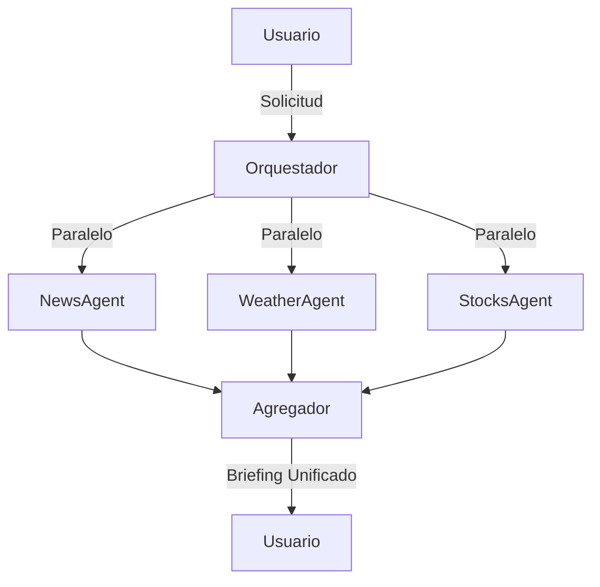

# Lab 02: Workflow Paralelo

**Duración**: 25 minutos  
**Nivel**: Intermedio  
**Objetivo**: Implementar ejecución paralela de múltiples agentes independientes con agregación de resultados

## Descripción

En este lab implementarás un workflow paralelo donde 3 agentes independientes ejecutan simultáneamente y sus resultados se combinan en una respuesta unificada:

1. **NewsAgent**: Obtiene titulares de noticias
2. **WeatherAgent**: Obtiene información del clima
3. **StocksAgent**: Obtiene información bursátil

Este patrón es ideal cuando las tareas son **independientes** y no necesitan información entre sí.



## Prerequisitos

- ✅ .NET 10 SDK instalado
- ✅ Azure OpenAI configurado con modelo `gpt-5.2`
- ✅ Completar Lab 01: Sequential Workflow

## Pasos del Lab

### Paso 1: Crear el Proyecto

```bash
# Navegar a la carpeta del lab
cd docs/modulo-03-workflows/labs/02-parallel

# Restaurar paquetes
dotnet restore
```

### Paso 2: Configurar API Key

```bash
# Inicializar user secrets
dotnet user-secrets init

# Configurar la API key
dotnet user-secrets set "AzureOpenAI:ApiKey" "TU-API-KEY-AQUI"
```

### Paso 3: Configurar Endpoint

Edita `appsettings.json` con tu endpoint de Azure OpenAI:

```json
{
  "AzureOpenAI": {
    "Endpoint": "https://TU-RECURSO.openai.azure.com/",
    "DeploymentName": "gpt-5.2"
  }
}
```

### Paso 4: Revisar el Código

Abre `Program.cs` y observa:

1. **Agentes independientes** (líneas 45-90):
   - Cada agente tiene un propósito específico y no comparte estado
   - Las instrucciones son especializadas para cada dominio

2. **Función helper de invocación** (líneas 95-110):
   - `InvokeAgentAsync` encapsula la lógica de llamada
   - Mide el tiempo de ejecución de cada agente
   - Retorna una tupla con nombre, resultado y tiempo

3. **Task.WhenAll para paralelismo** (líneas 120-135):
   ```csharp
   var newsTask = InvokeAgentAsync(newsAgent, "...");
   var weatherTask = InvokeAgentAsync(weatherAgent, "...");
   var stocksTask = InvokeAgentAsync(stocksAgent, "...");
   
   // Ejecuta las 3 tareas SIMULTÁNEAMENTE
   var results = await Task.WhenAll(newsTask, weatherTask, stocksTask);
   ```

4. **Agregación de resultados** (líneas 150-170):
   - Los resultados se combinan en un briefing unificado
   - Se mantiene la estructura individual de cada agente

### Paso 5: Ejecutar el Workflow

```bash
dotnet run
```

**Salida esperada**:

```
═══════════════════════════════════════════════════════════════════
           WORKFLOW PARALELO: News ║ Weather ║ Stocks
═══════════════════════════════════════════════════════════════════

✓ NewsAgent creado - Especialista en noticias
✓ WeatherAgent creado - Especialista en clima
✓ StocksAgent creado - Especialista en mercados

┌─────────────────────────────────────────────────────────────────┐
│ EJECUCIÓN PARALELA: Todos los agentes al mismo tiempo          │
└─────────────────────────────────────────────────────────────────┘

═══════════════════════════════════════════════════════════════════
                    RESULTADOS INDIVIDUALES
═══════════════════════════════════════════════════════════════════

┌─── NewsAgent (2340ms) ───
│ • Titular 1: [Noticia de tecnología]
│ • Titular 2: [Noticia de negocios]
│ • Titular 3: [Noticia mundial]
└────────────────────────────────────────────────────────────────

┌─── WeatherAgent (1890ms) ───
│ Madrid, España
│ Temperatura: 18°C
│ Condición: Parcialmente nublado
│ Humedad: 45%
└────────────────────────────────────────────────────────────────

┌─── StocksAgent (2100ms) ───
│ MSFT (Microsoft)
│ Precio: $425.50
│ Cambio: +1.2% 📈
│ Tendencia: Alcista
└────────────────────────────────────────────────────────────────

═══════════════════════════════════════════════════════════════════
               RESPUESTA AGREGADA (BRIEFING DIARIO)
═══════════════════════════════════════════════════════════════════

📰 **NOTICIAS DEL DÍA**
[Contenido del NewsAgent]

☀️ **CLIMA EN MADRID**
[Contenido del WeatherAgent]

📊 **MERCADOS - MICROSOFT (MSFT)**
[Contenido del StocksAgent]

═══════════════════════════════════════════════════════════════════
                    ANÁLISIS DE RENDIMIENTO
═══════════════════════════════════════════════════════════════════

📊 Tiempos individuales de cada agente:
   • NewsAgent: 2340ms
   • WeatherAgent: 1890ms
   • StocksAgent: 2100ms

⏱️  Tiempo PARALELO (real):        2450ms
⏱️  Tiempo SECUENCIAL (estimado): 6330ms
💨 Tiempo ahorrado:               3880ms
🚀 Factor de aceleración:         2.58x más rápido

═══════════════════════════════════════════════════════════════════
                    WORKFLOW COMPLETADO
═══════════════════════════════════════════════════════════════════

✓ Los 3 agentes ejecutaron en PARALELO usando Task.WhenAll
✓ Cada agente procesó su consulta de forma independiente
✓ Los resultados se agregaron en un briefing unificado
✓ Ejecución paralela fue ~2.6x más rápida que secuencial
```

### Paso 6: Validar Resultados

Verifica que:

1. ✅ Los 3 agentes ejecutaron (hay resultados de cada uno)
2. ✅ El tiempo paralelo es MENOR que la suma de tiempos individuales
3. ✅ Los resultados se agregan correctamente en el briefing
4. ✅ El factor de aceleración es >1x (idealmente ~2-3x con 3 agentes)

## Checkpoint de Validación

**Criterio de éxito**: Los 3 agentes ejecutan en paralelo y el tiempo total es menor que la suma de tiempos individuales.

**Validación del instructor**:
- [ ] La sección "ANÁLISIS DE RENDIMIENTO" muestra el tiempo paralelo
- [ ] El factor de aceleración es mayor a 1.5x
- [ ] El briefing unificado contiene información de los 3 agentes

## Troubleshooting

### "Task.WhenAll arroja excepción"

**Causa**: Una o más tareas fallaron.

**Solución**: Envuelve cada tarea en try-catch para manejo individual de errores:

```csharp
async Task<(string, string, long)> SafeInvokeAgentAsync(ChatCompletionAgent agent, string prompt)
{
    try
    {
        return await InvokeAgentAsync(agent, prompt);
    }
    catch (Exception ex)
    {
        return (agent.Name ?? "Unknown", $"Error: {ex.Message}", 0);
    }
}
```

### "El tiempo paralelo no es menor que secuencial"

**Causa posible 1**: Rate limiting de Azure OpenAI - las llamadas se están serializando.

**Solución**: Aumentar el límite de TPM (Tokens Per Minute) en Azure Portal.

**Causa posible 2**: La máquina tiene poca capacidad de threads.

**Solución**: Esto es normal en algunos entornos. El beneficio de paralelismo se verá mejor con más recursos.

### "Un agente tarda mucho más que los otros"

**Causa**: Prompts más complejos o respuestas más largas.

**Solución**: Esto es esperado. Task.WhenAll espera a que TODOS terminen, así que el tiempo total será el del agente más lento.

## Experimentos Opcionales

Si terminas antes, intenta:

1. **Agregar un cuarto agente**: Crea un `CryptoAgent` que obtenga precios de criptomonedas
2. **Implementar timeout**: Agrega `Task.WhenAll` con `CancellationToken` y timeout de 30 segundos
3. **Manejo de errores parciales**: Implementa lógica para retornar resultados parciales si un agente falla

## Siguiente Lab

Continúa con [Lab 03: Delegation Workflow](../03-delegation/) para aprender routing inteligente de tareas a agentes especializados.
