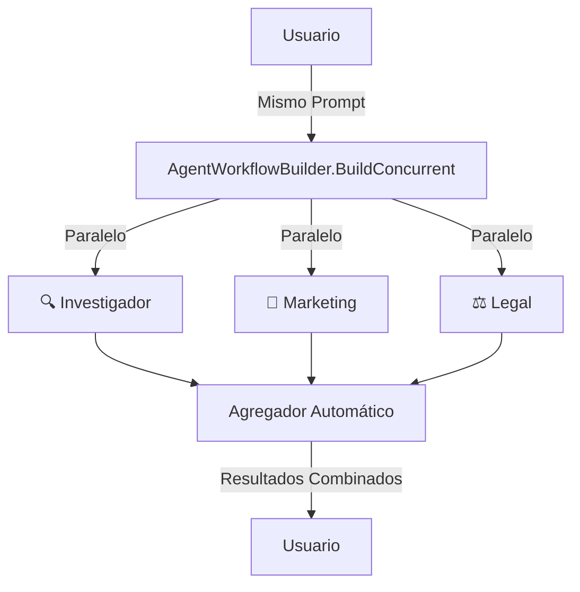

# Lab 02: Workflow Concurrente (Parallel)

**Duración**: 25 minutos  
**Nivel**: Intermedio  
**Objetivo**: Implementar orquestación concurrente donde múltiples agentes trabajan en la misma tarea simultáneamente usando `AgentWorkflowBuilder.BuildConcurrent()`

## Descripción

En este lab implementarás un **workflow concurrente** usando la API oficial de Microsoft Agent Framework. A diferencia de un enfoque manual con `Task.WhenAll`, utilizaremos `AgentWorkflowBuilder.BuildConcurrent()` que proporciona:

- Ejecución paralela automática de todos los agentes
- Agregación de resultados integrada
- Streaming de eventos para monitorear progreso en tiempo real
- Manejo de errores unificado

**Escenario**: Tres expertos (Investigador, Marketing, Legal) analizarán el mismo prompt simultáneamente, cada uno aportando su perspectiva única.



## Referencia Oficial

📚 **Documentación**: [Microsoft Agent Framework - Concurrent Orchestration](https://learn.microsoft.com/en-us/agent-framework/user-guide/workflows/orchestrations/concurrent?pivots=programming-language-csharp)

## Prerequisitos

- ✅ .NET 10 SDK instalado
- ✅ Azure CLI instalado y autenticado (`az login`)
- ✅ Azure OpenAI configurado con modelo `gpt-4o` o superior
- ✅ Completar Lab 01: Sequential Workflow

## Conceptos Clave

| Concepto | Descripción |
|----------|-------------|
| `ChatClientAgent` | Agente que usa `IChatClient` para comunicación con el modelo |
| `AgentWorkflowBuilder.BuildConcurrent()` | Construye un workflow donde todos los agentes procesan la misma entrada en paralelo |
| `InProcessExecution.StreamAsync()` | Ejecuta el workflow con streaming de eventos |
| `AgentRunUpdateEvent` | Evento emitido cuando un agente tiene actualizaciones |
| `WorkflowOutputEvent` | Evento final con los resultados agregados de todos los agentes |

## Pasos del Lab

### Paso 1: Crear el Proyecto desde Cero

```bash
# Crear carpeta del proyecto
mkdir -p docs/modulo-03-workflows/labs/02-parallel
cd docs/modulo-03-workflows/labs/02-parallel

# Crear proyecto .NET
dotnet new console -n ParallelWorkflow -o .

# Agregar paquetes necesarios
dotnet add package Azure.AI.OpenAI --version 2.2.0
dotnet add package Azure.Identity --version 1.14.0
dotnet add package Microsoft.Agents.AI --version 1.0.0-preview.260108.1
dotnet add package Microsoft.Agents.AI.Workflows --version 1.0.0-preview.260108.1
dotnet add package Microsoft.Extensions.AI --version 10.0.0
dotnet add package Microsoft.Extensions.Configuration --version 10.0.0
dotnet add package Microsoft.Extensions.Configuration.Json --version 10.0.0
dotnet add package Microsoft.Extensions.Configuration.UserSecrets --version 10.0.0

# Inicializar user secrets
dotnet user-secrets init
```

### Paso 2: Configurar appsettings.json

Crea el archivo `appsettings.json`:

```json
{
  "AzureOpenAI": {
    "Endpoint": "https://TU-RECURSO.openai.azure.com/",
    "DeploymentName": "gpt-4o"
  }
}
```

### Paso 3: Autenticación con Azure CLI

Este lab usa `AzureCliCredential` para autenticación (más seguro que API keys):

```bash
# Iniciar sesión en Azure
az login

# Verificar que estás en la suscripción correcta
az account show
```

### Paso 4: Crear el Cliente Azure OpenAI

En `Program.cs`, comienza con la configuración del cliente:

```csharp
using System.Diagnostics;
using Azure.AI.OpenAI;
using Azure.Identity;
using Microsoft.Agents.AI;
using Microsoft.Agents.AI.Chat;
using Microsoft.Agents.AI.Workflows;
using Microsoft.Extensions.AI;
using Microsoft.Extensions.Configuration;

// Cargar configuración
var configuration = new ConfigurationBuilder()
    .SetBasePath(Directory.GetCurrentDirectory())
    .AddJsonFile("appsettings.json", optional: false)
    .AddUserSecrets<Program>()
    .Build();

var endpoint = configuration["AzureOpenAI:Endpoint"] 
    ?? throw new InvalidOperationException("Falta: AzureOpenAI:Endpoint");
var deploymentName = configuration["AzureOpenAI:DeploymentName"] 
    ?? throw new InvalidOperationException("Falta: AzureOpenAI:DeploymentName");

// Crear cliente con AzureCliCredential (no requiere API key)
var chatClient = new AzureOpenAIClient(new Uri(endpoint), new AzureCliCredential())
    .GetChatClient(deploymentName)
    .AsIChatClient();
```

**💡 Nota**: `AsIChatClient()` convierte el cliente de Azure OpenAI a la interfaz `IChatClient` que requiere MAF.

### Paso 5: Definir los Agentes Especializados

Crea tres agentes con diferentes perspectivas usando `ChatClientAgent`:

```csharp
// Agente 1: Investigador de Mercado
var researcherAgent = new ChatClientAgent(chatClient,
    """
    Eres un experto investigador de mercado y productos. Dado un tema:
    1. Proporciona insights concisos y basados en hechos
    2. Identifica oportunidades de mercado
    3. Señala riesgos potenciales
    
    Responde en español. Máximo 150 palabras.
    """);

// Agente 2: Estratega de Marketing
var marketerAgent = new ChatClientAgent(chatClient,
    """
    Eres un estratega de marketing creativo. Dado un tema:
    1. Crea propuestas de valor convincentes
    2. Define mensajes para el público objetivo
    3. Incluye un slogan o tagline
    
    Responde en español. Máximo 150 palabras.
    """);

// Agente 3: Asesor Legal
var legalAgent = new ChatClientAgent(chatClient,
    """
    Eres un asesor legal y de cumplimiento. Dado un tema:
    1. Identifica restricciones regulatorias
    2. Señala posibles riesgos legales
    3. Recomienda disclaimers necesarios
    
    Responde en español. Máximo 150 palabras.
    """);

var agents = new[] { researcherAgent, marketerAgent, legalAgent };
```

### Paso 6: Construir el Workflow Concurrente

Usa `AgentWorkflowBuilder.BuildConcurrent()` para crear el workflow:

```csharp
// BuildConcurrent() crea un workflow donde TODOS los agentes
// procesan la misma entrada simultáneamente
var workflow = AgentWorkflowBuilder.BuildConcurrent(agents);
```

**🔑 Diferencia clave**: A diferencia de `Task.WhenAll`, `BuildConcurrent()` maneja automáticamente:
- La distribución del prompt a todos los agentes
- La recolección y agregación de resultados
- El streaming de eventos de progreso

### Paso 7: Ejecutar el Workflow con Streaming

```csharp
var userPrompt = "Estamos lanzando una nueva bicicleta eléctrica económica para commuters urbanos.";
var messages = new List<ChatMessage> { new(ChatRole.User, userPrompt) };

// Ejecutar con streaming de eventos
StreamingRun run = await InProcessExecution.StreamAsync(workflow, messages);
await run.TrySendMessageAsync(new TurnToken(emitEvents: true));

// Recolectar resultados
List<ChatMessage> results = new();

await foreach (WorkflowEvent evt in run.WatchStreamAsync().ConfigureAwait(false))
{
    if (evt is AgentRunUpdateEvent e)
    {
        // Progreso de un agente individual
        Console.WriteLine($"⚡ [{e.ExecutorId}]: {e.Data}");
    }
    else if (evt is WorkflowOutputEvent outputEvt)
    {
        // Resultado final agregado
        results = (List<ChatMessage>)outputEvt.Data!;
        break;
    }
}
```

### Paso 8: Mostrar Resultados Agregados

```csharp
var agentNames = new[] { "🔍 Investigador", "📣 Marketing", "⚖️ Legal" };
var agentIndex = 0;

foreach (var message in results)
{
    if (message.Role == ChatRole.Assistant)
    {
        var agentName = agentNames[agentIndex++];
        Console.WriteLine($"\n{agentName}:");
        Console.WriteLine(message.Text);
    }
}
```

### Paso 9: Ejecutar y Validar

```bash
dotnet run
```

**Salida esperada**:

```
═══════════════════════════════════════════════════════════════════
    WORKFLOW CONCURRENTE: Múltiples Perspectivas Simultáneas
═══════════════════════════════════════════════════════════════════

✓ Cliente Azure OpenAI configurado con AzureCliCredential
✓ 3 agentes especializados creados
✓ Workflow concurrente construido con AgentWorkflowBuilder.BuildConcurrent()

═══════════════════════════════════════════════════════════════════
              PROGRESO EN TIEMPO REAL (Streaming)
═══════════════════════════════════════════════════════════════════

⚡ [Agent_0]: Procesando análisis de mercado...
⚡ [Agent_1]: Generando estrategia de marketing...
⚡ [Agent_2]: Evaluando consideraciones legales...

═══════════════════════════════════════════════════════════════════
            RESULTADOS AGREGADOS DE TODOS LOS AGENTES
═══════════════════════════════════════════════════════════════════

┌─── 🔍 Investigador ───
│ **Insights de Mercado:**
│ - El mercado de e-bikes crece 10% anual en LATAM
│ - Segmento económico tiene competencia limitada
│ ...
└────────────────────────────────────────────────────────────────

┌─── 📣 Marketing ───
│ **Propuesta de Valor:**
│ "Muévete verde, muévete inteligente"
│ - Target: Profesionales urbanos 25-45 años
│ ...
└────────────────────────────────────────────────────────────────

┌─── ⚖️ Legal ───
│ **Consideraciones Regulatorias:**
│ - Cumplir NOM-001-SCT (vehículos)
│ - Certificación de batería UL
│ ...
└────────────────────────────────────────────────────────────────

═══════════════════════════════════════════════════════════════════
                    ANÁLISIS DE RENDIMIENTO
═══════════════════════════════════════════════════════════════════

⏱️  Tiempo CONCURRENTE (real):     2450ms
⏱️  Tiempo SECUENCIAL (estimado): 7350ms
🚀 Factor de aceleración:         ~3x más rápido
```

## Checkpoint de Validación

**Criterio de éxito**: Los 3 agentes ejecutan concurrentemente y cada uno aporta una perspectiva diferente al mismo problema.

**Validación del instructor**:
- [ ] El workflow usa `AgentWorkflowBuilder.BuildConcurrent()`
- [ ] Se muestran eventos de streaming (`AgentRunUpdateEvent`)
- [ ] Los resultados incluyen respuestas de los 3 agentes
- [ ] Cada agente aporta una perspectiva diferente (mercado, marketing, legal)

## Troubleshooting

### "AzureCliCredential authentication failed"

**Causa**: No has iniciado sesión en Azure CLI.

**Solución**:
```bash
az login
az account set --subscription "TU-SUSCRIPCION"
```

### "El workflow no emite eventos de streaming"

**Causa**: Falta `emitEvents: true` en `TurnToken`.

**Solución**: Verifica que uses:
```csharp
await run.TrySendMessageAsync(new TurnToken(emitEvents: true));
```

### "Results está vacío después del workflow"

**Causa**: El loop de eventos no está esperando correctamente.

**Solución**: Asegúrate de usar `await foreach` con `ConfigureAwait(false)`:
```csharp
await foreach (WorkflowEvent evt in run.WatchStreamAsync().ConfigureAwait(false))
```

### "Los agentes tardan mucho"

**Causa**: Rate limiting de Azure OpenAI.

**Solución**: 
1. Verificar cuota de TPM en Azure Portal
2. Reducir el `MaxTokens` en las instrucciones de los agentes
3. Usar un deployment con mayor capacidad

## Experimentos Opcionales

Si terminas antes, intenta:

1. **Agregar un cuarto agente**: Crea un `FinanceAgent` que analice el aspecto financiero
2. **Implementar un agregador personalizado**: Combina las respuestas en un resumen ejecutivo
3. **Cambiar el prompt**: Prueba con diferentes productos o servicios

## Comparación: Task.WhenAll vs BuildConcurrent

| Aspecto | Task.WhenAll | BuildConcurrent |
|---------|--------------|-----------------|
| Configuración | Manual | Automática |
| Distribución de prompt | Manual | Automática |
| Agregación de resultados | Manual | Automática |
| Streaming de eventos | No incluido | Incluido |
| Manejo de errores | Manual | Integrado |
| Integración con MAF | Baja | Nativa |

## Siguiente Lab

Continúa con [Lab 03: Delegation Workflow](../03-delegation/) para aprender routing inteligente de tareas a agentes especializados.
