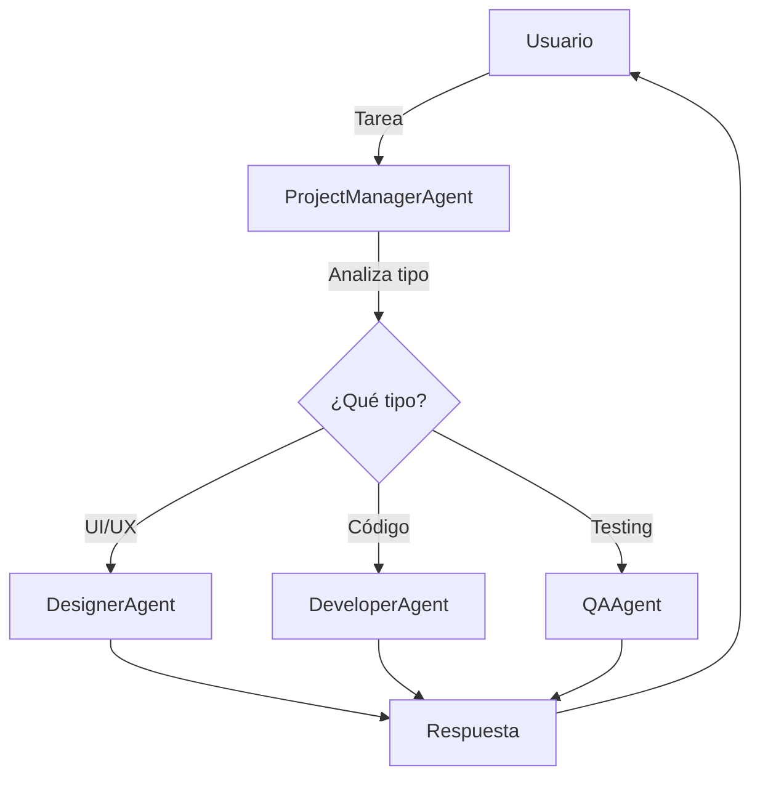

# Lab 03: Workflow de Delegación

**Duración**: 25 minutos  
**Nivel**: Intermedio-Avanzado  
**Objetivo**: Implementar un agente coordinador que ruta tareas a especialistas basado en análisis de contenido

## Descripción

En este lab implementarás un patrón de delegación con un **ProjectManagerAgent** que actúa como coordinador, analizando cada tarea y delegándola al especialista apropiado:

1. **ProjectManagerAgent**: Analiza la tarea y decide quién debe ejecutarla
2. **DesignerAgent**: Maneja tareas de UI/UX y diseño visual
3. **DeveloperAgent**: Maneja tareas de código y arquitectura
4. **QAAgent**: Maneja tareas de testing y calidad



## Prerequisitos

- ✅ .NET 10 SDK instalado
- ✅ Azure OpenAI configurado con modelo `gpt-5.2`
- ✅ Completar Lab 02: Parallel Workflow

## Pasos del Lab

### Paso 1: Crear el Proyecto

```bash
# Navegar a la carpeta del lab
cd docs/modulo-03-workflows/labs/03-delegation

# Restaurar paquetes
dotnet restore
```

### Paso 2: Configurar API Key

```bash
# Inicializar user secrets
dotnet user-secrets init

# Configurar la API key
dotnet user-secrets set "AzureOpenAI:ApiKey" "TU-API-KEY-AQUI"
```

### Paso 3: Configurar Endpoint

Edita `appsettings.json` con tu endpoint de Azure OpenAI:

```json
{
  "AzureOpenAI": {
    "Endpoint": "https://TU-RECURSO.openai.azure.com/",
    "DeploymentName": "gpt-5.2"
  }
}
```

### Paso 4: Revisar la Arquitectura

El proyecto tiene 3 archivos principales:

1. **SpecialistAgents.cs** - Define los 3 agentes especialistas
2. **ProjectManagerAgent.cs** - El coordinador con lógica de routing
3. **Program.cs** - Orquestación y demostración

### Paso 5: Analizar el Código de Routing

Abre `ProjectManagerAgent.cs` y observa:

1. **Función de routing** (líneas 170-180):
   ```csharp
   [KernelFunction("route_task")]
   [Description("Asigna una tarea al especialista apropiado")]
   public string RouteTask(
       [Description("El especialista: 'designer', 'developer', o 'qa'")] string specialist,
       [Description("Razón de la elección")] string reason)
   ```

2. **Heurística de fallback** (líneas 140-165):
   - Si el function calling no funciona, usa keywords
   - Palabras como "diseño", "UI", "wireframe" → Designer
   - Palabras como "test", "prueba", "bug" → QA
   - Default → Developer

3. **Flujo de delegación** (líneas 85-130):
   - PM recibe tarea → Analiza → Llama `route_task` → Invoca especialista

### Paso 6: Ejecutar el Workflow

```bash
dotnet run
```

**Salida esperada**:

```
═══════════════════════════════════════════════════════════════════
         WORKFLOW DE DELEGACIÓN: Project Manager → Especialistas
═══════════════════════════════════════════════════════════════════

Inicializando equipo de trabajo...

✓ ProjectManagerAgent creado - Coordinador del equipo
  └─ DesignerAgent (UI/UX)
  └─ DeveloperAgent (Código)
  └─ QAAgent (Testing)

═══════════════════════════════════════════════════════════════════
                    PROCESANDO TAREAS
═══════════════════════════════════════════════════════════════════

┌─────────────────────────────────────────────────────────────────┐
│ TAREA 1/3                                                        │
└─────────────────────────────────────────────────────────────────┘

📋 PM recibió tarea: "Diseñar la pantalla de login..."

   🔀 Function call: route_task(specialist="designer", reason="Tarea de UI")
🎯 PM decidió delegar a: designer
💭 Razonamiento: Tarea relacionada con diseño de interfaz

📤 Delegando tarea a DesignerAgent...

📥 Respuesta de DesignerAgent:
─────────────────────────────────────────────────────────────────
📐 RECOMENDACIONES DE DISEÑO PARA LOGIN

[Respuesta detallada del DesignerAgent...]

┌─────────────────────────────────────────────────────────────────┐
│ TAREA 2/3                                                        │
└─────────────────────────────────────────────────────────────────┘

📋 PM recibió tarea: "Implementar un endpoint REST..."

   🔀 Function call: route_task(specialist="developer", reason="Tarea de código")
🎯 PM decidió delegar a: developer

📥 Respuesta de DeveloperAgent:
─────────────────────────────────────────────────────────────────
💻 IMPLEMENTACIÓN DE ENDPOINT JWT

[Código y explicación del DeveloperAgent...]

┌─────────────────────────────────────────────────────────────────┐
│ TAREA 3/3                                                        │
└─────────────────────────────────────────────────────────────────┘

📋 PM recibió tarea: "Crear los casos de prueba..."

   🔀 Function call: route_task(specialist="qa", reason="Tarea de testing")
🎯 PM decidió delegar a: qa

📥 Respuesta de QAAgent:
─────────────────────────────────────────────────────────────────
🔍 CASOS DE PRUEBA PARA FLUJO DE LOGIN

[Casos de prueba del QAAgent...]

═══════════════════════════════════════════════════════════════════
                    RESUMEN DE DELEGACIONES
═══════════════════════════════════════════════════════════════════

┌──────────┬────────────────────────────────────────┬─────────────────┐
│ # Tarea  │ Descripción (truncada)                 │ Delegada a      │
├──────────┼────────────────────────────────────────┼─────────────────┤
│ Tarea 1  │ Diseñar la pantalla de login con ca... │ DesignerAgent   │
│ Tarea 2  │ Implementar un endpoint REST para a... │ DeveloperAgent  │
│ Tarea 3  │ Crear los casos de prueba para el f... │ QAAgent         │
└──────────┴────────────────────────────────────────┴─────────────────┘

📊 Distribución de trabajo:
   🎨 DesignerAgent:   1 tarea(s)
   💻 DeveloperAgent:  1 tarea(s)
   🔍 QAAgent:         1 tarea(s)

═══════════════════════════════════════════════════════════════════
                    WORKFLOW COMPLETADO
═══════════════════════════════════════════════════════════════════

✓ ProjectManagerAgent analizó cada tarea y determinó el especialista
✓ Las tareas de diseño fueron delegadas a DesignerAgent
✓ Las tareas de código fueron delegadas a DeveloperAgent
✓ Las tareas de testing fueron delegadas a QAAgent
```

### Paso 7: Validar Resultados

Verifica que:

1. ✅ La tarea de "diseñar pantalla" fue a DesignerAgent
2. ✅ La tarea de "implementar endpoint" fue a DeveloperAgent
3. ✅ La tarea de "casos de prueba" fue a QAAgent
4. ✅ Cada especialista respondió según su área de expertise

## Checkpoint de Validación

**Criterio de éxito**: El ProjectManagerAgent ruta correctamente las tareas al especialista apropiado basado en el contenido.

**Validación del instructor**:
- [ ] La tabla de resumen muestra 3 agentes diferentes
- [ ] Cada tarea fue delegada al especialista correcto
- [ ] Las respuestas de especialistas son relevantes a su área

## Troubleshooting

### "El PM siempre delega al mismo agente"

**Causa**: El function calling no está funcionando correctamente.

**Solución**: El código incluye heurística de fallback. Verifica que:
1. El Kernel tiene el plugin registrado correctamente
2. Las instrucciones del PM mencionan usar `route_task`

### "La función route_task no se llama"

**Causa**: El modelo no está usando function calling.

**Solución**: El código usa heurística de keywords como fallback. Esto es comportamiento esperado si el modelo decide no usar funciones.

### "El especialista incorrecto recibe la tarea"

**Causa**: Keywords ambiguos en la tarea.

**Ejemplo**: "Diseñar los tests de UI" podría ir a Designer o QA.

**Solución**: Esto es esperado en casos ambiguos. En producción, agregarías lógica para manejar conflictos.

## Experimentos Opcionales

Si terminas antes, intenta:

1. **Agregar un cuarto especialista**: Crea un `SecurityAgent` para tareas de seguridad
2. **Tareas ambiguas**: Prueba con "Implementar y probar el login" - ¿quién la recibe?
3. **Modificar heurística**: Ajusta las keywords en `DetermineAgentFromTask()`

## Siguiente Lab

Continúa con [Lab 04: Group Chat](../04-group-chat/) para aprender colaboración multi-agente con AgentGroupChat.
