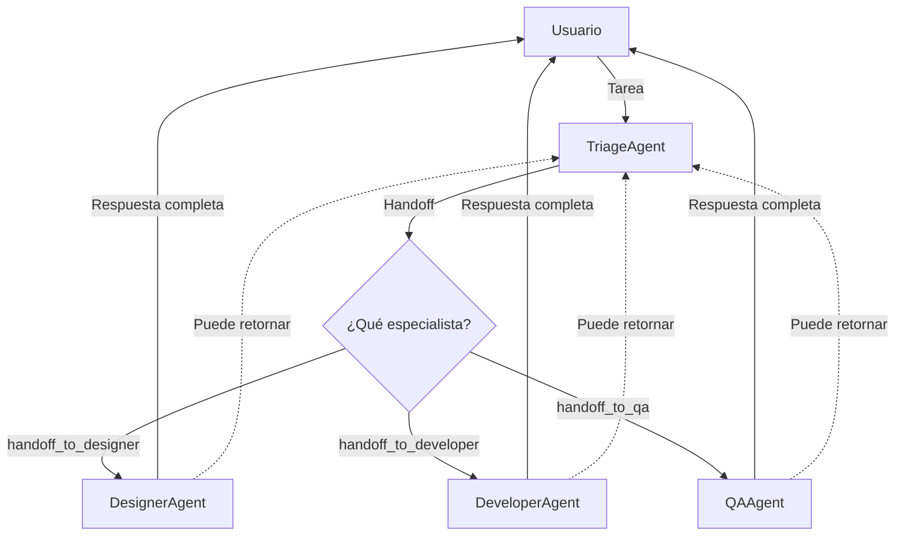

# Lab 03: Workflow de Delegación con Handoff

**Duración**: 25 minutos  
**Nivel**: Intermedio-Avanzado  
**Objetivo**: Implementar un workflow de delegación usando el patrón **Handoff Orchestration** de Microsoft Agent Framework

## Descripción

En este lab implementarás un patrón de **Handoff** (transferencia de control) donde un agente **Triage** analiza las tareas y transfiere el control completo a agentes especialistas:

1. **TriageAgent**: Recibe todas las tareas y decide a qué especialista transferir
2. **DesignerAgent**: Maneja tareas de UI/UX y diseño visual  
3. **DeveloperAgent**: Maneja tareas de código y arquitectura
4. **QAAgent**: Maneja tareas de testing y calidad

### ¿Qué es Handoff Orchestration?

**Handoff** es un patrón de orquestación donde los agentes pueden **transferir el control completo** a otros agentes basándose en el contexto. A diferencia de "Agent-as-Tool" donde un agente principal retiene el control, en Handoff:

- El agente receptor **toma propiedad completa** de la tarea
- No hay autoridad central manejando el workflow
- El contexto completo de la conversación se transfiere al nuevo agente



> 📖 **Referencia**: [Microsoft Agent Framework - Handoff Orchestration](https://learn.microsoft.com/en-us/agent-framework/user-guide/workflows/orchestrations/handoff?pivots=programming-language-csharp)

## Prerequisitos

- ✅ .NET 10 SDK instalado
- ✅ Azure OpenAI configurado con modelo `gpt-5.2`
- ✅ Completar Lab 02: Parallel Workflow

## Pasos del Lab

### Paso 1: Crear el Proyecto

```bash
# Navegar a la carpeta del lab
cd docs/modulo-03-workflows/labs/03-delegation

# Restaurar paquetes
dotnet restore
```

### Paso 2: Configurar API Key

```bash
# Inicializar user secrets
dotnet user-secrets init

# Configurar la API key
dotnet user-secrets set "AzureOpenAI:ApiKey" "TU-API-KEY-AQUI"
```

### Paso 3: Configurar Endpoint

Edita `appsettings.json` con tu endpoint de Azure OpenAI:

```json
{
  "AzureOpenAI": {
    "Endpoint": "https://TU-RECURSO.openai.azure.com/",
    "DeploymentName": "gpt-5.2"
  }
}
```

### Paso 4: Entender la Arquitectura de Handoff

El proyecto implementa el patrón oficial de **Handoff Orchestration** con 4 archivos:

| Archivo | Propósito |
|---------|-----------|
| `SpecialistAgents.cs` | Define los 3 agentes especialistas con `ChatClientAgent` |
| `ProjectManagerAgent.cs` | El agente Triage que decide handoffs |
| `Program.cs` | Configura `AgentWorkflowBuilder.StartHandoffWith()` |
| `appsettings.json` | Configuración de Azure OpenAI |

### Paso 5: Crear los Agentes Especialistas

Abre `SpecialistAgents.cs` y analiza la estructura:

```csharp
// Cada especialista se crea con ChatClientAgent
public static ChatClientAgent CreateDesignerAgent(IChatClient client)
{
    return new ChatClientAgent(
        chatClient: client,
        instructions: """
            Eres un diseñador UI/UX experto. Tu especialidad es:
            - Diseño de interfaces de usuario
            - Wireframes y mockups
            - Sistemas de diseño y accesibilidad
            
            Responde en español con recomendaciones detalladas.
            """,
        name: "designer_agent",
        description: "Especialista en diseño UI/UX"
    );
}
```

**Puntos clave**:
- Usamos `ChatClientAgent` (no `ChatCompletionAgent`)
- Cada agente tiene `name` único y `description` para el routing
- Las instrucciones definen el expertise del agente

### Paso 6: Crear el Agente Triage (Coordinador)

Abre `ProjectManagerAgent.cs` y observa cómo el Triage decide handoffs:

```csharp
// El TriageAgent decide a quién transferir
public static ChatClientAgent CreateTriageAgent(IChatClient client)
{
    return new ChatClientAgent(
        chatClient: client,
        instructions: """
            Eres un coordinador de equipo. Tu ÚNICA responsabilidad es:
            
            1. Analizar la tarea recibida
            2. Decidir qué especialista debe manejarla
            3. SIEMPRE hacer handoff a otro agente - NUNCA respondas tú mismo
            
            📋 CRITERIOS DE HANDOFF:
            - Tareas de diseño, UI, UX, interfaces → handoff_to_designer_agent
            - Tareas de código, APIs, arquitectura → handoff_to_developer_agent  
            - Tareas de testing, QA, pruebas → handoff_to_qa_agent
            
            Antes del handoff, explica brevemente por qué elegiste ese especialista.
            """,
        name: "triage_agent",
        description: "Coordinador que asigna tareas a especialistas"
    );
}
```

**Puntos clave**:
- El Triage **nunca responde directamente** - siempre hace handoff
- Las instrucciones mencionan explícitamente las funciones de handoff
- Proporciona razonamiento antes del handoff

### Paso 7: Configurar las Reglas de Handoff

En `Program.cs`, observa cómo se configura el workflow con `AgentWorkflowBuilder`:

```csharp
// Configurar el workflow de handoff
var workflow = AgentWorkflowBuilder
    .StartHandoffWith(triageAgent)                      // El triage recibe todas las tareas
    .WithHandoffs(triageAgent, [designerAgent, developerAgent, qaAgent])  // Triage → Especialistas
    .WithHandoff(designerAgent, triageAgent)            // Designer puede retornar al triage
    .WithHandoff(developerAgent, triageAgent)           // Developer puede retornar al triage
    .WithHandoff(qaAgent, triageAgent)                  // QA puede retornar al triage
    .Build();
```

**Reglas de Handoff configuradas**:

| Agente | Puede hacer handoff a |
|--------|----------------------|
| `triage_agent` | `designer_agent`, `developer_agent`, `qa_agent` |
| `designer_agent` | `triage_agent` (retorno) |
| `developer_agent` | `triage_agent` (retorno) |
| `qa_agent` | `triage_agent` (retorno) |

### Paso 8: Ejecutar el Workflow

```bash
dotnet run
```

**Interacción de ejemplo**:

```
═══════════════════════════════════════════════════════════════════
    WORKFLOW DE HANDOFF: Triage → Especialistas
═══════════════════════════════════════════════════════════════════

👥 Equipo configurado:
   • triage_agent (Coordinador)
   └─ designer_agent (UI/UX)
   └─ developer_agent (Código)
   └─ qa_agent (Testing)

📋 Reglas de handoff:
   triage → [designer, developer, qa]
   designer → [triage]
   developer → [triage]
   qa → [triage]

═══════════════════════════════════════════════════════════════════

📨 TAREA 1: "Diseñar la pantalla de login con campos de usuario..."

triage_agent: Esta tarea involucra diseño de interfaz de usuario.
              Haré handoff al especialista de diseño.
              🔀 Handoff → designer_agent

designer_agent: 📐 RECOMENDACIONES DE DISEÑO PARA LOGIN

1. **Estructura Visual**:
   - Header con logo centrado
   - Campos de email/contraseña con labels flotantes
   - Botón principal "Iniciar Sesión" (CTA prominente)

2. **Elementos Adicionales**:
   - Link "¿Olvidaste tu contraseña?"
   - Separador "O continúa con"
   - Botones de OAuth (Google, Microsoft, GitHub)

3. **Consideraciones de Accesibilidad**:
   - Contraste mínimo 4.5:1
   - Labels asociados a inputs
   - Focus visible en todos los elementos

═══════════════════════════════════════════════════════════════════

📨 TAREA 2: "Implementar un endpoint REST para autenticación JWT..."

triage_agent: Esta tarea requiere implementación de código y APIs.
              Haré handoff al especialista de desarrollo.
              🔀 Handoff → developer_agent

developer_agent: 💻 IMPLEMENTACIÓN DE ENDPOINT JWT

```csharp
[HttpPost("auth/login")]
public async Task<IActionResult> Login([FromBody] LoginRequest request)
{
    var user = await _userService.ValidateCredentialsAsync(
        request.Email, request.Password);
    
    if (user == null)
        return Unauthorized(new { error = "Credenciales inválidas" });
    
    var token = _jwtService.GenerateToken(user);
    return Ok(new { token, expiresIn = 3600 });
}
```

**Consideraciones de seguridad**: 
- Usar HTTPS
- Rate limiting
- Almacenar passwords con bcrypt

═══════════════════════════════════════════════════════════════════

📨 TAREA 3: "Crear los casos de prueba para el flujo de login..."

triage_agent: Esta tarea es de testing y QA.
              Haré handoff al especialista de calidad.
              🔀 Handoff → qa_agent

qa_agent: 🔍 CASOS DE PRUEBA PARA FLUJO DE LOGIN

| ID | Escenario | Input | Resultado Esperado |
|----|-----------|-------|-------------------|
| TC01 | Login exitoso | email/pass válidos | Token JWT, 200 OK |
| TC02 | Email inválido | formato incorrecto | Error 400, mensaje |
| TC03 | Password incorrecto | pass erróneo | Error 401, sin detalles |
| TC04 | Cuenta bloqueada | 5 intentos fallidos | Error 423, tiempo espera |
| TC05 | Rate limiting | 100 req/min | Error 429, retry-after |

═══════════════════════════════════════════════════════════════════
                    RESUMEN DE HANDOFFS
═══════════════════════════════════════════════════════════════════

┌──────────┬────────────────────────────────┬─────────────────┐
│ Tarea    │ Descripción                    │ Handoff a       │
├──────────┼────────────────────────────────┼─────────────────┤
│ Tarea 1  │ Diseñar la pantalla de login   │ designer_agent  │
│ Tarea 2  │ Implementar endpoint REST JWT  │ developer_agent │
│ Tarea 3  │ Crear casos de prueba login    │ qa_agent        │
└──────────┴────────────────────────────────┴─────────────────┘

✓ Workflow completado con patrón Handoff
```

### Paso 9: Analizar el Flujo de Eventos

El workflow emite eventos que puedes observar:

```csharp
// Procesar eventos del workflow
await foreach (WorkflowEvent evt in run.WatchStreamAsync())
{
    if (evt is AgentRunUpdateEvent e)
    {
        // Muestra qué agente está respondiendo
        Console.WriteLine($"{e.ExecutorId}: {e.Data}");
    }
    else if (evt is WorkflowOutputEvent outputEvt)
    {
        // El workflow terminó
        var messages = (List<ChatMessage>)outputEvt.Data!;
    }
}
```

**Tipos de eventos**:
- `AgentRunUpdateEvent`: Streaming de respuesta de un agente
- `WorkflowOutputEvent`: El workflow completó con mensajes finales
- El handoff ocurre automáticamente cuando el agente llama `handoff_to_*`

### Paso 10: Validar Resultados

Verifica que:

1. ✅ El `triage_agent` recibió cada tarea primero
2. ✅ Cada tarea fue transferida (handoff) al especialista correcto
3. ✅ El especialista proporcionó una respuesta completa
4. ✅ Los eventos muestran el flujo `triage → specialist`

## Checkpoint de Validación

**Criterio de éxito**: El TriageAgent transfiere correctamente el control a especialistas usando el patrón Handoff.

**Validación del instructor**:
- [ ] El workflow usa `AgentWorkflowBuilder.StartHandoffWith()`
- [ ] Las reglas de handoff están configuradas con `.WithHandoffs()`
- [ ] Cada tarea muestra un handoff explícito en los logs
- [ ] Los especialistas responden según su área de expertise

## Conceptos Clave: Handoff vs Agent-as-Tool

| Aspecto | Handoff | Agent-as-Tool |
|---------|---------|---------------|
| **Control** | Se transfiere completamente | El agente principal retiene control |
| **Propiedad** | El receptor es dueño de la tarea | El principal maneja todo |
| **Contexto** | Conversación completa se transfiere | Solo se pasa información relevante |
| **Retorno** | Opcional (puede volver al triage) | Siempre retorna al principal |

## Troubleshooting

### "El triage no hace handoff"

**Causa**: Las instrucciones no mencionan las funciones de handoff.

**Solución**: Verifica que las instrucciones del triage incluyan:
```csharp
"SIEMPRE hacer handoff a otro agente - NUNCA respondas tú mismo"
```

### "Error: handoff_to_X not found"

**Causa**: Las reglas de handoff no están configuradas correctamente.

**Solución**: Verifica que usaste `.WithHandoffs()`:
```csharp
.WithHandoffs(triageAgent, [designerAgent, developerAgent, qaAgent])
```

### "El especialista no responde"

**Causa**: El agente no está registrado en el workflow.

**Solución**: Todos los agentes deben estar en las reglas de handoff.

### "El workflow nunca termina"

**Causa**: Los agentes se pasan control infinitamente.

**Solución**: Asegúrate de que los especialistas no siempre hagan handoff de vuelta al triage.

## Experimentos Opcionales

Si terminas antes, intenta:

1. **Agregar un cuarto especialista**: Crea un `SecurityAgent` para tareas de seguridad
2. **Handoff entre especialistas**: Permite que `developer_agent` haga handoff a `qa_agent` directamente
3. **Conversación multi-turno**: Implementa un loop interactivo donde el usuario puede hacer múltiples preguntas
4. **Human-in-the-loop**: Agrega una función que requiera aprobación humana antes de ejecutarse

## Siguiente Lab

Continúa con [Lab 04: Group Chat](../04-group-chat/) para aprender colaboración multi-agente con AgentGroupChat.
