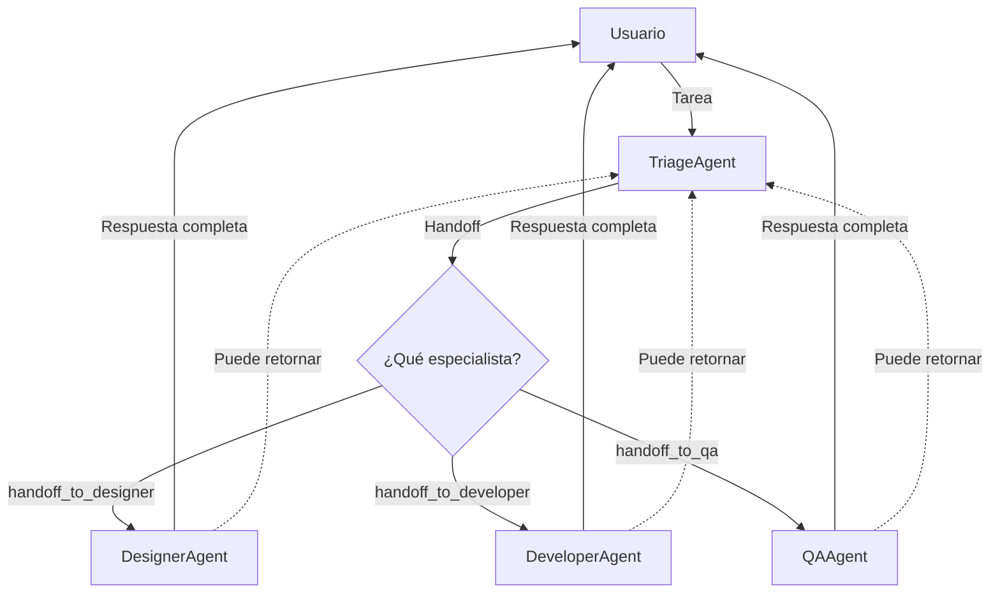

# Lab 03: Workflow de Delegación con Handoff

**Duración**: 25 minutos  
**Nivel**: Intermedio-Avanzado  
**Objetivo**: Implementar un workflow de delegación usando el patrón **Handoff Orchestration** de Microsoft Agent Framework

## Descripción

En este lab implementarás un patrón de **Handoff** (transferencia de control) donde un agente **Triage** analiza las tareas y transfiere el control completo a agentes especialistas:

1. **TriageAgent**: Recibe todas las tareas y decide a qué especialista transferir
2. **DesignerAgent**: Maneja tareas de UI/UX y diseño visual  
3. **DeveloperAgent**: Maneja tareas de código y arquitectura
4. **QAAgent**: Maneja tareas de testing y calidad

### ¿Qué es Handoff Orchestration?

**Handoff** es un patrón de orquestación donde los agentes pueden **transferir el control completo** a otros agentes basándose en el contexto. A diferencia de "Agent-as-Tool" donde un agente principal retiene el control, en Handoff:

- El agente receptor **toma propiedad completa** de la tarea
- No hay autoridad central manejando el workflow
- El contexto completo de la conversación se transfiere al nuevo agente



> 📖 **Referencia**: [Microsoft Agent Framework - Handoff Orchestration](https://learn.microsoft.com/en-us/agent-framework/user-guide/workflows/orchestrations/handoff?pivots=programming-language-csharp)

## Prerequisitos

- ✅ .NET 10 SDK instalado
- ✅ Azure OpenAI configurado con modelo `gpt-5.2`
- ✅ Completar Lab 02: Parallel Workflow

## Pasos del Lab

### Paso 1: Crear el Proyecto

```bash
# Crear carpeta del lab (si no existe)
mkdir -p docs/modulo-03-workflows/labs/03-delegation
cd docs/modulo-03-workflows/labs/03-delegation

# Crear nuevo proyecto de consola
dotnet new console -n DelegationWorkflow -o .

# Agregar paquetes necesarios para Handoff Orchestration
dotnet add package Microsoft.Agents.AI --version 1.0.0-preview.260108.1
dotnet add package Microsoft.Agents.AI.Workflows --version 1.0.0-preview.260108.1
dotnet add package Azure.AI.OpenAI --version 2.1.0
dotnet add package Azure.Identity --version 1.14.0
dotnet add package Microsoft.Extensions.Configuration --version 10.0.0
dotnet add package Microsoft.Extensions.Configuration.Json --version 10.0.0
dotnet add package Microsoft.Extensions.Configuration.UserSecrets --version 10.0.0
```

### Paso 2: Crear appsettings.json

Crea el archivo `appsettings.json` con la configuración de Azure OpenAI:

```json
{
  "AzureOpenAI": {
    "Endpoint": "https://TU-RECURSO.openai.azure.com/",
    "DeploymentName": "gpt-5.2"
  }
}
```

**⚠️ Importante**: Actualiza el `Endpoint` con tu recurso de Azure OpenAI.

### Paso 3: Crear Program.cs - Estructura Inicial

Reemplaza el contenido de `Program.cs` con los usings y la configuración:

```csharp
// =============================================================================
// Program.cs - Workflow de Handoff con Microsoft Agent Framework
// =============================================================================
// Descripción: Este ejemplo implementa el patrón de Handoff Orchestration donde
// un agente Triage transfiere el control completo a agentes especialistas según
// el tipo de trabajo requerido.
//
// Conceptos demostrados:
// - Patrón Handoff Orchestration (transferencia de control)
// - ChatClientAgent para agentes especializados
// - AgentWorkflowBuilder para configurar reglas de handoff
// - Eventos de workflow (AgentRunUpdateEvent, WorkflowOutputEvent)
//
// Referencia: https://learn.microsoft.com/en-us/agent-framework/user-guide/workflows/orchestrations/handoff
// =============================================================================

using Azure.AI.OpenAI;
using Azure.Identity;
using Microsoft.Agents.AI;
using Microsoft.Agents.AI.Workflows;
using Microsoft.Extensions.AI;
using Microsoft.Extensions.Configuration;

// =============================================================================
// PASO 1: Configuración
// =============================================================================

// Cargar configuración desde appsettings.json y user secrets
var configuration = new ConfigurationBuilder()
    .SetBasePath(Directory.GetCurrentDirectory())
    .AddJsonFile("appsettings.json", optional: false)
    .AddUserSecrets<Program>()
    .Build();

// Obtener configuración de Azure OpenAI
var endpoint = configuration["AzureOpenAI:Endpoint"] 
    ?? throw new InvalidOperationException("Falta configuración: AzureOpenAI:Endpoint");
var deploymentName = configuration["AzureOpenAI:DeploymentName"] 
    ?? throw new InvalidOperationException("Falta configuración: AzureOpenAI:DeploymentName");

Console.WriteLine("═══════════════════════════════════════════════════════════════════");
Console.WriteLine("    WORKFLOW DE HANDOFF: Triage → Especialistas");
Console.WriteLine("═══════════════════════════════════════════════════════════════════");
Console.WriteLine();
```

**Puntos clave**:
- Usamos `ConfigurationBuilder` para cargar settings de forma segura
- Los user secrets permiten almacenar credenciales sin incluirlas en el código

### Paso 4: Crear el Cliente de Azure OpenAI

Agrega el código para crear el cliente de chat:

```csharp
// =============================================================================
// PASO 2: Crear el cliente de Azure OpenAI
// =============================================================================

// Crear el cliente de chat usando Azure OpenAI con DefaultAzureCredential
// AsIChatClient() convierte el cliente a la interfaz IChatClient de Extensions.AI
IChatClient chatClient = new AzureOpenAIClient(new Uri(endpoint), new DefaultAzureCredential())
    .GetChatClient(deploymentName)
    .AsIChatClient();

Console.WriteLine("✓ Cliente Azure OpenAI configurado con DefaultAzureCredential");
Console.WriteLine($"  Endpoint: {endpoint}");
Console.WriteLine($"  Modelo: {deploymentName}");
Console.WriteLine();
```

**Puntos clave**:
- `DefaultAzureCredential` usa las credenciales de Azure CLI o Managed Identity
- `AsIChatClient()` convierte a la interfaz estándar de Microsoft.Extensions.AI

### Paso 5: Crear los Agentes Especialistas

Agrega los tres agentes especialistas usando `ChatClientAgent`:

```csharp
// =============================================================================
// PASO 3: Crear los agentes especialistas usando ChatClientAgent
// =============================================================================
// En Handoff Orchestration, usamos ChatClientAgent que permite la transferencia
// de control entre agentes. Cada agente tiene un nombre único y descripción
// que el sistema usa para el routing automático.
// =============================================================================

Console.WriteLine("👥 Creando equipo de agentes especialistas...");
Console.WriteLine();

// Agente especialista en Diseño UI/UX
ChatClientAgent designerAgent = new(
    chatClient: chatClient,
    instructions: """
        Eres un diseñador UI/UX experto. Has recibido esta tarea porque el 
        coordinador determinó que requiere expertise en diseño.

        📐 TU EXPERTISE:
        - Diseño de interfaces de usuario (UI)
        - Experiencia de usuario (UX)
        - Wireframes y mockups
        - Sistemas de diseño
        - Colores, tipografía y espaciado
        - Accesibilidad (WCAG 2.1)
        - Responsive design

        🎯 CÓMO RESPONDER:
        1. Analiza el requerimiento de diseño
        2. Proporciona recomendaciones específicas y actionables
        3. Sugiere un enfoque visual con estructura clara
        4. Incluye consideraciones de accesibilidad
        5. Si es relevante, describe componentes UI específicos

        Responde en español, de forma estructurada y profesional.
        Máximo 200 palabras.
        """,
    name: "designer_agent",
    description: "Especialista en diseño UI/UX, wireframes, mockups y accesibilidad"
);
Console.WriteLine($"  ✓ {designerAgent.Name} (UI/UX)");

// Agente especialista en Desarrollo
ChatClientAgent developerAgent = new(
    chatClient: chatClient,
    instructions: """
        Eres un desarrollador de software senior. Has recibido esta tarea porque
        el coordinador determinó que requiere expertise en desarrollo.

        💻 TU EXPERTISE:
        - Desarrollo en C# y .NET
        - Arquitectura de software (Clean Architecture, DDD)
        - APIs RESTful y GraphQL
        - Patrones de diseño
        - Bases de datos SQL y NoSQL
        - Seguridad (autenticación, autorización)
        - Mejores prácticas de código

        🎯 CÓMO RESPONDER:
        1. Analiza el requerimiento técnico
        2. Proporciona una solución con pseudocódigo o estructura
        3. Explica la arquitectura o patrón sugerido
        4. Incluye consideraciones de seguridad y rendimiento
        5. Menciona dependencias o configuraciones necesarias

        Responde en español, de forma técnica pero clara.
        Máximo 200 palabras.
        """,
    name: "developer_agent",
    description: "Especialista en desarrollo de software, APIs y arquitectura"
);
Console.WriteLine($"  ✓ {developerAgent.Name} (Código)");

// Agente especialista en QA
ChatClientAgent qaAgent = new(
    chatClient: chatClient,
    instructions: """
        Eres un especialista en Quality Assurance (QA). Has recibido esta tarea
        porque el coordinador determinó que requiere expertise en testing.

        🔍 TU EXPERTISE:
        - Testing funcional y no funcional
        - Automatización de pruebas (xUnit, NUnit, Selenium)
        - Casos de prueba y test plans
        - Pruebas de regresión
        - Pruebas de rendimiento y carga
        - Pruebas de seguridad
        - Reporte y seguimiento de bugs

        🎯 CÓMO RESPONDER:
        1. Analiza qué necesita ser probado
        2. Define escenarios de prueba (happy path + edge cases)
        3. Proporciona casos de prueba específicos y detallados
        4. Sugiere herramientas o frameworks apropiados
        5. Incluye criterios de aceptación claros

        Responde en español, de forma estructurada y exhaustiva.
        Máximo 200 palabras.
        """,
    name: "qa_agent",
    description: "Especialista en QA, testing y automatización de pruebas"
);
Console.WriteLine($"  ✓ {qaAgent.Name} (Testing)");
Console.WriteLine();
```

**Puntos clave**:
- `ChatClientAgent` es el tipo de agente requerido para Handoff Orchestration
- Cada agente tiene un `name` único que se usa para identificarlo en el workflow
- El `description` ayuda al sistema a entender las capacidades del agente

### Paso 6: Crear el Agente Triage (Coordinador)

Agrega el agente que coordina los handoffs:

```csharp
// =============================================================================
// PASO 4: Crear el agente Triage (Coordinador)
// =============================================================================
// El Triage es el agente que recibe todas las tareas inicialmente y decide
// a qué especialista transferir el control. En Handoff, el Triage NUNCA
// responde directamente - siempre hace handoff a un especialista.
// =============================================================================

Console.WriteLine("👔 Creando Triage Agent (Coordinador)...");

ChatClientAgent triageAgent = new(
    chatClient: chatClient,
    instructions: """
        Eres un coordinador de equipo técnico. Tu ÚNICA responsabilidad es analizar
        las tareas y hacer handoff al especialista correcto. NUNCA respondas las
        tareas tú mismo - SIEMPRE transfiere el control a un especialista.

        👥 TU EQUIPO DE ESPECIALISTAS:
        
        1. **designer_agent** - Experto en:
           - Diseño de interfaces (UI)
           - Experiencia de usuario (UX)
           - Wireframes y mockups
           - Sistemas de diseño
           - Accesibilidad
           
        2. **developer_agent** - Experto en:
           - Desarrollo de software
           - APIs y endpoints
           - Arquitectura de sistemas
           - Código y algoritmos
           - Bases de datos
           
        3. **qa_agent** - Experto en:
           - Testing y QA
           - Casos de prueba
           - Automatización
           - Control de calidad
           - Validación

        🎯 TU PROCESO:
        1. Lee la tarea cuidadosamente
        2. Identifica el tipo de trabajo requerido
        3. Explica brevemente por qué elegiste ese especialista
        4. Haz handoff usando: handoff_to_designer_agent, handoff_to_developer_agent, o handoff_to_qa_agent

        📋 CRITERIOS DE DECISIÓN:
        - Palabras como "diseño", "pantalla", "interfaz", "UI", "UX", "botón", "color" → designer_agent
        - Palabras como "implementar", "código", "API", "endpoint", "función", "clase" → developer_agent
        - Palabras como "test", "prueba", "validar", "QA", "bug", "caso de prueba" → qa_agent

        ⚠️ IMPORTANTE: SIEMPRE haz handoff - NUNCA intentes resolver la tarea tú mismo.

        Responde en español.
        """,
    name: "triage_agent",
    description: "Coordinador que asigna tareas a especialistas mediante handoff"
);

Console.WriteLine($"  ✓ {triageAgent.Name} (Coordinador)");
Console.WriteLine($"    └─ {designerAgent.Name}");
Console.WriteLine($"    └─ {developerAgent.Name}");
Console.WriteLine($"    └─ {qaAgent.Name}");
Console.WriteLine();
```

**Puntos clave**:
- El Triage **NUNCA** responde directamente - siempre hace handoff
- Las instrucciones mencionan explícitamente los nombres de los agentes (`designer_agent`, etc.)
- El sistema genera automáticamente funciones `handoff_to_[agent_name]` basándose en la configuración

### Paso 7: Configurar el Workflow de Handoff

Configura las reglas de handoff usando `AgentWorkflowBuilder`:

```csharp
// =============================================================================
// PASO 5: Configurar el Workflow de Handoff con AgentWorkflowBuilder
// =============================================================================
// AgentWorkflowBuilder es la API oficial para configurar Handoff Orchestration.
// - CreateHandoffBuilderWith(): Define el agente que inicia el workflow
// - WithHandoffs(): Configura qué agentes pueden recibir handoff desde un agente
// - WithHandoff(): Configura handoff de un agente a otro específico
// =============================================================================

Console.WriteLine("📋 Configurando reglas de handoff...");

var workflow = AgentWorkflowBuilder
    .CreateHandoffBuilderWith(triageAgent)                                  // Agente inicial
    .WithHandoffs(triageAgent, [designerAgent, developerAgent, qaAgent])    // Triage → Especialistas
    .WithHandoff(designerAgent, triageAgent)                                // Designer puede volver a Triage
    .WithHandoff(developerAgent, triageAgent)                               // Developer puede volver a Triage
    .WithHandoff(qaAgent, triageAgent)                                      // QA puede volver a Triage
    .Build();

Console.WriteLine("   triage_agent → [designer_agent, developer_agent, qa_agent]");
Console.WriteLine("   designer_agent → [triage_agent]");
Console.WriteLine("   developer_agent → [triage_agent]");
Console.WriteLine("   qa_agent → [triage_agent]");
Console.WriteLine();
```

**Puntos clave**:
- `CreateHandoffBuilderWith()` define el agente que recibe las tareas inicialmente
- `WithHandoffs()` permite configurar múltiples destinos de handoff desde un agente
- `WithHandoff()` configura un handoff específico de A → B
- Los especialistas pueden volver al Triage si necesitan redireccionar

### Paso 8: Definir las Tareas de Prueba

Agrega las tareas que procesará el workflow:

```csharp
// =============================================================================
// PASO 6: Definir tareas de diferentes tipos
// =============================================================================

var tasks = new[]
{
    // Tarea de diseño
    "Diseñar la pantalla de login con campos de usuario y contraseña, incluir botón de 'Olvidé mi contraseña' y opción de login con redes sociales",
    
    // Tarea de desarrollo
    "Implementar un endpoint REST para autenticación JWT que reciba email y password, valide credenciales contra la base de datos y retorne un token",
    
    // Tarea de QA
    "Crear los casos de prueba para el flujo de login, incluyendo credenciales válidas, inválidas, cuenta bloqueada y rate limiting"
};

Console.WriteLine("═══════════════════════════════════════════════════════════════════");
Console.WriteLine("                    PROCESANDO TAREAS CON HANDOFF");
Console.WriteLine("═══════════════════════════════════════════════════════════════════");
```

### Paso 9: Ejecutar el Workflow con Streaming

Agrega el loop principal que procesa cada tarea:

```csharp
// =============================================================================
// PASO 7: Procesar cada tarea usando el workflow de Handoff
// =============================================================================
// Para cada tarea:
// 1. Creamos un mensaje de usuario
// 2. Ejecutamos el workflow con InProcessExecution.StreamAsync()
// 3. Observamos los eventos del workflow para ver los handoffs
// 4. Capturamos la respuesta del especialista
// =============================================================================

var results = new List<(string Task, string HandoffTo, string Response)>();

for (int i = 0; i < tasks.Length; i++)
{
    Console.WriteLine();
    Console.WriteLine($"┌─────────────────────────────────────────────────────────────────┐");
    Console.WriteLine($"│ TAREA {i + 1}/{tasks.Length}                                                        │");
    Console.WriteLine($"└─────────────────────────────────────────────────────────────────┘");
    Console.WriteLine();
    
    var taskDescription = tasks[i].Length > 60 
        ? tasks[i].Substring(0, 57) + "..." 
        : tasks[i];
    Console.WriteLine($"📨 \"{taskDescription}\"");
    Console.WriteLine();

    // Crear mensajes para esta tarea
    List<ChatMessage> messages = [new ChatMessage(ChatRole.User, tasks[i])];

    string currentAgent = "triage_agent";
    string handoffTo = "";
    string fullResponse = "";
    
    try
    {
        // Ejecutar el workflow con streaming de eventos
        StreamingRun run = await InProcessExecution.StreamAsync(workflow, messages);
        await run.TrySendMessageAsync(new TurnToken(emitEvents: true));

        // Procesar eventos del workflow
        await foreach (WorkflowEvent evt in run.WatchStreamAsync().ConfigureAwait(false))
        {
            if (evt is AgentRunUpdateEvent e)
            {
                // Detectar handoff (cambio de agente)
                if (e.ExecutorId != currentAgent)
                {
                    if (currentAgent == "triage_agent" && !string.IsNullOrEmpty(e.ExecutorId))
                    {
                        handoffTo = e.ExecutorId;
                        Console.WriteLine($"   🔀 Handoff: {currentAgent} → {handoffTo}");
                        Console.WriteLine();
                        Console.Write($"🤖 {handoffTo}: ");
                    }
                    currentAgent = e.ExecutorId ?? currentAgent;
                }
                
                // Mostrar respuesta en streaming (solo del especialista)
                if (!string.IsNullOrEmpty(e.Data?.ToString()) && currentAgent != "triage_agent")
                {
                    Console.Write(e.Data);
                    fullResponse += e.Data;
                }
            }
            else if (evt is WorkflowOutputEvent)
            {
                // El workflow ha terminado
                break;
            }
        }
        Console.WriteLine();
    }
    catch (Exception ex)
    {
        Console.WriteLine($"\n❌ Error: {ex.Message}");
        fullResponse = $"Error: {ex.Message}";
    }
    
    Console.WriteLine();
    
    results.Add((tasks[i], handoffTo, fullResponse));
}
```

**Puntos clave**:
- `InProcessExecution.StreamAsync()` ejecuta el workflow con streaming de eventos
- `TurnToken(emitEvents: true)` habilita la emisión de eventos para observar el progreso
- `AgentRunUpdateEvent` contiene `ExecutorId` (nombre del agente actual) y `Data` (fragmento de respuesta)
- Un cambio en `ExecutorId` indica que ocurrió un **handoff**
- `WorkflowOutputEvent` indica que el workflow terminó

### Paso 10: Mostrar Resumen de Resultados

Agrega el código para mostrar el resumen final:

```csharp
// =============================================================================
// PASO 8: Resumen de Handoffs
// =============================================================================

Console.WriteLine("═══════════════════════════════════════════════════════════════════");
Console.WriteLine("                    RESUMEN DE HANDOFFS");
Console.WriteLine("═══════════════════════════════════════════════════════════════════");
Console.WriteLine();

Console.WriteLine("┌──────────┬────────────────────────────────────────┬─────────────────┐");
Console.WriteLine("│ Tarea    │ Descripción                            │ Handoff a       │");
Console.WriteLine("├──────────┼────────────────────────────────────────┼─────────────────┤");

for (int i = 0; i < results.Count; i++)
{
    var (task, handoff, _) = results[i];
    var truncatedTask = task.Length > 38 ? task.Substring(0, 35) + "..." : task.PadRight(38);
    var handoffDisplay = string.IsNullOrEmpty(handoff) ? "N/A" : handoff;
    Console.WriteLine($"│ Tarea {i + 1}  │ {truncatedTask} │ {handoffDisplay,-15} │");
}

Console.WriteLine("└──────────┴────────────────────────────────────────┴─────────────────┘");
Console.WriteLine();

// Contar handoffs por tipo
var designerCount = results.Count(r => r.HandoffTo.Contains("designer"));
var developerCount = results.Count(r => r.HandoffTo.Contains("developer"));
var qaCount = results.Count(r => r.HandoffTo.Contains("qa"));

Console.WriteLine("📊 Distribución de handoffs:");
Console.WriteLine($"   🎨 designer_agent:    {designerCount} tarea(s)");
Console.WriteLine($"   💻 developer_agent:   {developerCount} tarea(s)");
Console.WriteLine($"   🔍 qa_agent:          {qaCount} tarea(s)");
Console.WriteLine();
```

### Paso 11: Validación Final

Agrega el mensaje de validación al final del programa:

```csharp
// =============================================================================
// PASO 9: Validación del workflow
// =============================================================================

Console.WriteLine("═══════════════════════════════════════════════════════════════════");
Console.WriteLine("                    WORKFLOW COMPLETADO");
Console.WriteLine("═══════════════════════════════════════════════════════════════════");
Console.WriteLine();
Console.WriteLine("✓ Patrón Handoff Orchestration implementado correctamente");
Console.WriteLine("✓ El Triage analizó y transfirió control a especialistas");
Console.WriteLine("✓ Cada especialista procesó su tarea con control completo");
Console.WriteLine("✓ Los eventos del workflow mostraron las transiciones");
Console.WriteLine();
Console.WriteLine("📖 Conceptos demostrados:");
Console.WriteLine("   - Handoff: Transferencia completa de control entre agentes");
Console.WriteLine("   - AgentWorkflowBuilder: Configuración declarativa de handoffs");
Console.WriteLine("   - WorkflowEvents: Observación de transiciones en tiempo real");
Console.WriteLine();
Console.WriteLine("📚 Referencia: https://learn.microsoft.com/en-us/agent-framework/user-guide/workflows/orchestrations/handoff");
Console.WriteLine();
```

### Paso 12: Ejecutar el Workflow

```bash
dotnet run
```

**Salida esperada**:

```
═══════════════════════════════════════════════════════════════════
    WORKFLOW DE HANDOFF: Triage → Especialistas
═══════════════════════════════════════════════════════════════════

✓ Cliente Azure OpenAI configurado con DefaultAzureCredential
  Endpoint: https://tu-recurso.openai.azure.com/
  Modelo: gpt-5.2

👥 Creando equipo de agentes especialistas...

  ✓ designer_agent (UI/UX)
  ✓ developer_agent (Código)
  ✓ qa_agent (Testing)

👔 Creando Triage Agent (Coordinador)...
  ✓ triage_agent (Coordinador)
    └─ designer_agent
    └─ developer_agent
    └─ qa_agent

📋 Configurando reglas de handoff...
   triage_agent → [designer_agent, developer_agent, qa_agent]
   designer_agent → [triage_agent]
   developer_agent → [triage_agent]
   qa_agent → [triage_agent]

═══════════════════════════════════════════════════════════════════
                    PROCESANDO TAREAS CON HANDOFF
═══════════════════════════════════════════════════════════════════

┌─────────────────────────────────────────────────────────────────┐
│ TAREA 1/3                                                        │
└─────────────────────────────────────────────────────────────────┘

📨 "Diseñar la pantalla de login con campos de usuario y contr..."

   🔀 Handoff: triage_agent → designer_agent

🤖 designer_agent: ## Recomendaciones de Diseño para Login

### Estructura Visual
- Header con logo centrado
- Campos de email/contraseña con labels flotantes
- Botón principal "Iniciar Sesión" con color de acento
...

┌─────────────────────────────────────────────────────────────────┐
│ TAREA 2/3                                                        │
└─────────────────────────────────────────────────────────────────┘

📨 "Implementar un endpoint REST para autenticación JWT que re..."

   🔀 Handoff: triage_agent → developer_agent

🤖 developer_agent: ## Implementación de Endpoint JWT

### Estructura del Endpoint
```csharp
[HttpPost("api/auth/login")]
public async Task<IActionResult> Login([FromBody] LoginRequest request)
...

┌─────────────────────────────────────────────────────────────────┐
│ TAREA 3/3                                                        │
└─────────────────────────────────────────────────────────────────┘

📨 "Crear los casos de prueba para el flujo de login, incluyen..."

   🔀 Handoff: triage_agent → qa_agent

🤖 qa_agent: ## Casos de Prueba para Login

| ID | Escenario | Entrada | Resultado Esperado |
|----|-----------|---------|-------------------|
| TC-01 | Login exitoso | Email/password válidos | Token JWT |
...

═══════════════════════════════════════════════════════════════════
                    RESUMEN DE HANDOFFS
═══════════════════════════════════════════════════════════════════

┌──────────┬────────────────────────────────────────┬─────────────────┐
│ Tarea    │ Descripción                            │ Handoff a       │
├──────────┼────────────────────────────────────────┼─────────────────┤
│ Tarea 1  │ Diseñar la pantalla de login con ca... │ designer_agent  │
│ Tarea 2  │ Implementar un endpoint REST para a... │ developer_agent │
│ Tarea 3  │ Crear los casos de prueba para el f... │ qa_agent        │
└──────────┴────────────────────────────────────────┴─────────────────┘

📊 Distribución de handoffs:
   🎨 designer_agent:    1 tarea(s)
   💻 developer_agent:   1 tarea(s)
   🔍 qa_agent:          1 tarea(s)

═══════════════════════════════════════════════════════════════════
                    WORKFLOW COMPLETADO
═══════════════════════════════════════════════════════════════════

✓ Patrón Handoff Orchestration implementado correctamente
✓ El Triage analizó y transfirió control a especialistas
✓ Cada especialista procesó su tarea con control completo
✓ Los eventos del workflow mostraron las transiciones
```

## Checkpoint de Validación

**Criterio de éxito**: El TriageAgent transfiere correctamente el control a especialistas usando el patrón Handoff.

**Validación del instructor**:
- [ ] El proyecto compila sin errores
- [ ] El workflow usa `AgentWorkflowBuilder.CreateHandoffBuilderWith()`
- [ ] Las reglas de handoff están configuradas con `.WithHandoffs()`
- [ ] Cada tarea muestra un handoff explícito (`🔀 Handoff →`)
- [ ] Los especialistas responden según su área de expertise

## Conceptos Clave: Handoff vs Agent-as-Tool

| Aspecto | Handoff | Agent-as-Tool |
|---------|---------|---------------|
| **Control** | Se transfiere completamente | El agente principal retiene control |
| **Propiedad** | El receptor es dueño de la tarea | El principal maneja todo |
| **Contexto** | Conversación completa se transfiere | Solo se pasa información relevante |
| **Retorno** | Opcional (puede volver al triage) | Siempre retorna al principal |

## Resumen de APIs Utilizadas

| API | Descripción |
|-----|-------------|
| `ChatClientAgent` | Tipo de agente requerido para Handoff Orchestration |
| `AgentWorkflowBuilder.CreateHandoffBuilderWith()` | Crea el workflow con el agente inicial |
| `.WithHandoffs(from, [to1, to2, ...])` | Configura múltiples destinos de handoff |
| `.WithHandoff(from, to)` | Configura un handoff específico |
| `InProcessExecution.StreamAsync()` | Ejecuta el workflow con streaming |
| `TurnToken(emitEvents: true)` | Habilita eventos de progreso |
| `AgentRunUpdateEvent` | Evento con fragmentos de respuesta y agente actual |
| `WorkflowOutputEvent` | Evento de finalización del workflow |

## Resumen de Archivos

| Archivo | Propósito |
|---------|-----------|
| `DelegationWorkflow.csproj` | Configuración del proyecto y paquetes NuGet |
| `appsettings.json` | Configuración de Azure OpenAI (endpoint, modelo) |
| `Program.cs` | Workflow completo con agentes y lógica de handoff |

## Troubleshooting

### "El triage no hace handoff"

**Causa**: Las instrucciones no mencionan las funciones de handoff.

**Solución**: Verifica que las instrucciones del triage incluyan:
```csharp
"SIEMPRE hacer handoff a otro agente - NUNCA respondas tú mismo"
```

### "Error: handoff_to_X not found"

**Causa**: Las reglas de handoff no están configuradas correctamente.

**Solución**: Verifica que usaste `.WithHandoffs()`:
```csharp
.WithHandoffs(triageAgent, [designerAgent, developerAgent, qaAgent])
```

### "DefaultAzureCredential authentication failed"

**Causa**: No hay sesión activa de Azure CLI.

**Solución**: 
```bash
az login
```

### "El especialista no responde"

**Causa**: El agente no está registrado en el workflow.

**Solución**: Todos los agentes deben estar en las reglas de handoff.

## Experimentos Opcionales

Si terminas antes, intenta:

1. **Agregar un cuarto especialista**: Crea un `SecurityAgent` para tareas de seguridad
2. **Handoff entre especialistas**: Permite que `developer_agent` haga handoff a `qa_agent` directamente
3. **Conversación multi-turno**: Implementa un loop interactivo donde el usuario puede hacer múltiples preguntas

## Siguiente Lab

Continúa con [Lab 04: Group Chat](../04-group-chat/) para aprender colaboración multi-agente con AgentGroupChat.
