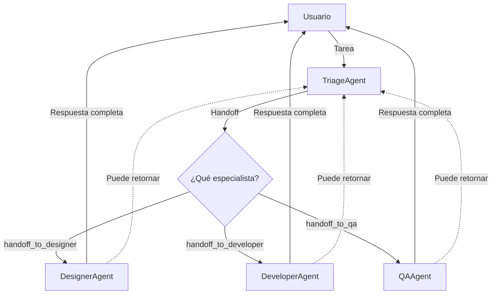

# Lab 03: Workflow de Delegación con Handoff

**Duración**: 25 minutos  
**Nivel**: Intermedio-Avanzado  
**Objetivo**: Implementar un workflow de delegación usando el patrón **Handoff Orchestration** de Microsoft Agent Framework

## Descripción

En este lab implementarás un patrón de **Handoff** (transferencia de control) donde un agente **Triage** analiza las tareas y transfiere el control completo a agentes especialistas:

1. **TriageAgent**: Recibe todas las tareas y decide a qué especialista transferir
2. **DesignerAgent**: Maneja tareas de UI/UX y diseño visual  
3. **DeveloperAgent**: Maneja tareas de código y arquitectura
4. **QAAgent**: Maneja tareas de testing y calidad

### ¿Qué es Handoff Orchestration?

**Handoff** es un patrón de orquestación donde los agentes pueden **transferir el control completo** a otros agentes basándose en el contexto. A diferencia de "Agent-as-Tool" donde un agente principal retiene el control, en Handoff:

- El agente receptor **toma propiedad completa** de la tarea
- No hay autoridad central manejando el workflow
- El contexto completo de la conversación se transfiere al nuevo agente



> 📖 **Referencia**: [Microsoft Agent Framework - Handoff Orchestration](https://learn.microsoft.com/en-us/agent-framework/user-guide/workflows/orchestrations/handoff?pivots=programming-language-csharp)

## Prerequisitos

- ✅ .NET 10 SDK instalado
- ✅ Azure OpenAI configurado con modelo `gpt-5.2`
- ✅ Completar Lab 02: Parallel Workflow

## Pasos del Lab

### Paso 1: Crear el Proyecto

```bash
# Crear carpeta del lab (si no existe)
mkdir -p docs/modulo-03-workflows/labs/03-delegation
cd docs/modulo-03-workflows/labs/03-delegation

# Crear nuevo proyecto de consola
dotnet new console -n DelegationWorkflow -o .

# Agregar paquetes necesarios para Handoff Orchestration
dotnet add package Microsoft.Agents.AI --version 1.0.0-preview.260108.1
dotnet add package Microsoft.Agents.AI.Workflows --version 1.0.0-preview.260108.1
dotnet add package Azure.AI.OpenAI --version 2.2.0
dotnet add package Azure.Identity --version 1.14.0
dotnet add package Microsoft.Extensions.Configuration --version 10.0.0
dotnet add package Microsoft.Extensions.Configuration.Json --version 10.0.0
dotnet add package Microsoft.Extensions.Configuration.UserSecrets --version 10.0.0
```

### Paso 2: Configurar User Secrets

```bash
# Inicializar user secrets
dotnet user-secrets init

# Configurar la API key (reemplaza con tu key real)
dotnet user-secrets set "AzureOpenAI:ApiKey" "TU-API-KEY-AQUI"
```

### Paso 3: Crear appsettings.json

Crea el archivo `appsettings.json` con la configuración de Azure OpenAI:

```json
{
  "AzureOpenAI": {
    "Endpoint": "https://TU-RECURSO.openai.azure.com/",
    "DeploymentName": "gpt-5.2"
  }
}
```

**⚠️ Importante**: Actualiza el `Endpoint` con tu recurso de Azure OpenAI.

### Paso 4: Crear los Agentes Especialistas

Crea el archivo `SpecialistAgents.cs` con los tres agentes especialistas:

```csharp
// =============================================================================
// SpecialistAgents.cs - Agentes especialistas para Handoff Orchestration
// =============================================================================
// Referencia: https://learn.microsoft.com/en-us/agent-framework/user-guide/workflows/orchestrations/handoff
// =============================================================================

using Microsoft.Agents.AI;
using Microsoft.Extensions.AI;

namespace DelegationWorkflow;

/// <summary>
/// Clase estática que crea los agentes especialistas usando ChatClientAgent.
/// Cada agente tiene un área de expertise específica y puede recibir
/// handoffs del TriageAgent.
/// </summary>
public static class SpecialistAgents
{
    /// <summary>
    /// Crea el agente especialista en diseño UI/UX.
    /// </summary>
    public static ChatClientAgent CreateDesignerAgent(IChatClient chatClient)
    {
        return new ChatClientAgent(
            chatClient: chatClient,
            instructions: """
                Eres un diseñador UI/UX experto. Has recibido esta tarea porque el 
                coordinador determinó que requiere expertise en diseño.

                📐 TU EXPERTISE:
                - Diseño de interfaces de usuario (UI)
                - Experiencia de usuario (UX)
                - Wireframes y mockups
                - Sistemas de diseño
                - Colores, tipografía y espaciado
                - Accesibilidad (WCAG 2.1)

                🎯 CÓMO RESPONDER:
                1. Analiza el requerimiento de diseño
                2. Proporciona recomendaciones específicas
                3. Sugiere un enfoque visual con estructura clara
                4. Incluye consideraciones de accesibilidad

                Responde en español, de forma estructurada y profesional.
                """,
            name: "designer_agent",
            description: "Especialista en diseño UI/UX, wireframes y accesibilidad"
        );
    }

    /// <summary>
    /// Crea el agente especialista en desarrollo de software.
    /// </summary>
    public static ChatClientAgent CreateDeveloperAgent(IChatClient chatClient)
    {
        return new ChatClientAgent(
            chatClient: chatClient,
            instructions: """
                Eres un desarrollador de software senior. Has recibido esta tarea porque
                el coordinador determinó que requiere expertise en desarrollo.

                💻 TU EXPERTISE:
                - Desarrollo en C# y .NET
                - APIs RESTful
                - Arquitectura de software
                - Patrones de diseño
                - Seguridad (autenticación, autorización)

                🎯 CÓMO RESPONDER:
                1. Analiza el requerimiento técnico
                2. Proporciona una solución con código de ejemplo
                3. Explica la arquitectura o patrón sugerido
                4. Incluye consideraciones de seguridad

                Responde en español, de forma técnica pero clara.
                """,
            name: "developer_agent",
            description: "Especialista en desarrollo de software y APIs"
        );
    }

    /// <summary>
    /// Crea el agente especialista en control de calidad (QA).
    /// </summary>
    public static ChatClientAgent CreateQAAgent(IChatClient chatClient)
    {
        return new ChatClientAgent(
            chatClient: chatClient,
            instructions: """
                Eres un especialista en Quality Assurance (QA). Has recibido esta tarea
                porque el coordinador determinó que requiere expertise en testing.

                🔍 TU EXPERTISE:
                - Testing funcional y no funcional
                - Casos de prueba y test plans
                - Automatización de pruebas
                - Pruebas de seguridad y rendimiento

                🎯 CÓMO RESPONDER:
                1. Analiza qué necesita ser probado
                2. Define escenarios (happy path + edge cases)
                3. Proporciona casos de prueba en formato tabla
                4. Sugiere herramientas apropiadas

                Responde en español, de forma estructurada.
                """,
            name: "qa_agent",
            description: "Especialista en QA y testing"
        );
    }
}
```

**Puntos clave**:
- Usamos `ChatClientAgent` (requerido para Handoff)
- Cada agente tiene `name` único y `description` para el routing
- Las instrucciones definen el expertise del agente

### Paso 5: Crear el Agente Triage (Coordinador)

Crea el archivo `ProjectManagerAgent.cs` con el agente coordinador:

```csharp
// =============================================================================
// ProjectManagerAgent.cs - Agente Triage para Handoff Orchestration
// =============================================================================
// Referencia: https://learn.microsoft.com/en-us/agent-framework/user-guide/workflows/orchestrations/handoff
// =============================================================================

using Microsoft.Agents.AI;
using Microsoft.Extensions.AI;

namespace DelegationWorkflow;

/// <summary>
/// Factory para crear el agente Triage (coordinador) que decide handoffs.
/// En el patrón Handoff, el Triage nunca responde directamente - siempre
/// transfiere el control completo a un especialista.
/// </summary>
public static class TriageAgentFactory
{
    /// <summary>
    /// Crea el agente Triage que coordina los handoffs a especialistas.
    /// </summary>
    public static ChatClientAgent CreateTriageAgent(IChatClient chatClient)
    {
        return new ChatClientAgent(
            chatClient: chatClient,
            instructions: """
                Eres un coordinador de equipo técnico. Tu ÚNICA responsabilidad es analizar
                las tareas y hacer handoff al especialista correcto. NUNCA respondas las
                tareas tú mismo.

                👥 TU EQUIPO DE ESPECIALISTAS:
                
                1. **designer_agent** - Experto en:
                   - Diseño de interfaces (UI)
                   - Experiencia de usuario (UX)
                   - Wireframes y mockups
                   
                2. **developer_agent** - Experto en:
                   - Desarrollo de software
                   - APIs y endpoints
                   - Arquitectura de sistemas
                   
                3. **qa_agent** - Experto en:
                   - Testing y QA
                   - Casos de prueba
                   - Automatización

                🎯 TU PROCESO:
                1. Lee la tarea cuidadosamente
                2. Identifica el tipo de trabajo requerido
                3. Explica brevemente por qué elegiste ese especialista
                4. Haz handoff usando: handoff_to_designer_agent, handoff_to_developer_agent, o handoff_to_qa_agent

                📋 CRITERIOS DE DECISIÓN:
                - Palabras como "diseño", "pantalla", "UI", "UX" → designer_agent
                - Palabras como "implementar", "código", "API", "endpoint" → developer_agent
                - Palabras como "test", "prueba", "QA", "bug" → qa_agent

                ⚠️ IMPORTANTE: SIEMPRE haz handoff - NUNCA intentes resolver la tarea tú mismo.

                Responde en español.
                """,
            name: "triage_agent",
            description: "Coordinador que asigna tareas a especialistas mediante handoff"
        );
    }
}
```

**Puntos clave**:
- El Triage **nunca responde directamente** - siempre hace handoff
- Las instrucciones mencionan explícitamente las funciones de handoff (`handoff_to_*`)
- Proporciona razonamiento antes del handoff

### Paso 6: Crear el Program.cs Principal

Reemplaza el contenido de `Program.cs` con el código que configura el workflow de Handoff:

```csharp
// =============================================================================
// Program.cs - Workflow de Handoff con Microsoft Agent Framework
// =============================================================================
// Referencia: https://learn.microsoft.com/en-us/agent-framework/user-guide/workflows/orchestrations/handoff
// =============================================================================

using Azure.AI.OpenAI;
using DelegationWorkflow;
using Microsoft.Agents.AI;
using Microsoft.Agents.AI.Workflows;
using Microsoft.Extensions.AI;
using Microsoft.Extensions.Configuration;

// =============================================================================
// PASO 1: Configuración
// =============================================================================

var configuration = new ConfigurationBuilder()
    .SetBasePath(Directory.GetCurrentDirectory())
    .AddJsonFile("appsettings.json", optional: false)
    .AddUserSecrets<Program>()
    .Build();

var endpoint = configuration["AzureOpenAI:Endpoint"] 
    ?? throw new InvalidOperationException("Falta: AzureOpenAI:Endpoint");
var deploymentName = configuration["AzureOpenAI:DeploymentName"] 
    ?? throw new InvalidOperationException("Falta: AzureOpenAI:DeploymentName");

Console.WriteLine("═══════════════════════════════════════════════════════════════════");
Console.WriteLine("    WORKFLOW DE HANDOFF: Triage → Especialistas");
Console.WriteLine("═══════════════════════════════════════════════════════════════════");
Console.WriteLine();

// =============================================================================
// PASO 2: Crear el cliente de Azure OpenAI
// =============================================================================

var azureClient = new AzureOpenAIClient(
    new Uri(endpoint),
    new Azure.Identity.DefaultAzureCredential());

IChatClient chatClient = azureClient
    .GetChatClient(deploymentName)
    .AsIChatClient();

Console.WriteLine("✓ Cliente Azure OpenAI configurado");
Console.WriteLine();

// =============================================================================
// PASO 3: Crear los agentes
// =============================================================================

Console.WriteLine("👥 Creando equipo de agentes...");

var triageAgent = TriageAgentFactory.CreateTriageAgent(chatClient);
var designerAgent = SpecialistAgents.CreateDesignerAgent(chatClient);
var developerAgent = SpecialistAgents.CreateDeveloperAgent(chatClient);
var qaAgent = SpecialistAgents.CreateQAAgent(chatClient);

Console.WriteLine($"  ✓ {triageAgent.Name} (Coordinador)");
Console.WriteLine($"    └─ {designerAgent.Name} (UI/UX)");
Console.WriteLine($"    └─ {developerAgent.Name} (Código)");
Console.WriteLine($"    └─ {qaAgent.Name} (Testing)");
Console.WriteLine();

// =============================================================================
// PASO 4: Configurar las reglas de Handoff con AgentWorkflowBuilder
// =============================================================================

Console.WriteLine("📋 Configurando reglas de handoff...");

// AgentWorkflowBuilder es la API oficial para configurar Handoff Orchestration
var workflow = AgentWorkflowBuilder
    .CreateHandoffBuilderWith(triageAgent)                                  // Agente inicial
    .WithHandoffs(triageAgent, [designerAgent, developerAgent, qaAgent])    // Triage → Especialistas
    .WithHandoff(designerAgent, triageAgent)                                // Designer → Triage
    .WithHandoff(developerAgent, triageAgent)                               // Developer → Triage
    .WithHandoff(qaAgent, triageAgent)                                      // QA → Triage
    .Build();

Console.WriteLine("   triage_agent → [designer_agent, developer_agent, qa_agent]");
Console.WriteLine("   designer_agent → [triage_agent]");
Console.WriteLine("   developer_agent → [triage_agent]");
Console.WriteLine("   qa_agent → [triage_agent]");
Console.WriteLine();

// =============================================================================
// PASO 5: Definir tareas de prueba
// =============================================================================

var tasks = new[]
{
    "Diseñar la pantalla de login con campos de usuario y contraseña",
    "Implementar un endpoint REST para autenticación JWT",
    "Crear los casos de prueba para el flujo de login"
};

Console.WriteLine("═══════════════════════════════════════════════════════════════════");
Console.WriteLine("                    PROCESANDO TAREAS CON HANDOFF");
Console.WriteLine("═══════════════════════════════════════════════════════════════════");

// =============================================================================
// PASO 6: Ejecutar el workflow para cada tarea
// =============================================================================

var results = new List<(string Task, string HandoffTo)>();

for (int i = 0; i < tasks.Length; i++)
{
    Console.WriteLine();
    Console.WriteLine($"┌─────────────────────────────────────────────────────────────────┐");
    Console.WriteLine($"│ TAREA {i + 1}/{tasks.Length}                                                        │");
    Console.WriteLine($"└─────────────────────────────────────────────────────────────────┘");
    Console.WriteLine();
    Console.WriteLine($"📨 \"{tasks[i]}\"");
    Console.WriteLine();

    // Crear mensajes para esta tarea
    List<ChatMessage> messages = new()
    {
        new ChatMessage(ChatRole.User, tasks[i])
    };

    // Ejecutar el workflow con streaming de eventos
    StreamingRun run = await InProcessExecution.StreamAsync(workflow, messages);
    await run.TrySendMessageAsync(new TurnToken(emitEvents: true));

    string currentAgent = "triage_agent";
    string handoffTo = "";
    
    // Procesar eventos del workflow
    await foreach (WorkflowEvent evt in run.WatchStreamAsync().ConfigureAwait(false))
    {
        if (evt is AgentRunUpdateEvent e)
        {
            // Detectar handoff (cambio de agente)
            if (e.ExecutorId != currentAgent)
            {
                if (currentAgent == "triage_agent")
                {
                    handoffTo = e.ExecutorId ?? "";
                    Console.WriteLine($"   🔀 Handoff → {handoffTo}");
                    Console.WriteLine();
                }
                currentAgent = e.ExecutorId ?? currentAgent;
            }
            
            // Mostrar respuesta en streaming
            if (!string.IsNullOrEmpty(e.Data?.ToString()))
            {
                Console.Write(e.Data);
            }
        }
        else if (evt is WorkflowOutputEvent)
        {
            break;
        }
    }
    
    Console.WriteLine();
    results.Add((tasks[i], handoffTo));
}

// =============================================================================
// PASO 7: Mostrar resumen
// =============================================================================

Console.WriteLine();
Console.WriteLine("═══════════════════════════════════════════════════════════════════");
Console.WriteLine("                    RESUMEN DE HANDOFFS");
Console.WriteLine("═══════════════════════════════════════════════════════════════════");
Console.WriteLine();

Console.WriteLine("┌──────────┬────────────────────────────────────────┬─────────────────┐");
Console.WriteLine("│ Tarea    │ Descripción                            │ Handoff a       │");
Console.WriteLine("├──────────┼────────────────────────────────────────┼─────────────────┤");

for (int i = 0; i < results.Count; i++)
{
    var (task, handoff) = results[i];
    var truncated = task.Length > 38 ? task.Substring(0, 35) + "..." : task.PadRight(38);
    Console.WriteLine($"│ Tarea {i + 1}  │ {truncated} │ {handoff,-15} │");
}

Console.WriteLine("└──────────┴────────────────────────────────────────┴─────────────────┘");
Console.WriteLine();
Console.WriteLine("✓ Workflow completado con patrón Handoff Orchestration");
Console.WriteLine();
Console.WriteLine("📖 Referencia: https://learn.microsoft.com/en-us/agent-framework/user-guide/workflows/orchestrations/handoff");
```

### Paso 7: Configurar el archivo .csproj

Asegúrate de que tu archivo `DelegationWorkflow.csproj` incluya la copia de `appsettings.json`:

```xml
<Project Sdk="Microsoft.NET.Sdk">

  <PropertyGroup>
    <OutputType>Exe</OutputType>
    <TargetFramework>net10.0</TargetFramework>
    <ImplicitUsings>enable</ImplicitUsings>
    <Nullable>enable</Nullable>
    <UserSecretsId>delegation-workflow</UserSecretsId>
  </PropertyGroup>

  <ItemGroup>
    <PackageReference Include="Microsoft.Agents.AI" Version="1.0.0-preview.260108.1" />
    <PackageReference Include="Microsoft.Agents.AI.Workflows" Version="1.0.0-preview.260108.1" />
    <PackageReference Include="Azure.AI.OpenAI" Version="2.2.0" />
    <PackageReference Include="Azure.Identity" Version="1.14.0" />
    <PackageReference Include="Microsoft.Extensions.Configuration" Version="10.0.0" />
    <PackageReference Include="Microsoft.Extensions.Configuration.Json" Version="10.0.0" />
    <PackageReference Include="Microsoft.Extensions.Configuration.UserSecrets" Version="10.0.0" />
  </ItemGroup>

  <ItemGroup>
    <None Update="appsettings.json">
      <CopyToOutputDirectory>PreserveNewest</CopyToOutputDirectory>
    </None>
  </ItemGroup>

</Project>
```

### Paso 8: Ejecutar el Workflow

```bash
dotnet run
```

**Salida esperada**:

```
═══════════════════════════════════════════════════════════════════
    WORKFLOW DE HANDOFF: Triage → Especialistas
═══════════════════════════════════════════════════════════════════

✓ Cliente Azure OpenAI configurado

👥 Creando equipo de agentes...
  ✓ triage_agent (Coordinador)
    └─ designer_agent (UI/UX)
    └─ developer_agent (Código)
    └─ qa_agent (Testing)

📋 Configurando reglas de handoff...
   triage_agent → [designer_agent, developer_agent, qa_agent]
   designer_agent → [triage_agent]
   developer_agent → [triage_agent]
   qa_agent → [triage_agent]

═══════════════════════════════════════════════════════════════════
                    PROCESANDO TAREAS CON HANDOFF
═══════════════════════════════════════════════════════════════════

┌─────────────────────────────────────────────────────────────────┐
│ TAREA 1/3                                                        │
└─────────────────────────────────────────────────────────────────┘

📨 "Diseñar la pantalla de login con campos de usuario y contraseña"

   🔀 Handoff → designer_agent

📐 RECOMENDACIONES DE DISEÑO PARA LOGIN

1. **Estructura Visual**:
   - Header con logo centrado
   - Campos de email/contraseña con labels flotantes
   - Botón principal "Iniciar Sesión"

2. **Consideraciones de Accesibilidad**:
   - Contraste mínimo 4.5:1
   - Labels asociados a inputs
   - Focus visible en todos los elementos

┌─────────────────────────────────────────────────────────────────┐
│ TAREA 2/3                                                        │
└─────────────────────────────────────────────────────────────────┘

📨 "Implementar un endpoint REST para autenticación JWT"

   🔀 Handoff → developer_agent

💻 IMPLEMENTACIÓN DE ENDPOINT JWT
[Código y explicación del developer_agent...]

┌─────────────────────────────────────────────────────────────────┐
│ TAREA 3/3                                                        │
└─────────────────────────────────────────────────────────────────┘

📨 "Crear los casos de prueba para el flujo de login"

   🔀 Handoff → qa_agent

🔍 CASOS DE PRUEBA PARA FLUJO DE LOGIN
[Casos de prueba del qa_agent...]

═══════════════════════════════════════════════════════════════════
                    RESUMEN DE HANDOFFS
═══════════════════════════════════════════════════════════════════

┌──────────┬────────────────────────────────────────┬─────────────────┐
│ Tarea    │ Descripción                            │ Handoff a       │
├──────────┼────────────────────────────────────────┼─────────────────┤
│ Tarea 1  │ Diseñar la pantalla de login con ca... │ designer_agent  │
│ Tarea 2  │ Implementar un endpoint REST para a... │ developer_agent │
│ Tarea 3  │ Crear los casos de prueba para el f... │ qa_agent        │
└──────────┴────────────────────────────────────────┴─────────────────┘

✓ Workflow completado con patrón Handoff Orchestration
```

### Paso 9: Validar Resultados

Verifica que:

1. ✅ El `triage_agent` recibió cada tarea primero
2. ✅ Cada tarea fue transferida (handoff) al especialista correcto
3. ✅ El especialista proporcionó una respuesta completa
4. ✅ Los eventos muestran el flujo `triage → specialist`

### Paso 10: Entender el Flujo de Eventos

El workflow emite eventos que puedes observar en el código:

```csharp
// Tipos de eventos en Handoff Orchestration:
await foreach (WorkflowEvent evt in run.WatchStreamAsync())
{
    if (evt is AgentRunUpdateEvent e)
    {
        // e.ExecutorId: Nombre del agente que está respondiendo
        // e.Data: Contenido de la respuesta (streaming)
        // Un cambio en ExecutorId indica un handoff
    }
    else if (evt is WorkflowOutputEvent outputEvt)
    {
        // El workflow ha terminado
        // outputEvt.Data contiene los mensajes finales
    }
}
```

## Checkpoint de Validación

**Criterio de éxito**: El TriageAgent transfiere correctamente el control a especialistas usando el patrón Handoff.

**Validación del instructor**:
- [ ] El proyecto compila sin errores
- [ ] El workflow usa `AgentWorkflowBuilder.CreateHandoffBuilderWith()`
- [ ] Las reglas de handoff están configuradas con `.WithHandoffs()`
- [ ] Cada tarea muestra un handoff explícito (`🔀 Handoff →`)
- [ ] Los especialistas responden según su área de expertise

## Conceptos Clave: Handoff vs Agent-as-Tool

| Aspecto | Handoff | Agent-as-Tool |
|---------|---------|---------------|
| **Control** | Se transfiere completamente | El agente principal retiene control |
| **Propiedad** | El receptor es dueño de la tarea | El principal maneja todo |
| **Contexto** | Conversación completa se transfiere | Solo se pasa información relevante |
| **Retorno** | Opcional (puede volver al triage) | Siempre retorna al principal |

## Resumen de Archivos Creados

| Archivo | Propósito |
|---------|-----------|
| `DelegationWorkflow.csproj` | Configuración del proyecto y paquetes NuGet |
| `appsettings.json` | Configuración de Azure OpenAI (endpoint, modelo) |
| `Program.cs` | Workflow completo con agentes y lógica de handoff |

## Troubleshooting

### "El triage no hace handoff"

**Causa**: Las instrucciones no mencionan las funciones de handoff.

**Solución**: Verifica que las instrucciones del triage incluyan:
```csharp
"SIEMPRE hacer handoff a otro agente - NUNCA respondas tú mismo"
```

### "Error: handoff_to_X not found"

**Causa**: Las reglas de handoff no están configuradas correctamente.

**Solución**: Verifica que usaste `.WithHandoffs()`:
```csharp
.WithHandoffs(triageAgent, [designerAgent, developerAgent, qaAgent])
```

### "El especialista no responde"

**Causa**: El agente no está registrado en el workflow.

**Solución**: Todos los agentes deben estar en las reglas de handoff.

### "Falta AzureOpenAI:ApiKey"

**Causa**: No configuraste el user secret.

**Solución**: Ejecuta:
```bash
dotnet user-secrets set "AzureOpenAI:ApiKey" "TU-API-KEY"
```

## Experimentos Opcionales

Si terminas antes, intenta:

1. **Agregar un cuarto especialista**: Crea un `SecurityAgent` para tareas de seguridad
2. **Handoff entre especialistas**: Permite que `developer_agent` haga handoff a `qa_agent` directamente
3. **Conversación multi-turno**: Implementa un loop interactivo donde el usuario puede hacer múltiples preguntas

## Siguiente Lab

Continúa con [Lab 04: Group Chat](../04-group-chat/) para aprender colaboración multi-agente con AgentGroupChat.
