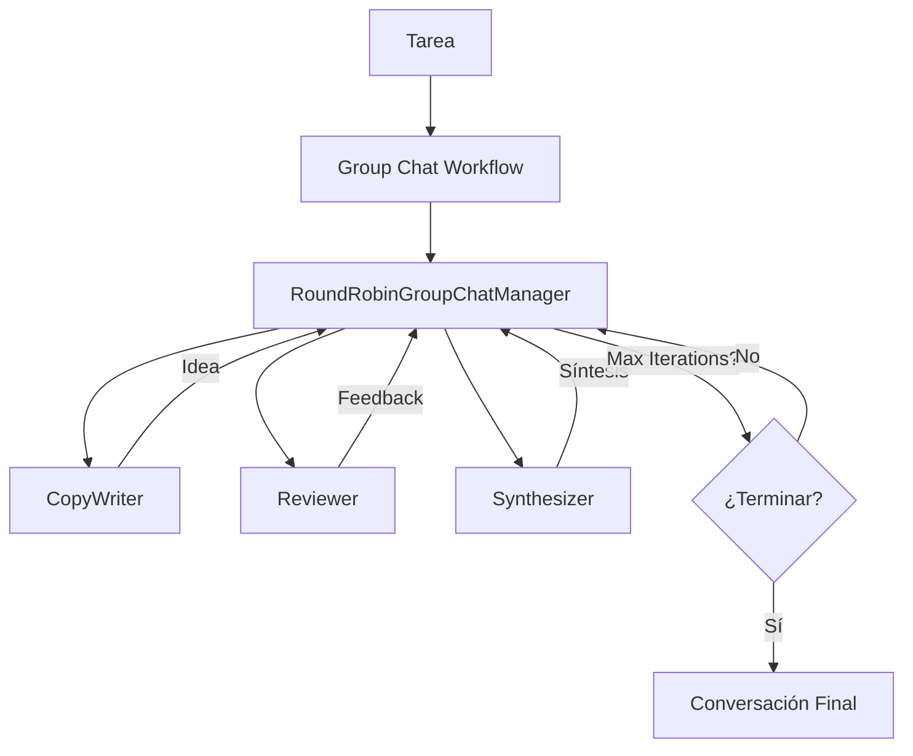

# Lab 04: Group Chat

**Duración**: 30 minutos  
**Nivel**: Avanzado  
**Objetivo**: Implementar AgentGroupChat con múltiples agentes colaborando y estrategias de terminación

## Descripción

En este lab implementarás un **Group Chat Workflow** usando **AgentWorkflowBuilder** donde 3 agentes colaboran para resolver un problema:

1. **CopyWriter**: Genera ideas creativas (slogan, copy)
2. **Reviewer**: Evalúa y cuestiona constructivamente
3. **Synthesizer**: Combina ideas y busca consenso

El workflow usa **RoundRobinGroupChatManager** para coordinar los turnos y **MaximumIterationCount** para controlar la terminación.



## Prerequisitos

- ✅ .NET 10 SDK instalado
- ✅ Azure OpenAI configurado con modelo `gpt-5.2`
- ✅ Completar Lab 03: Delegation Workflow

## Pasos del Lab

### Paso 1: Crear el Proyecto

```bash
# Navegar a la carpeta del lab
cd docs/modulo-03-workflows/labs/04-group-chat

# Restaurar paquetes
dotnet restore
```

### Paso 2: Autenticación con Azure CLI

Este lab usa **Azure CLI authentication** en lugar de API keys:

```bash
# Verificar que estás autenticado con Azure CLI
az login

# Verificar tu suscripción actual
az account show
```

### Paso 3: Configurar Endpoint

Edita `appsettings.json` con tu endpoint de Azure OpenAI:

```json
{
  "AzureOpenAI": {
    "Endpoint": "https://TU-RECURSO.openai.azure.com/",
    "DeploymentName": "gpt-5.2"
  }
}
```

### Paso 4: Crear el Código del Group Chat Workflow

Abre `Program.cs` y sigue estos pasos para crear el workflow desde cero:

#### **Paso 4.1: Agregar los using directives**

Al inicio del archivo, agrega las referencias necesarias:

```csharp
using Azure.AI.OpenAI;
using Azure.Identity;
using Microsoft.Agents.AI;
using Microsoft.Agents.AI.Workflows;
using Microsoft.Extensions.AI;
using Microsoft.Extensions.Configuration;
```

💡 **¿Por qué?** Necesitamos Azure OpenAI para el cliente, Azure Identity para autenticación, Agents.AI para los agentes, Workflows para el group chat, y Extensions.AI para `AsIChatClient()`.

---

#### **Paso 4.2: Cargar la configuración**

Carga el endpoint y deployment desde `appsettings.json`:

```csharp
var configuration = new ConfigurationBuilder()
    .SetBasePath(Directory.GetCurrentDirectory())
    .AddJsonFile("appsettings.json", optional: false)
    .AddUserSecrets<Program>()
    .Build();

var endpoint = configuration["AzureOpenAI:Endpoint"] 
    ?? throw new InvalidOperationException("Falta configuración: AzureOpenAI:Endpoint");
var deploymentName = configuration["AzureOpenAI:DeploymentName"] 
    ?? throw new InvalidOperationException("Falta configuración: AzureOpenAI:DeploymentName");
```

💡 **¿Por qué?** Separamos la configuración del código para facilitar cambios entre ambientes.

---

#### **Paso 4.3: Crear el cliente de Azure OpenAI**

Configura la autenticación con Azure CLI:

```csharp
var chatClient = new AzureOpenAIClient(new Uri(endpoint), new AzureCliCredential())
    .GetChatClient(deploymentName)
    .AsIChatClient();

Console.WriteLine("═══════════════════════════════════════════════════════════════════");
Console.WriteLine("         GROUP CHAT: Brainstorm ↔ Critic ↔ Synthesizer");
Console.WriteLine("═══════════════════════════════════════════════════════════════════");
Console.WriteLine();
```

💡 **¿Por qué?** 
- `AzureCliCredential()` usa tu sesión de `az login` (no necesitas API keys)
- `GetChatClient()` obtiene el cliente para tu deployment
- `AsIChatClient()` lo convierte a la interfaz estándar que usan los agentes

---

#### **Paso 4.4: Crear el primer agente (CopyWriter)**

Define un agente que genera ideas creativas:

```csharp
ChatClientAgent brainstormAgent = new(chatClient,
    """
    Eres un agente creativo de copywriting. Tu rol en el grupo es:
    
    💡 TU FUNCIÓN:
    - Generar ideas creativas e innovadoras
    - Proponer eslóganes impactantes
    - Ser conciso y directo
    
    Responde en español con máximo 100 palabras.
    """,
    "CopyWriter",
    "Un agente creativo de generación de ideas"
);

Console.WriteLine("✓ CopyWriter creado - Generador de ideas");
```

💡 **¿Por qué?** `ChatClientAgent` recibe: el cliente, las instrucciones (su "personalidad"), un nombre para identificarlo, y una descripción.

---

#### **Paso 4.5: Crear el segundo agente (Reviewer)**

Define un agente que evalúa y mejora:

```csharp
ChatClientAgent criticAgent = new(chatClient,
    """
    Eres un agente crítico constructivo. Tu rol en el grupo es:
    
    🔍 TU FUNCIÓN:
    - Evaluar las ideas propuestas
    - Identificar debilidades y riesgos
    - Sugerir mejoras específicas
    - Ser constructivo, no destructivo
    
    Responde en español con máximo 100 palabras.
    """,
    "Reviewer",
    "Un agente de evaluación y mejora"
);

Console.WriteLine("✓ Reviewer creado - Evaluador constructivo");
```

---

#### **Paso 4.6: Crear el tercer agente (Synthesizer)**

Define un agente que combina y resume:

```csharp
ChatClientAgent synthesizerAgent = new(chatClient,
    """
    Eres un agente sintetizador. Tu rol en el grupo es:
    
    🎯 TU FUNCIÓN:
    - Combinar las mejores ideas del grupo
    - Encontrar puntos en común
    - Crear propuestas unificadas
    - Facilitar el consenso
    
    Responde en español con máximo 100 palabras.
    """,
    "Synthesizer",
    "Un agente de síntesis y consenso"
);

Console.WriteLine("✓ Synthesizer creado - Integrador de propuestas");
Console.WriteLine();
```

---

#### **Paso 4.7: Construir el workflow con AgentWorkflowBuilder**

Crea el workflow de grupo con un manager de round-robin:

```csharp
Console.WriteLine("Configurando Group Chat Workflow...");

var workflow = AgentWorkflowBuilder
    .CreateGroupChatBuilderWith(agents => 
        new RoundRobinGroupChatManager(agents) 
        { 
            MaximumIterationCount = 5
        })
    .AddParticipants(brainstormAgent, criticAgent, synthesizerAgent)
    .Build();

Console.WriteLine("✓ Group Chat Workflow configurado");
Console.WriteLine("  └─ Manager: RoundRobinGroupChatManager");
Console.WriteLine("  └─ Máximo de iteraciones: 5");
Console.WriteLine("  └─ Participantes: 3 agentes (round-robin)");
Console.WriteLine();
```

💡 **¿Por qué?**
- `CreateGroupChatBuilderWith()` recibe una función lambda que configura el manager
- `agents =>` recibe automáticamente la lista de participantes
- `RoundRobinGroupChatManager` alterna entre agentes en orden circular
- `MaximumIterationCount = 5` limita a 5 turnos totales
- `AddParticipants()` agrega los 3 agentes al grupo

---

#### **Paso 4.8: Definir la tarea**

Crea el mensaje inicial:

```csharp
var problem = "Crea un eslogan para un vehículo eléctrico ecológico.";

Console.WriteLine("═══════════════════════════════════════════════════════════════════");
Console.WriteLine("                    TAREA A RESOLVER");
Console.WriteLine("═══════════════════════════════════════════════════════════════════");
Console.WriteLine(problem);
Console.WriteLine();

var messages = new List<ChatMessage> { 
    new(ChatRole.User, problem) 
};
```

---

#### **Paso 4.9: Ejecutar el workflow con streaming**

Inicia la ejecución y procesa eventos:

```csharp
Console.WriteLine("═══════════════════════════════════════════════════════════════════");
Console.WriteLine("                    CONVERSACIÓN DEL GRUPO");
Console.WriteLine("═══════════════════════════════════════════════════════════════════");
Console.WriteLine();

StreamingRun run = await InProcessExecution.StreamAsync(workflow, messages);
await run.TrySendMessageAsync(new TurnToken(emitEvents: true));

int turnCount = 0;
List<ChatMessage>? finalConversation = null;

await foreach (WorkflowEvent evt in run.WatchStreamAsync().ConfigureAwait(false))
{
    if (evt is AgentRunUpdateEvent update)
    {
        AgentRunResponse response = update.AsResponse();
        
        foreach (ChatMessage message in response.Messages)
        {
            if (message.AuthorName != null)
            {
                turnCount++;
                var emoji = update.ExecutorId switch
                {
                    "CopyWriter" => "💡",
                    "Reviewer" => "🔍",
                    "Synthesizer" => "🎯",
                    _ => "👤"
                };
                
                Console.WriteLine($"\n┌─── Turno {turnCount}: {emoji} {update.ExecutorId} ───");
                Console.WriteLine("│");
            }
            
            if (message.Text != null)
            {
                foreach (var line in message.Text.Split('\n'))
                {
                    Console.WriteLine($"│ {line}");
                }
            }
        }
        
        if (response.Messages.Any())
        {
            Console.WriteLine("│");
            Console.WriteLine("└────────────────────────────────────────────────────────────────");
        }
    }
    else if (evt is WorkflowOutputEvent output)
    {
        finalConversation = output.As<List<ChatMessage>>();
        break;
    }
}
```

💡 **¿Por qué?**
- `InProcessExecution.StreamAsync()` ejecuta el workflow en este proceso
- `TurnToken(emitEvents: true)` activa la emisión de eventos
- `WatchStreamAsync()` devuelve eventos conforme ocurren
- `AgentRunUpdateEvent` se emite por cada respuesta de agente
- `WorkflowOutputEvent` se emite al final con toda la conversación

---

#### **Paso 4.10: Mostrar el resumen final**

Muestra la conversación completa:

```csharp
Console.WriteLine();
Console.WriteLine("═══════════════════════════════════════════════════════════════════");
Console.WriteLine("                    CONVERSACIÓN FINAL");
Console.WriteLine("═══════════════════════════════════════════════════════════════════");

if (finalConversation != null)
{
    Console.WriteLine();
    foreach (var message in finalConversation)
    {
        var author = message.AuthorName ?? "Usuario";
        var emoji = author switch
        {
            "CopyWriter" => "💡",
            "Reviewer" => "🔍",
            "Synthesizer" => "🎯",
            "Usuario" => "👤",
            _ => "👤"
        };
        
        Console.WriteLine($"{emoji} [{author}]");
        Console.WriteLine(message.Text ?? "(sin contenido)");
        Console.WriteLine("─────────────────────────────────────────────────────────────────");
    }
}

Console.WriteLine();
Console.WriteLine($"📊 Total de turnos: {turnCount}");
Console.WriteLine($"👥 Participantes: CopyWriter, Reviewer, Synthesizer");
Console.WriteLine();
```

---

#### **Paso 4.11: Mostrar confirmación de éxito**

Finaliza con validación:

```csharp
Console.WriteLine("═══════════════════════════════════════════════════════════════════");
Console.WriteLine("                    WORKFLOW COMPLETADO");
Console.WriteLine("═══════════════════════════════════════════════════════════════════");
Console.WriteLine();
Console.WriteLine("✓ Group Chat Workflow ejecutó conversación multi-agente");
Console.WriteLine("✓ Cada agente participó según su rol (writer, reviewer, synthesizer)");
Console.WriteLine("✓ RoundRobinGroupChatManager coordinó los turnos");
Console.WriteLine("✓ Terminación por MaximumIterationCount");
Console.WriteLine("✓ Eventos procesados con streaming en tiempo real");
Console.WriteLine();
```

---

#### **Resumen de lo que creaste:**

✅ **3 agentes especializados** con roles complementarios  
✅ **1 workflow de grupo** con manager de round-robin  
✅ **Streaming de eventos** en tiempo real  
✅ **Ejecución coordinada** con máximo 5 turnos  
✅ **Visualización completa** de la conversación

### Paso 5: Ejecutar el Group Chat Workflow
✓ Reviewer creado - Evaluador constructivo
✓ Synthesizer creado - Integrador de propuestas

Configurando Group Chat Workflow...
✓ Group Chat Workflow configurado
  └─ Manager: RoundRobinGroupChatManager
  └─ Máximo de iteraciones: 5
  └─ Participantes: 3 agentes (round-robin)

═══════════════════════════════════════════════════════════════════
                    TAREA A RESOLVER
═══════════════════════════════════════════════════════════════════
Crea un eslogan para un vehículo eléctrico ecológico.

═══════════════════════════════════════════════════════════════════
                    CONVERSACIÓN DEL GRUPO
═══════════════════════════════════════════════════════════════════

┌─── Turno 1: 💡 CopyWriter ───
│
│ "Potencia Verde, Futuro Limpio" - Conduce hacia un mañana sostenible.
│
└────────────────────────────────────────────────────────────────────

┌─── Turno 2: 🔍 Reviewer ───
│
│ El eslogan es bueno pero "Potencia Verde" puede sonar genérico.
│ Considera enfatizar la experiencia de conducción eléctrica.
│ Sugerencia: Algo como "Energía Pura, Conducción Perfecta"
│
└────────────────────────────────────────────────────────────────────

┌─── Turno 3: 🎯 Synthesizer ───
│
│ Propuesta integrada: "Energía Pura, Futuro Limpio"
│ Combina la sugerencia del reviewer (energía pura) con el mensaje
│ de sostenibilidad original.
│
└────────────────────────────────────────────────────────────────────

[... más turnos hasta 5 ...]

═══════════════════════════════════════════════════════════════════
                    CONVERSACIÓN FINAL
═══════════════════════════════════════════════════════════════════

👤 [Usuario]
Crea un eslogan para un vehículo eléctrico ecológico.
─────────────────────────────────────────────────────────────────────

💡 [CopyWriter]
"Potencia Verde, Futuro Limpio" - Conduce hacia un mañana sostenible.
─────────────────────────────────────────────────────────────────────

🔍 [Reviewer]
El eslogan es bueno pero "Potencia Verde" puede sonar genérico...
─────────────────────────────────────────────────────────────────────

[... mensajes completos ...]

📊 Total de turnos: 5
👥 Participantes: CopyWriter, Reviewer, Synthesizer

═══════════════════════════════════════════════════════════════════
                    WORKFLOW COMPLETADO
═══════════════════════════════════════════════════════════════════

✓ Group Chat Workflow ejecutó conversación multi-agente
✓ Cada agente participó según su rol (writer, reviewer, synthesizer)
✓ RoundRobinGroupChatManager coordinó los turnos
✓ Terminación por MaximumIterationCount
✓ Eventos procesados con streaming en tiempo real
📋 PROPUESTA FINAL:
─────────────────────────────────────────────────────────────────
CONSENSO ALCANZADO: 
Propuesta final para reducir abandono en onboarding:
1. Implementar login social (Google/Apple) como opción principal
2. Reducir registro a 3 campos: email, objetivo fitness, nivel actual
3. Mostrar valor inmediato: plan personalizado tras completar
4. Gamificación en fase 2 post-validación

═══════════════════════════════════════════════════════════════════
                    WORKFLOW COMPLETADO
═══════════════════════════════════════════════════════════════════

✓ AgentGroupChat ejecutó conversación multi-agente
✓ Cada agente participó según su rol (brainstorm, critic, synthesize)
✓ Terminación: Por consenso
✓ Round-robin aseguró participación equitativa
```

### Paso 6: Validar Resultados

Verifica que:

1. ✅ Los 3 agentes participaron en la conversación
2. ✅ Cada agente actuó según su rol (ideas, críticas, síntesis)
3. ✅ La conversación terminó (por consenso o max turns)
4. ✅ Hay una propuesta final identificable

## Checkpoint de Validación

**Criterio de éxito**: El AgentGroupChat ejecuta una conversación colaborativa que termina por consenso o máximo de turnos.

**Validación del instructor**:
- [ ] La conversación muestra múltiples turnos (mínimo 3)
- [ ] Cada tipo de agente participó al menos 1 vez
- [ ] El resumen indica terminación (consenso o max turns)

## Troubleshooting

### "Error de autenticación con Azure CLI"

**Causa**: No estás autenticado o no tienes permisos en el recurso Azure OpenAI.

**Solución**: 
```bash
az login
az account set --subscription "TU-SUBSCRIPCION"
```

### "Solo un agente participa"

**Causa**: Problema con la configuración de participantes en el workflow.

**Solución**: Verificar que los 3 agentes están agregados con `.AddParticipants(agent1, agent2, agent3)`.

### "La conversación termina muy rápido"

**Causa**: MaximumIterationCount es muy bajo.

**Solución**: Ajustar `MaximumIterationCount = 5` a un valor mayor si necesitas más turnos.

### "Los agentes no alternan en orden"

**Causa**: El `RoundRobinGroupChatManager` debería alternar automáticamente.

**Solución**: Verificar que el manager se configuró correctamente en `CreateGroupChatBuilderWith()`.

### "No se reciben eventos WorkflowEvent"

**Causa**: Problema con el streaming o el processing de eventos.

**Solución**: Verificar que `TurnToken(emitEvents: true)` está configurado y el loop `await foreach` procesa correctamente.

## Conceptos Clave de la Nueva API

| Concepto | Descripción |
|----------|-la tarea**: Usa una tarea diferente (ej: "Crea un eslogan para una aplicación de meditación")
2. **Agregar un cuarto agente**: Crea un `DevilsAdvocateAgent` que siempre cuestione y agrégalo con `.AddParticipants()`
3. **Ajustar MaximumIterationCount**: Prueba con valores diferentes (3, 7, 10) y observa el comportamiento
4. **Custom Manager**: Investiga cómo extender `RoundRobinGroupChatManager` con lógica personalizada participantes |
| `MaximumIterationCount` | Propiedad del manager que controla cuántos turnos máximos ejecutar |
| `StreamingRun` | Representa la ejecución streaming del workflow |
| `WorkflowEvent` | Eventos que se emiten durante la ejecución (AgentRunUpdateEvent, WorkflowOutputEvent) |
| `InProcessExecution` | Ejecutor para workflows que corren en el mismo procesolícito |
| `FunctionCallTerminationCondition` | Termina si se llama una función específica | Acciones de cierre |
| `AggregatedTerminationCondition` | Combina múltiples condiciones (OR) | Escenarios complejos |

## Experimentos Opcionales

Si terminas antes, intenta:

1. **Cambiar el problema**: Usa un problema diferente (ej: "¿Cómo reducir el tiempo de respuesta de nuestra API?")
2. **Agregar un cuarto agente**: Crea un `DevilsAdvocateAgent` que siempre cuestione
3. **Cambiar terminación**: Usa solo `MaxTurnsTerminationCondition(5)` y observa
4. **Modificar estrategia de selección**: Investiga otras estrategias disponibles

## Siguiente Lab

Continúa con [Lab 05: Azure AI Agent Service](../05-azure-agent-service/) para aprender persistencia de estado y workflows que pueden pausar y reanudar.
