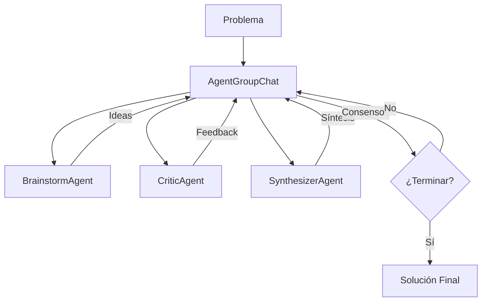

# Lab 04: Group Chat

**Duración**: 30 minutos  
**Nivel**: Avanzado  
**Objetivo**: Implementar AgentGroupChat con múltiples agentes colaborando y estrategias de terminación

## Descripción

En este lab implementarás un **AgentGroupChat** donde 3 agentes colaboran para resolver un problema:

1. **BrainstormAgent**: Genera ideas creativas
2. **CriticAgent**: Evalúa y cuestiona constructivamente
3. **SynthesizerAgent**: Combina ideas y busca consenso

La conversación continúa hasta alcanzar consenso o un máximo de turnos.



## Prerequisitos

- ✅ .NET 10 SDK instalado
- ✅ Azure OpenAI configurado con modelo `gpt-5.2`
- ✅ Completar Lab 03: Delegation Workflow

## Pasos del Lab

### Paso 1: Crear el Proyecto

```bash
# Navegar a la carpeta del lab
cd docs/modulo-03-workflows/labs/04-group-chat

# Restaurar paquetes
dotnet restore
```

### Paso 2: Configurar API Key

```bash
# Inicializar user secrets
dotnet user-secrets init

# Configurar la API key
dotnet user-secrets set "AzureOpenAI:ApiKey" "TU-API-KEY-AQUI"
```

### Paso 3: Configurar Endpoint

Edita `appsettings.json` con tu endpoint de Azure OpenAI:

```json
{
  "AzureOpenAI": {
    "Endpoint": "https://TU-RECURSO.openai.azure.com/",
    "DeploymentName": "gpt-5.2"
  }
}
```

### Paso 4: Revisar el Código

Abre `Program.cs` y observa:

1. **Agentes con roles complementarios** (líneas 45-110):
   - BrainstormAgent: Instrucciones para generar ideas
   - CriticAgent: Instrucciones para evaluar
   - SynthesizerAgent: Instrucciones para integrar

2. **Keyword de consenso** (en instrucciones de cada agente):
   ```
   Si crees que el grupo ha llegado a una buena solución, di exactamente:
   "CONSENSO ALCANZADO: [resumen de la solución]"
   ```

3. **Condición de terminación combinada** (líneas 115-125):
   ```csharp
   var terminationCondition = new AggregatedTerminationCondition(
       new MaxTurnsTerminationCondition(10),     // Fallback de seguridad
       new KeywordTerminationCondition("CONSENSO ALCANZADO")  // Por consenso
   );
   ```

4. **Creación del AgentGroupChat** (líneas 130-140):
   ```csharp
   var groupChat = new AgentGroupChat(brainstormAgent, criticAgent, synthesizerAgent)
   {
       TerminationCondition = terminationCondition,
       SelectionStrategy = new RoundRobinSelectionStrategy()
   };
   ```

5. **Ejecución iterativa** (líneas 160-190):
   - `await foreach (var message in groupChat.InvokeAsync())`
   - Cada iteración es un turno de un agente

### Paso 5: Ejecutar el Group Chat

```bash
dotnet run
```

**Salida esperada**:

```
═══════════════════════════════════════════════════════════════════
         GROUP CHAT: Brainstorm ↔ Critic ↔ Synthesizer
═══════════════════════════════════════════════════════════════════

✓ BrainstormAgent creado - Generador de ideas
✓ CriticAgent creado - Evaluador constructivo
✓ SynthesizerAgent creado - Integrador de propuestas

Configurando AgentGroupChat...
✓ AgentGroupChat configurado
  └─ Estrategia de terminación: MaxTurns(10) OR Keyword('CONSENSO ALCANZADO')
  └─ Selección de agente: Round-robin

═══════════════════════════════════════════════════════════════════
                    PROBLEMA A RESOLVER
═══════════════════════════════════════════════════════════════════
¿Cómo podemos mejorar la experiencia de onboarding de nuevos usuarios 
en nuestra aplicación móvil de fitness? Actualmente el 60% abandona 
antes de completar el registro.

═══════════════════════════════════════════════════════════════════
                    CONVERSACIÓN DEL GRUPO
═══════════════════════════════════════════════════════════════════

┌─── Turno 1: 💡 BrainstormAgent ───
│
│ Ideas para mejorar el onboarding:
│ 1. Login social (Google/Apple) para eliminar fricción
│ 2. Onboarding progresivo - mostrar solo lo esencial al inicio
│ 3. Gamificación con badges por completar pasos
│
└────────────────────────────────────────────────────────────────

┌─── Turno 2: 🔍 CriticAgent ───
│
│ Evaluación de las ideas:
│ - Login social: ✅ Buena idea, reduce abandono significativamente
│ - Onboarding progresivo: ⚠️ ¿Qué info es realmente esencial?
│ - Gamificación: ⚠️ Puede parecer forzada si no encaja con el tono
│ 
│ Sugiero: Definir los 3 campos mínimos requeridos primero.
│
└────────────────────────────────────────────────────────────────

┌─── Turno 3: 🎯 SynthesizerAgent ───
│
│ Síntesis de la discusión:
│ - Consenso en login social como prioridad 1
│ - Necesitamos definir campos mínimos (¿email + objetivo fitness?)
│ - Gamificación a evaluar después del MVP
│
└────────────────────────────────────────────────────────────────

[... más turnos ...]

┌─── Turno 6: 🎯 SynthesizerAgent ───
│
│ CONSENSO ALCANZADO: 
│ Propuesta final para reducir abandono en onboarding:
│ 1. Implementar login social (Google/Apple) como opción principal
│ 2. Reducir registro a 3 campos: email, objetivo fitness, nivel actual
│ 3. Mostrar valor inmediato: plan personalizado tras completar
│ 4. Gamificación en fase 2 post-validación
│
└────────────────────────────────────────────────────────────────

═══════════════════════════════════════════════════════════════════
                    RESUMEN DE LA SESIÓN
═══════════════════════════════════════════════════════════════════

📊 Total de turnos: 6
👥 Participantes: BrainstormAgent, CriticAgent, SynthesizerAgent

✅ RESULTADO: Consenso alcanzado

📋 PROPUESTA FINAL:
─────────────────────────────────────────────────────────────────
CONSENSO ALCANZADO: 
Propuesta final para reducir abandono en onboarding:
1. Implementar login social (Google/Apple) como opción principal
2. Reducir registro a 3 campos: email, objetivo fitness, nivel actual
3. Mostrar valor inmediato: plan personalizado tras completar
4. Gamificación en fase 2 post-validación

═══════════════════════════════════════════════════════════════════
                    WORKFLOW COMPLETADO
═══════════════════════════════════════════════════════════════════

✓ AgentGroupChat ejecutó conversación multi-agente
✓ Cada agente participó según su rol (brainstorm, critic, synthesize)
✓ Terminación: Por consenso
✓ Round-robin aseguró participación equitativa
```

### Paso 6: Validar Resultados

Verifica que:

1. ✅ Los 3 agentes participaron en la conversación
2. ✅ Cada agente actuó según su rol (ideas, críticas, síntesis)
3. ✅ La conversación terminó (por consenso o max turns)
4. ✅ Hay una propuesta final identificable

## Checkpoint de Validación

**Criterio de éxito**: El AgentGroupChat ejecuta una conversación colaborativa que termina por consenso o máximo de turnos.

**Validación del instructor**:
- [ ] La conversación muestra múltiples turnos (mínimo 3)
- [ ] Cada tipo de agente participó al menos 1 vez
- [ ] El resumen indica terminación (consenso o max turns)

## Troubleshooting

### "El group chat no termina nunca"

**Causa**: Ningún agente usa la keyword de consenso y max turns es muy alto.

**Solución**: Reducir `MaxTurnsTerminationCondition(10)` a un número menor para pruebas.

### "Solo un agente participa"

**Causa**: Problema con `RoundRobinSelectionStrategy`.

**Solución**: Verificar que los 3 agentes están pasados al constructor de `AgentGroupChat`.

### "No hay consenso pero la conversación terminó"

**Causa**: Se alcanzó el máximo de turnos (10).

**Explicación**: Esto es comportamiento esperado. La keyword "CONSENSO ALCANZADO" es opcional - si los agentes no la usan, el max turns actúa como fallback.

### "Los agentes repiten las mismas ideas"

**Causa**: No hay suficiente contexto del historial.

**Solución**: El `AgentGroupChat` maneja el historial automáticamente. Si persiste, verificar que cada agente tiene instrucciones claras.

## Estrategias de Terminación Disponibles

| Estrategia | Descripción | Uso |
|------------|-------------|-----|
| `MaxTurnsTerminationCondition(n)` | Termina después de n turnos | Fallback de seguridad |
| `KeywordTerminationCondition("texto")` | Termina si algún agente dice "texto" | Consenso explícito |
| `FunctionCallTerminationCondition` | Termina si se llama una función específica | Acciones de cierre |
| `AggregatedTerminationCondition` | Combina múltiples condiciones (OR) | Escenarios complejos |

## Experimentos Opcionales

Si terminas antes, intenta:

1. **Cambiar el problema**: Usa un problema diferente (ej: "¿Cómo reducir el tiempo de respuesta de nuestra API?")
2. **Agregar un cuarto agente**: Crea un `DevilsAdvocateAgent` que siempre cuestione
3. **Cambiar terminación**: Usa solo `MaxTurnsTerminationCondition(5)` y observa
4. **Modificar estrategia de selección**: Investiga otras estrategias disponibles

## Siguiente Lab

Continúa con [Lab 05: Azure AI Agent Service](../05-azure-agent-service/) para aprender persistencia de estado y workflows que pueden pausar y reanudar.
