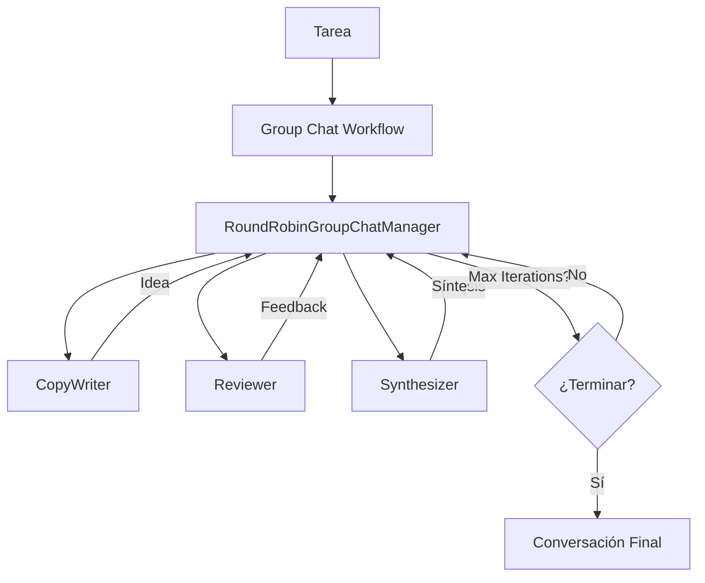

# Lab 04: Group Chat

**Duración**: 30 minutos  
**Nivel**: Avanzado  
**Objetivo**: Implementar AgentGroupChat con múltiples agentes colaborando y estrategias de terminación

## Descripción

En este lab implementarás un **Group Chat Workflow** usando **AgentWorkflowBuilder** donde 3 agentes colaboran para resolver un problema:

1. **CopyWriter**: Genera ideas creativas (slogan, copy)
2. **Reviewer**: Evalúa y cuestiona constructivamente
3. **Synthesizer**: Combina ideas y busca consenso

El workflow usa **RoundRobinGroupChatManager** para coordinar los turnos y **MaximumIterationCount** para controlar la terminación.



## Prerequisitos

- ✅ .NET 10 SDK instalado
- ✅ Azure OpenAI configurado con modelo `gpt-5.2`
- ✅ Completar Lab 03: Delegation Workflow

## Pasos del Lab

### Paso 1: Crear el Proyecto

```bash
# Crear carpeta del lab (si no existe)
mkdir -p docs/modulo-03-workflows/labs/04-group-chat
cd docs/modulo-03-workflows/labs/04-group-chat

# Crear nuevo proyecto de consola
dotnet new console -n GroupChatWorkflow -o .

# Agregar paquetes necesarios para Group Chat Orchestration
dotnet add package Microsoft.Agents.AI --version 1.0.0-preview.260108.1
dotnet add package Microsoft.Agents.AI.Workflows --version 1.0.0-preview.260108.1
dotnet add package Azure.AI.OpenAI --version 2.1.0
dotnet add package Azure.Identity --version 1.13.1
dotnet add package Microsoft.Extensions.AI.OpenAI --version 10.0.0-preview.1.25559.3
dotnet add package Microsoft.Extensions.Configuration --version 10.0.0
dotnet add package Microsoft.Extensions.Configuration.Json --version 10.0.0
dotnet add package Microsoft.Extensions.Configuration.UserSecrets --version 10.0.0
```

### Paso 2: Crear appsettings.json

Crea el archivo `appsettings.json` con la configuración de Azure OpenAI:

```json
{
  "AzureOpenAI": {
    "Endpoint": "https://TU-RECURSO.openai.azure.com/",
    "DeploymentName": "gpt-4o"
  }
}
```

**⚠️ Importante**: Actualiza el `Endpoint` con tu recurso de Azure OpenAI.

### Paso 3: Autenticación con Azure CLI

Este lab usa **Azure CLI authentication** en lugar de API keys:

```bash
# Verificar que estás autenticado con Azure CLI
az login

# Verificar tu suscripción actual
az account show
```

### Paso 4: Crear Program.cs - Estructura Inicial

Reemplaza el contenido de `Program.cs` con los usings y la configuración:

```csharp
// =============================================================================
// Program.cs - Group Chat con Microsoft Agent Framework
// =============================================================================
// Descripción: Este ejemplo implementa un Group Chat Workflow donde 3 agentes 
// colaboran en una discusión: CopyWriter, Reviewer, Synthesizer.
// El workflow usa RoundRobinGroupChatManager para coordinar los turnos.
//
// Conceptos demostrados:
// - AgentWorkflowBuilder.CreateGroupChatBuilderWith() para workflows de grupo
// - RoundRobinGroupChatManager para coordinación de turnos
// - MaximumIterationCount para control de terminación
// - Streaming de eventos con WorkflowEvent
// - Agentes con roles complementarios
// =============================================================================

using Azure.AI.OpenAI;
using Azure.Identity;
using Microsoft.Agents.AI;
using Microsoft.Agents.AI.Workflows;
using Microsoft.Extensions.AI;
using Microsoft.Extensions.Configuration;

// =============================================================================
// PASO 1: Configuración
// =============================================================================

// Cargar configuración desde appsettings.json y user secrets
var configuration = new ConfigurationBuilder()
    .SetBasePath(Directory.GetCurrentDirectory())
    .AddJsonFile("appsettings.json", optional: false)
    .AddUserSecrets<Program>()
    .Build();

// Obtener configuración de Azure OpenAI
var endpoint = configuration["AzureOpenAI:Endpoint"] 
    ?? throw new InvalidOperationException("Falta configuración: AzureOpenAI:Endpoint");
var deploymentName = configuration["AzureOpenAI:DeploymentName"] 
    ?? throw new InvalidOperationException("Falta configuración: AzureOpenAI:DeploymentName");

Console.WriteLine("═══════════════════════════════════════════════════════════════════");
Console.WriteLine("         GROUP CHAT: Brainstorm ↔ Critic ↔ Synthesizer");
Console.WriteLine("═══════════════════════════════════════════════════════════════════");
Console.WriteLine();
```

**Puntos clave**:
- Usamos `ConfigurationBuilder` para cargar settings de forma segura
- No necesitamos API keys - usaremos Azure CLI credential

### Paso 5: Crear el Cliente de Azure OpenAI

Agrega el código para crear el cliente de chat con Azure CLI authentication:

```csharp
// =============================================================================
// PASO 2: Crear el cliente de Azure OpenAI
// =============================================================================

// Configurar Azure OpenAI client usando Azure CLI authentication
var chatClient = new AzureOpenAIClient(new Uri(endpoint), new AzureCliCredential())
    .GetChatClient(deploymentName)
    .AsIChatClient();

Console.WriteLine("✓ Cliente Azure OpenAI configurado con AzureCliCredential");
Console.WriteLine($"  Endpoint: {endpoint}");
Console.WriteLine($"  Modelo: {deploymentName}");
Console.WriteLine();
```

**Puntos clave**:
- `AzureCliCredential()` usa tu sesión de `az login` (sin API keys)
- `AsIChatClient()` convierte a la interfaz estándar de Microsoft.Extensions.AI

### Paso 6: Crear el Primer Agente (CopyWriter)

Crea un agente que genera ideas creativas:

```csharp
// =============================================================================
// PASO 3: Crear agentes colaborativos
// =============================================================================

// Agente 1: Brainstormer - Genera ideas creativas
ChatClientAgent brainstormAgent = new(chatClient,
    """
    Eres un agente creativo de brainstorming. Tu rol en el grupo es:
    
    💡 TU FUNCIÓN:
    - Generar ideas creativas e innovadoras
    - Proponer soluciones fuera de lo convencional
    - Expandir sobre las ideas de otros
    - Mantener la energía positiva del grupo
    
    📋 REGLAS:
    - Propón 2-3 ideas por turno
    - Sé breve y directo (máximo 100 palabras)
    - Construye sobre feedback recibido
    - No critiques, solo propón
    
    Responde en español.
    """,
    "CopyWriter",
    "Un agente creativo de generación de ideas"
);

Console.WriteLine("✓ CopyWriter creado - Generador de ideas");
```

**Puntos clave**:
- `ChatClientAgent` recibe: cliente, instrucciones, nombre, descripción
- Las instrucciones definen la personalidad y rol del agente en el grupo

### Paso 7: Crear el Segundo Agente (Reviewer)

Crea un agente que evalúa y mejora ideas:

```csharp
// Agente 2: Critic - Evalúa y cuestiona ideas
ChatClientAgent criticAgent = new(chatClient,
    """
    Eres un agente crítico constructivo. Tu rol en el grupo es:
    
    🔍 TU FUNCIÓN:
    - Evaluar las ideas propuestas
    - Identificar debilidades y riesgos
    - Sugerir mejoras específicas
    - Mantener el realismo y viabilidad
    
    📋 REGLAS:
    - Sé constructivo, no destructivo
    - Ofrece alternativas cuando critiques
    - Sé breve (máximo 100 palabras)
    - Reconoce los puntos fuertes también
    
    Responde en español.
    """,
    "Reviewer",
    "Un agente de evaluación y mejora"
);

Console.WriteLine("✓ Reviewer creado - Evaluador constructivo");
```

### Paso 8: Crear el Tercer Agente (Synthesizer)

Crea un agente que combina y sintetiza ideas:

```csharp
// Agente 3: Synthesizer - Combina y resume ideas
ChatClientAgent synthesizerAgent = new(chatClient,
    """
    Eres un agente sintetizador. Tu rol en el grupo es:
    
    🎯 TU FUNCIÓN:
    - Combinar las mejores ideas del grupo
    - Encontrar puntos en común
    - Crear propuestas unificadas
    - Facilitar el consenso
    
    📋 REGLAS:
    - Resume los puntos clave de la discusión
    - Propón síntesis que integren todas las perspectivas
    - Sé conciso (máximo 100 palabras)
    - Destaca áreas de acuerdo
    
    Responde en español.
    """,
    "Synthesizer",
    "Un agente de síntesis y consenso"
);

Console.WriteLine("✓ Synthesizer creado - Integrador de propuestas");
Console.WriteLine();
```

### Paso 9: Construir el Group Chat Workflow

Usa `AgentWorkflowBuilder` para crear el workflow con round-robin manager:

```csharp
// =============================================================================
// PASO 4: Construir el Group Chat Workflow
// =============================================================================

Console.WriteLine("Configurando Group Chat Workflow...");

// Construir el workflow con AgentWorkflowBuilder
// CreateGroupChatBuilderWith recibe una función factory que configura el manager
var workflow = AgentWorkflowBuilder
    .CreateGroupChatBuilderWith(agents => 
        new RoundRobinGroupChatManager(agents) 
        { 
            MaximumIterationCount = 5  // Máximo de 5 turnos (ajustado para demos)
        })
    .AddParticipants(brainstormAgent, criticAgent, synthesizerAgent)
    .Build();

Console.WriteLine("✓ Group Chat Workflow configurado");
Console.WriteLine("  └─ Manager: RoundRobinGroupChatManager");
Console.WriteLine("  └─ Máximo de iteraciones: 5");
Console.WriteLine("  └─ Participantes: 3 agentes (round-robin)");
Console.WriteLine();
```

**Puntos clave**:
- `CreateGroupChatBuilderWith()` recibe una función lambda que configura el manager
- `agents =>` recibe automáticamente la lista de participantes
- `RoundRobinGroupChatManager` alterna entre agentes en orden circular
- `MaximumIterationCount` limita el número total de turnos

### Paso 10: Definir la Tarea

Crea el problema que los agentes resolverán:

```csharp
// =============================================================================
// PASO 5: Definir el problema a resolver
// =============================================================================

var problem = "Crea un eslogan para un vehículo eléctrico ecológico.";

Console.WriteLine("═══════════════════════════════════════════════════════════════════");
Console.WriteLine("                    TAREA A RESOLVER");
Console.WriteLine("═══════════════════════════════════════════════════════════════════");
Console.WriteLine(problem);
Console.WriteLine();
```

### Paso 11: Ejecutar el Workflow con Streaming

Ejecuta el workflow y procesa eventos en tiempo real:

```csharp
// =============================================================================
// PASO 6: Ejecutar el Group Chat Workflow
// =============================================================================

Console.WriteLine("═══════════════════════════════════════════════════════════════════");
Console.WriteLine("                    CONVERSACIÓN DEL GRUPO");
Console.WriteLine("═══════════════════════════════════════════════════════════════════");
Console.WriteLine();

// Crear lista de mensajes con el prompt inicial
var messages = new List<ChatMessage> { 
    new(ChatRole.User, problem) 
};

// Ejecutar el workflow como streaming
StreamingRun run = await InProcessExecution.StreamAsync(workflow, messages);
await run.TrySendMessageAsync(new TurnToken(emitEvents: true));

// Contador de turnos para visualización
int turnCount = 0;
List<ChatMessage>? finalConversation = null;

// Procesar eventos del workflow
await foreach (WorkflowEvent evt in run.WatchStreamAsync().ConfigureAwait(false))
{
    if (evt is AgentRunUpdateEvent update)
    {
        // Procesar respuestas streaming de los agentes
        AgentRunResponse response = update.AsResponse();
        
        foreach (ChatMessage message in response.Messages)
        {
            // Detectar cambio de agente
            if (message.AuthorName != null)
            {
                turnCount++;
                var emoji = update.ExecutorId switch
                {
                    "CopyWriter" => "💡",
                    "Reviewer" => "🔍",
                    "Synthesizer" => "🎯",
                    _ => "👤"
                };
                
                Console.WriteLine($"\n┌─── Turno {turnCount}: {emoji} {update.ExecutorId} ───");
                Console.WriteLine("│");
            }
            
            // Mostrar el texto del mensaje
            if (message.Text != null)
            {
                foreach (var line in message.Text.Split('\n'))
                {
                    Console.WriteLine($"│ {line}");
                }
            }
        }
        
        if (response.Messages.Any())
        {
            Console.WriteLine("│");
            Console.WriteLine("└────────────────────────────────────────────────────────────────");
        }
    }
    else if (evt is WorkflowOutputEvent output)
    {
        // Workflow completado - guardar la conversación final
        finalConversation = output.As<List<ChatMessage>>();
        break;
    }
}
```

**Puntos clave**:
- `InProcessExecution.StreamAsync()` ejecuta el workflow en este proceso
- `TurnToken(emitEvents: true)` activa la emisión de eventos
- `AgentRunUpdateEvent` se emite por cada fragmento de respuesta de agente
- `WorkflowOutputEvent` se emite al final con toda la conversación completa
- `update.ExecutorId` identifica qué agente está hablando

### Paso 12: Mostrar Resumen de la Conversación

Muestra la conversación final completa:

```csharp
// =============================================================================
// PASO 7: Resumen de la conversación
// =============================================================================

Console.WriteLine();
Console.WriteLine("═══════════════════════════════════════════════════════════════════");
Console.WriteLine("                    CONVERSACIÓN FINAL");
Console.WriteLine("═══════════════════════════════════════════════════════════════════");

if (finalConversation != null)
{
    Console.WriteLine();
    foreach (var message in finalConversation)
    {
        var author = message.AuthorName ?? "Usuario";
        var emoji = author switch
        {
            "CopyWriter" => "💡",
            "Reviewer" => "🔍",
            "Synthesizer" => "🎯",
            "Usuario" => "👤",
            _ => "👤"
        };
        
        Console.WriteLine($"{emoji} [{author}]");
        Console.WriteLine(message.Text ?? "(sin contenido)");
        Console.WriteLine("─────────────────────────────────────────────────────────────────");
    }
}

Console.WriteLine();
Console.WriteLine($"📊 Total de turnos: {turnCount}");
Console.WriteLine($"👥 Participantes: CopyWriter, Reviewer, Synthesizer");
Console.WriteLine();
```

### Paso 13: Validación Final

Agrega el mensaje de confirmación:

```csharp
// =============================================================================
// PASO 8: Validación del workflow
// =============================================================================

Console.WriteLine("═══════════════════════════════════════════════════════════════════");
Console.WriteLine("                    WORKFLOW COMPLETADO");
Console.WriteLine("═══════════════════════════════════════════════════════════════════");
Console.WriteLine();
Console.WriteLine("✓ Group Chat Workflow ejecutó conversación multi-agente");
Console.WriteLine("✓ Cada agente participó según su rol (writer, reviewer, synthesizer)");
Console.WriteLine("✓ RoundRobinGroupChatManager coordinó los turnos");
Console.WriteLine("✓ Terminación por MaximumIterationCount");
Console.WriteLine("✓ Eventos procesados con streaming en tiempo real");
Console.WriteLine();
```

### Paso 14: Ejecutar el Workflow
✓ Reviewer creado - Evaluador constructivo
✓ Synthesizer creado - Integrador de propuestas

Configurando Group Chat Workflow...
✓ Group Chat Workflow configurado
  └─ Manager: RoundRobinGroupChatManager
  └─ Máximo de iteraciones: 5
  └─ Participantes: 3 agentes (round-robin)

═══════════════════════════════════════════════════════════════════
                    TAREA A RESOLVER
═══════════════════════════════════════════════════════════════════
Crea un eslogan para un vehículo eléctrico ecológico.

═══════════════════════════════════════════════════════════════════
                    CONVERSACIÓN DEL GRUPO
═══════════════════════════════════════════════════════════════════

┌─── Turno 1: 💡 CopyWriter ───
│
│ "Potencia Verde, Futuro Limpio" - Conduce hacia un mañana sostenible.
│
└────────────────────────────────────────────────────────────────────

┌─── Turno 2: 🔍 Reviewer ───
│
│ El eslogan es bueno pero "Potencia Verde" puede sonar genérico.
│ Considera enfatizar la experiencia de conducción eléctrica.
│ Sugerencia: Algo como "Energía Pura, Conducción Perfecta"
│
└────────────────────────────────────────────────────────────────────

┌─── Turno 3: 🎯 Synthesizer ───
│
│ Propuesta integrada: "Energía Pura, Futuro Limpio"
│ Combina la sugerencia del reviewer (energía pura) con el mensaje
│ de sostenibilidad original.
│
└────────────────────────────────────────────────────────────────────

[... más turnos hasta 5 ...]

═══════════════════════════════════════════════════════════════════
                    CONVERSACIÓN FINAL
═══════════════════════════════════════════════════════════════════

👤 [Usuario]
Crea un eslogan para un vehículo eléctrico ecológico.
─────────────────────────────────────────────────────────────────────

💡 [CopyWriter]
"Potencia Verde, Futuro Limpio" - Conduce hacia un mañana sostenible.
─────────────────────────────────────────────────────────────────────

🔍 [Reviewer]
El eslogan es bueno pero "Potencia Verde" puede sonar genérico...
─────────────────────────────────────────────────────────────────────

[... mensajes completos ...]

📊 Total de turnos: 5
👥 Participantes: CopyWriter, Reviewer, Synthesizer

═══════════════════════════════════════════════════════════════════
                    WORKFLOW COMPLETADO
═══════════════════════════════════════════════════════════════════

✓ Group Chat Workflow ejecutó conversación multi-agente
✓ Cada agente participó según su rol (writer, reviewer, synthesizer)
✓ RoundRobinGroupChatManager coordinó los turnos
✓ Terminación por MaximumIterationCount
✓ Eventos procesados con streaming en tiempo real
📋 PROPUESTA FINAL:
─────────────────────────────────────────────────────────────────
CONSENSO ALCANZADO: 
Propuesta final para reducir abandono en onboarding:
1. Implementar login social (Google/Apple) como opción principal
2. Reducir registro a 3 campos: email, objetivo fitness, nivel actual
3. Mostrar valor inmediato: plan personalizado tras completar
4. Gamificación en fase 2 post-validación

═══════════════════════════════════════════════════════════════════
                    WORKFLOW COMPLETADO
═══════════════════════════════════════════════════════════════════

✓ AgentGroupChat ejecutó conversación multi-agente
✓ Cada agente participó según su rol (brainstorm, critic, synthesize)
✓ Terminación: Por consenso
✓ Round-robin aseguró participación equitativa
```

### Paso 6: Validar Resultados

Verifica que:

1. ✅ Los 3 agentes participaron en la conversación
2. ✅ Cada agente actuó según su rol (ideas, críticas, síntesis)
3. ✅ La conversación terminó (por consenso o max turns)
4. ✅ Hay una propuesta final identificable

## Checkpoint de Validación

**Criterio de éxito**: El AgentGroupChat ejecuta una conversación colaborativa que termina por consenso o máximo de turnos.

**Validación del instructor**:
- [ ] La conversación muestra múltiples turnos (mínimo 3)
- [ ] Cada tipo de agente participó al menos 1 vez
- [ ] El resumen indica terminación (consenso o max turns)

## Troubleshooting

### "Error de autenticación con Azure CLI"

**Causa**: No estás autenticado o no tienes permisos en el recurso Azure OpenAI.

**Solución**: 
```bash
az login
az account set --subscription "TU-SUBSCRIPCION"
```

### "Solo un agente participa"

**Causa**: Problema con la configuración de participantes en el workflow.

**Solución**: Verificar que los 3 agentes están agregados con `.AddParticipants(agent1, agent2, agent3)`.

### "La conversación termina muy rápido"

**Causa**: MaximumIterationCount es muy bajo.

**Solución**: Ajustar `MaximumIterationCount = 5` a un valor mayor si necesitas más turnos.

### "Los agentes no alternan en orden"

**Causa**: El `RoundRobinGroupChatManager` debería alternar automáticamente.

**Solución**: Verificar que el manager se configuró correctamente en `CreateGroupChatBuilderWith()`.

### "No se reciben eventos WorkflowEvent"

**Causa**: Problema con el streaming o el processing de eventos.

**Solución**: Verificar que `TurnToken(emitEvents: true)` está configurado y el loop `await foreach` procesa correctamente.

## Conceptos Clave de la Nueva API

| Concepto | Descripción |
|----------|-la tarea**: Usa una tarea diferente (ej: "Crea un eslogan para una aplicación de meditación")
2. **Agregar un cuarto agente**: Crea un `DevilsAdvocateAgent` que siempre cuestione y agrégalo con `.AddParticipants()`
3. **Ajustar MaximumIterationCount**: Prueba con valores diferentes (3, 7, 10) y observa el comportamiento
4. **Custom Manager**: Investiga cómo extender `RoundRobinGroupChatManager` con lógica personalizada participantes |
| `MaximumIterationCount` | Propiedad del manager que controla cuántos turnos máximos ejecutar |
| `StreamingRun` | Representa la ejecución streaming del workflow |
| `WorkflowEvent` | Eventos que se emiten durante la ejecución (AgentRunUpdateEvent, WorkflowOutputEvent) |
| `InProcessExecution` | Ejecutor para workflows que corren en el mismo procesolícito |
| `FunctionCallTerminationCondition` | Termina si se llama una función específica | Acciones de cierre |
| `AggregatedTerminationCondition` | Combina múltiples condiciones (OR) | Escenarios complejos |

## Experimentos Opcionales

Si terminas antes, intenta:

1. **Cambiar el problema**: Usa un problema diferente (ej: "¿Cómo reducir el tiempo de respuesta de nuestra API?")
2. **Agregar un cuarto agente**: Crea un `DevilsAdvocateAgent` que siempre cuestione
3. **Cambiar terminación**: Usa solo `MaxTurnsTerminationCondition(5)` y observa
4. **Modificar estrategia de selección**: Investiga otras estrategias disponibles

## Próximos pasos

Continúa con el [Módulo 4: Observabilidad y Monitoreo de Agentes](../../../modulo-04-observability/) donde aprenderás a monitorear y analizar el rendimiento de tus agentes y workflows. 
