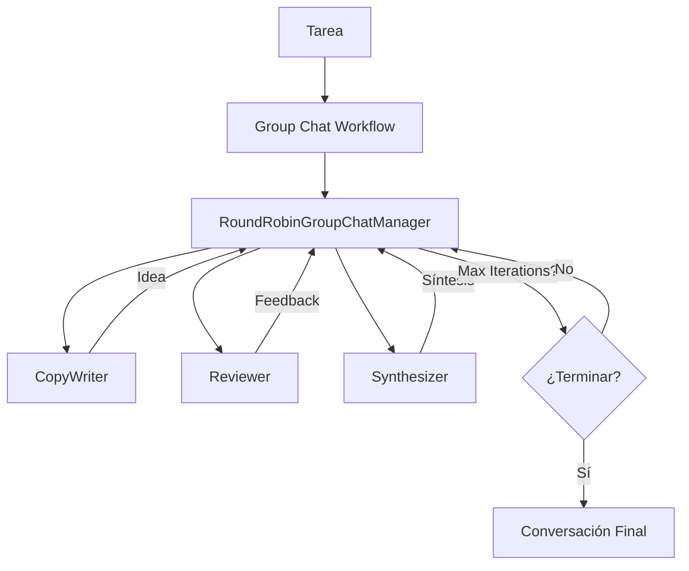

# Lab 04: Group Chat

**Duración**: 30 minutos  
**Nivel**: Avanzado  
**Objetivo**: Implementar AgentGroupChat con múltiples agentes colaborando y estrategias de terminación

## Descripción

En este lab implementarás un **Group Chat Workflow** usando **AgentWorkflowBuilder** donde 3 agentes colaboran para resolver un problema:

1. **CopyWriter**: Genera ideas creativas (slogan, copy)
2. **Reviewer**: Evalúa y cuestiona constructivamente
3. **Synthesizer**: Combina ideas y busca consenso

El workflow usa **RoundRobinGroupChatManager** para coordinar los turnos y **MaximumIterationCount** para controlar la terminación.



## Prerequisitos

- ✅ .NET 10 SDK instalado
- ✅ Azure OpenAI configurado con modelo `gpt-5.2`
- ✅ Completar Lab 03: Delegation Workflow

## Pasos del Lab

### Paso 1: Crear el Proyecto

```bash
# Navegar a la carpeta del lab
cd docs/modulo-03-workflows/labs/04-group-chat

# Restaurar paquetes
dotnet restore
```

### Paso 2: Autenticación con Azure CLI

Este lab usa **Azure CLI authentication** en lugar de API keys:

```bash
# Verificar que estás autenticado con Azure CLI
az login

# Verificar tu suscripción actual
az account show
```

### Paso 3: Configurar Endpoint

Edita `appsettings.json` con tu endpoint de Azure OpenAI:

```json
{
  "AzureOpenAI": {
    "Endpoint": "https://TU-RECURSO.openai.azure.com/",
    "DeploymentName": "gpt-5.2"
  }
}
```

### Paso 4: Entender la Estructura del Código

Abre `Program.cs` y estudia cómo funciona la nueva API de Group Chat workflows. El código está organizado en 7 pasos claramente marcados:

#### **PASO 1: Configuración (líneas 16-46)**

Carga la configuración desde `appsettings.json` y crea el cliente de Azure OpenAI con autenticación de Azure CLI:

```csharp
var chatClient = new AzureOpenAIClient(new Uri(endpoint), new AzureCliCredential())
    .GetChatClient(deploymentName)
    .AsIChatClient();
```

🔑 **Concepto clave**: `AsIChatClient()` convierte el ChatClient de Azure OpenAI en una interfaz estándar `IChatClient` que puede usar el framework de agentes.

#### **PASO 2: Crear Agentes Colaborativos (líneas 48-137)**

Define 3 agentes especializados usando `ChatClientAgent`:

```csharp
ChatClientAgent writer = new(chatClient,
    "Instrucciones del agente...",
    "CopyWriter",              // Nombre del agente
    "Descripción del rol"      // Descripción para el manager
);
```

🔑 **Concepto clave**: Cada agente tiene instrucciones específicas que definen su personalidad y responsabilidades en el grupo. No hay keywords de consenso - la terminación se controla por el manager.

#### **PASO 3: Construir el Workflow (líneas 139-157)**

Usa `AgentWorkflowBuilder` con un manager de round-robin:

```csharp
var workflow = AgentWorkflowBuilder
    .CreateGroupChatBuilderWith(agents => 
        new RoundRobinGroupChatManager(agents) 
        { 
            MaximumIterationCount = 5  // Máximo de turnos
        })
    .AddParticipants(writer, reviewer, synthesizer)
    .Build();
```

🔑 **Concepto clave**: La función lambda `agents =>` recibe la lista de participantes y devuelve un manager configurado. `RoundRobinGroupChatManager` alternará automáticamente entre los agentes.

#### **PASO 4: Definir la Tarea (líneas 159-167)**

Establece el problema que los agentes deben resolver:

```csharp
var problem = "Crea un eslogan para un vehículo eléctrico ecológico.";
var messages = new List<ChatMessage> { 
    new(ChatRole.User, problem) 
};
```

#### **PASO 5: Ejecutar el Workflow con Streaming (líneas 169-248)**

Inicia la ejecución y procesa eventos en tiempo real:

```csharp
StreamingRun run = await InProcessExecution.StreamAsync(workflow, messages);
await run.TrySendMessageAsync(new TurnToken(emitEvents: true));

await foreach (WorkflowEvent evt in run.WatchStreamAsync())
{
    if (evt is AgentRunUpdateEvent update)
    {
        // Mostrar respuestas de cada agente
        AgentRunResponse response = update.AsResponse();
        foreach (ChatMessage message in response.Messages)
        {
            Console.WriteLine($"[{update.ExecutorId}]: {message.Text}");
        }
    }
    else if (evt is WorkflowOutputEvent output)
    {
        // Workflow completado - guardar conversación
        finalConversation = output.As<List<ChatMessage>>();
        break;
    }
}
```

🔑 **Concepto clave**: 
- `AgentRunUpdateEvent`: Se emite cada vez que un agente responde (puede haber múltiples eventos por turno si la respuesta es larga)
- `WorkflowOutputEvent`: Se emite al final con toda la conversación como `List<ChatMessage>`

#### **PASO 6: Mostrar Resumen (líneas 250-282)**

Muestra la conversación final completa con todos los mensajes:

```csharp
foreach (var message in finalConversation)
{
    var author = message.AuthorName ?? "Usuario";
    Console.WriteLine($"{emoji} [{author}]");
    Console.WriteLine(message.Text);
}
```

#### **PASO 7: Validación (líneas 284-295)**

Confirma que el workflow funcionó correctamente con todos los componentes.

---

#### **Diferencias Clave vs API Antigua**

| Aspecto | API Antigua (AgentGroupChat) | API Nueva (AgentWorkflowBuilder) |
|---------|------------------------------|-----------------------------------|
| Constructor | `new AgentGroupChat(agent1, agent2)` | `AgentWorkflowBuilder.CreateGroupChatBuilderWith()` |
| Manager | `SelectionStrategy` property | Factory function que crea el manager |
| Terminación | `TerminationCondition` (múltiples tipos) | `MaximumIterationCount` en el manager |
| Ejecución | `await foreach (var msg in chat.InvokeAsync())` | `StreamingRun` con eventos `WorkflowEvent` |
| Agentes | `ChatCompletionAgent` | `ChatClientAgent` |
| Autenticación | API Key en constructor | Azure CLI credential |
| Output | Mensajes individuales | `WorkflowOutputEvent` con conversación completa |

### Paso 5: Ejecutar el Group Chat Workflow
✓ Reviewer creado - Evaluador constructivo
✓ Synthesizer creado - Integrador de propuestas

Configurando Group Chat Workflow...
✓ Group Chat Workflow configurado
  └─ Manager: RoundRobinGroupChatManager
  └─ Máximo de iteraciones: 5
  └─ Participantes: 3 agentes (round-robin)

═══════════════════════════════════════════════════════════════════
                    TAREA A RESOLVER
═══════════════════════════════════════════════════════════════════
Crea un eslogan para un vehículo eléctrico ecológico.

═══════════════════════════════════════════════════════════════════
                    CONVERSACIÓN DEL GRUPO
═══════════════════════════════════════════════════════════════════

┌─── Turno 1: 💡 CopyWriter ───
│
│ "Potencia Verde, Futuro Limpio" - Conduce hacia un mañana sostenible.
│
└────────────────────────────────────────────────────────────────────

┌─── Turno 2: 🔍 Reviewer ───
│
│ El eslogan es bueno pero "Potencia Verde" puede sonar genérico.
│ Considera enfatizar la experiencia de conducción eléctrica.
│ Sugerencia: Algo como "Energía Pura, Conducción Perfecta"
│
└────────────────────────────────────────────────────────────────────

┌─── Turno 3: 🎯 Synthesizer ───
│
│ Propuesta integrada: "Energía Pura, Futuro Limpio"
│ Combina la sugerencia del reviewer (energía pura) con el mensaje
│ de sostenibilidad original.
│
└────────────────────────────────────────────────────────────────────

[... más turnos hasta 5 ...]

═══════════════════════════════════════════════════════════════════
                    CONVERSACIÓN FINAL
═══════════════════════════════════════════════════════════════════

👤 [Usuario]
Crea un eslogan para un vehículo eléctrico ecológico.
─────────────────────────────────────────────────────────────────────

💡 [CopyWriter]
"Potencia Verde, Futuro Limpio" - Conduce hacia un mañana sostenible.
─────────────────────────────────────────────────────────────────────

🔍 [Reviewer]
El eslogan es bueno pero "Potencia Verde" puede sonar genérico...
─────────────────────────────────────────────────────────────────────

[... mensajes completos ...]

📊 Total de turnos: 5
👥 Participantes: CopyWriter, Reviewer, Synthesizer

═══════════════════════════════════════════════════════════════════
                    WORKFLOW COMPLETADO
═══════════════════════════════════════════════════════════════════

✓ Group Chat Workflow ejecutó conversación multi-agente
✓ Cada agente participó según su rol (writer, reviewer, synthesizer)
✓ RoundRobinGroupChatManager coordinó los turnos
✓ Terminación por MaximumIterationCount
✓ Eventos procesados con streaming en tiempo real
📋 PROPUESTA FINAL:
─────────────────────────────────────────────────────────────────
CONSENSO ALCANZADO: 
Propuesta final para reducir abandono en onboarding:
1. Implementar login social (Google/Apple) como opción principal
2. Reducir registro a 3 campos: email, objetivo fitness, nivel actual
3. Mostrar valor inmediato: plan personalizado tras completar
4. Gamificación en fase 2 post-validación

═══════════════════════════════════════════════════════════════════
                    WORKFLOW COMPLETADO
═══════════════════════════════════════════════════════════════════

✓ AgentGroupChat ejecutó conversación multi-agente
✓ Cada agente participó según su rol (brainstorm, critic, synthesize)
✓ Terminación: Por consenso
✓ Round-robin aseguró participación equitativa
```

### Paso 6: Validar Resultados

Verifica que:

1. ✅ Los 3 agentes participaron en la conversación
2. ✅ Cada agente actuó según su rol (ideas, críticas, síntesis)
3. ✅ La conversación terminó (por consenso o max turns)
4. ✅ Hay una propuesta final identificable

## Checkpoint de Validación

**Criterio de éxito**: El AgentGroupChat ejecuta una conversación colaborativa que termina por consenso o máximo de turnos.

**Validación del instructor**:
- [ ] La conversación muestra múltiples turnos (mínimo 3)
- [ ] Cada tipo de agente participó al menos 1 vez
- [ ] El resumen indica terminación (consenso o max turns)

## Troubleshooting

### "Error de autenticación con Azure CLI"

**Causa**: No estás autenticado o no tienes permisos en el recurso Azure OpenAI.

**Solución**: 
```bash
az login
az account set --subscription "TU-SUBSCRIPCION"
```

### "Solo un agente participa"

**Causa**: Problema con la configuración de participantes en el workflow.

**Solución**: Verificar que los 3 agentes están agregados con `.AddParticipants(agent1, agent2, agent3)`.

### "La conversación termina muy rápido"

**Causa**: MaximumIterationCount es muy bajo.

**Solución**: Ajustar `MaximumIterationCount = 5` a un valor mayor si necesitas más turnos.

### "Los agentes no alternan en orden"

**Causa**: El `RoundRobinGroupChatManager` debería alternar automáticamente.

**Solución**: Verificar que el manager se configuró correctamente en `CreateGroupChatBuilderWith()`.

### "No se reciben eventos WorkflowEvent"

**Causa**: Problema con el streaming o el processing de eventos.

**Solución**: Verificar que `TurnToken(emitEvents: true)` está configurado y el loop `await foreach` procesa correctamente.

## Conceptos Clave de la Nueva API

| Concepto | Descripción |
|----------|-la tarea**: Usa una tarea diferente (ej: "Crea un eslogan para una aplicación de meditación")
2. **Agregar un cuarto agente**: Crea un `DevilsAdvocateAgent` que siempre cuestione y agrégalo con `.AddParticipants()`
3. **Ajustar MaximumIterationCount**: Prueba con valores diferentes (3, 7, 10) y observa el comportamiento
4. **Custom Manager**: Investiga cómo extender `RoundRobinGroupChatManager` con lógica personalizada participantes |
| `MaximumIterationCount` | Propiedad del manager que controla cuántos turnos máximos ejecutar |
| `StreamingRun` | Representa la ejecución streaming del workflow |
| `WorkflowEvent` | Eventos que se emiten durante la ejecución (AgentRunUpdateEvent, WorkflowOutputEvent) |
| `InProcessExecution` | Ejecutor para workflows que corren en el mismo procesolícito |
| `FunctionCallTerminationCondition` | Termina si se llama una función específica | Acciones de cierre |
| `AggregatedTerminationCondition` | Combina múltiples condiciones (OR) | Escenarios complejos |

## Experimentos Opcionales

Si terminas antes, intenta:

1. **Cambiar el problema**: Usa un problema diferente (ej: "¿Cómo reducir el tiempo de respuesta de nuestra API?")
2. **Agregar un cuarto agente**: Crea un `DevilsAdvocateAgent` que siempre cuestione
3. **Cambiar terminación**: Usa solo `MaxTurnsTerminationCondition(5)` y observa
4. **Modificar estrategia de selección**: Investiga otras estrategias disponibles

## Siguiente Lab

Continúa con [Lab 05: Azure AI Agent Service](../05-azure-agent-service/) para aprender persistencia de estado y workflows que pueden pausar y reanudar.
