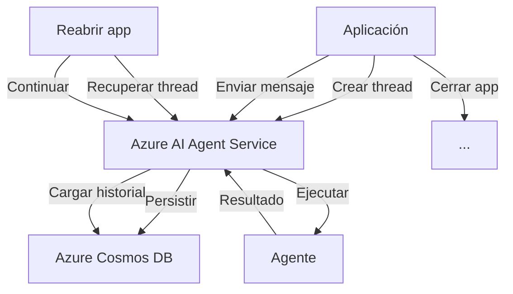

# Lab 05: Azure AI Agent Service - Workflows Persistentes

**Duración**: 35 minutos  
**Nivel**: Avanzado  
**Objetivo**: Implementar workflows con estado persistente usando Azure AI Agent Service

## Descripción

En este lab implementarás un workflow que **persiste su estado** en Azure AI Agent Service. A diferencia de los labs anteriores donde el estado se pierde al cerrar la aplicación, aquí podrás:

1. **Pausar** el workflow (cerrar la aplicación)
2. **Reanudar** donde quedaste (reabrir la aplicación)
3. **Mantener** todo el historial de conversación



## Prerequisitos

- ✅ .NET 10 SDK instalado
- ✅ Azure AI Foundry project configurado
- ✅ Azure CLI instalado y autenticado (`az login`)
- ✅ Completar Lab 04: Group Chat

## Configuración de Azure AI Foundry

### Paso 1: Crear Proyecto en Azure AI Foundry

Si no tienes un proyecto de Azure AI Foundry, sigue la guía del instructor en:
`instructor-guide/azure-ai-foundry-setup.md`

Necesitarás:
- Un proyecto de Azure AI Foundry
- Conexión a Azure OpenAI configurada
- El endpoint del proyecto (ej: `https://tu-proyecto.services.ai.azure.com`)

### Paso 2: Autenticación con Azure

```bash
# Iniciar sesión en Azure
az login

# Verificar la suscripción correcta
az account show
```

## Pasos del Lab

### Paso 1: Crear el Proyecto

```bash
# Navegar a la carpeta del lab
cd docs/modulo-03-workflows/labs/05-azure-agent-service

# Restaurar paquetes
dotnet restore
```

### Paso 2: Configurar Endpoint del Proyecto

Edita `appsettings.json` con tu endpoint de Azure AI Foundry:

```json
{
  "AzureAIFoundry": {
    "ProjectEndpoint": "https://TU-PROYECTO.services.ai.azure.com",
    "ModelDeployment": "gpt-5.2"
  }
}
```

**Cómo obtener el endpoint**:
1. Ir a [Azure AI Foundry](https://ai.azure.com)
2. Abrir tu proyecto
3. Copiar el endpoint desde "Project settings"

### Paso 3: Revisar el Código

Abre `Program.cs` y observa:

1. **Autenticación con DefaultAzureCredential** (líneas 45-50):
   ```csharp
   var credential = new DefaultAzureCredential();
   var projectClient = new AIProjectClient(new Uri(projectEndpoint), credential);
   ```

2. **Persistencia local del thread ID** (líneas 55-75):
   - Se guarda en `thread_state.json`
   - Permite recuperar la conversación después de cerrar

3. **Recuperación de thread existente** (líneas 100-130):
   - Si existe `thread_state.json`, recupera el thread
   - Muestra el historial de mensajes anteriores

4. **Loop de conversación con runs** (líneas 175-230):
   ```csharp
   // Crear mensaje
   await agentsClient.CreateMessageAsync(thread.Id, MessageRole.User, userInput);
   
   // Crear run (ejecución del agente)
   var run = await agentsClient.CreateRunAsync(thread.Id, agent.Id);
   
   // Esperar completado
   while (run.Status == RunStatus.InProgress) { ... }
   ```

### Paso 4: Primera Ejecución

```bash
dotnet run
```

**Salida esperada (primera vez)**:

```
═══════════════════════════════════════════════════════════════════
     WORKFLOW PERSISTENTE: Azure AI Agent Service
═══════════════════════════════════════════════════════════════════

Conectando a Azure AI Foundry...
✓ Conectado a proyecto: https://tu-proyecto.services.ai.azure.com

Creando nuevo agente persistente...
✓ Agente creado: AsistenteAnalisisDatos (ID: asst_abc123)

Creando nuevo thread de conversación...
✓ Thread creado (ID: thread_xyz789)

═══════════════════════════════════════════════════════════════════
                    CONVERSACIÓN INTERACTIVA
═══════════════════════════════════════════════════════════════════

Escribe tus mensajes. Comandos especiales:
  'salir' - Termina la sesión (el thread persiste para después)
  'nuevo' - Crea un nuevo thread (borra historial)
  'historial' - Muestra el historial completo

─────────────────────────────────────────────────────────────────

👤 Tú: Hola, quiero analizar los datos de ventas del Q4
🤖 Agente: ...
   ¡Hola! Encantado de ayudarte con el análisis de ventas del Q4. 
   Para comenzar, ¿podrías indicarme qué tipo de datos tienes disponibles?
   Por ejemplo: ventas totales, por región, por producto, etc.

👤 Tú: Tenemos ventas por región: Norte $1.2M, Sur $800K, Este $950K, Oeste $1.1M
🤖 Agente: ...
   Excelente. Aquí está mi análisis inicial de ventas por región Q4:
   
   📊 RESUMEN:
   • Total Q4: $4.05M
   • Región líder: Norte ($1.2M - 30%)
   • Oportunidad de mejora: Sur ($800K - 20%)
   
   ¿Te gustaría profundizar en alguna región específica?

👤 Tú: salir

💾 Estado guardado. Puedes continuar la conversación más tarde.
   Thread ID: thread_xyz789
```

### Paso 5: Segunda Ejecución (Reanudación)

Cierra completamente la aplicación y vuelve a ejecutar:

```bash
dotnet run
```

**Salida esperada (reanudación)**:

```
═══════════════════════════════════════════════════════════════════
     WORKFLOW PERSISTENTE: Azure AI Agent Service
═══════════════════════════════════════════════════════════════════

Conectando a Azure AI Foundry...
✓ Conectado a proyecto: https://tu-proyecto.services.ai.azure.com

┌─────────────────────────────────────────────────────────────────┐
│ 📁 ESTADO PREVIO ENCONTRADO                                     │
└─────────────────────────────────────────────────────────────────┘
   Thread ID: thread_xyz789
   Agent ID: asst_abc123

✓ Agente recuperado: AsistenteAnalisisDatos (ID: asst_abc123)
✓ Thread recuperado (ID: thread_xyz789)

📜 HISTORIAL DE CONVERSACIÓN:
─────────────────────────────────────────────────────────────────
   👤 Usuario: Hola, quiero analizar los datos de ventas del Q4
   🤖 Agente: ¡Hola! Encantado de ayudarte con el análisis de ve...
   👤 Usuario: Tenemos ventas por región: Norte $1.2M, Sur $800K...
   🤖 Agente: Excelente. Aquí está mi análisis inicial de venta...
─────────────────────────────────────────────────────────────────

═══════════════════════════════════════════════════════════════════
                    CONVERSACIÓN INTERACTIVA
═══════════════════════════════════════════════════════════════════

👤 Tú: ¿Puedes comparar el Norte vs el Sur?
🤖 Agente: ...
   Basándome en los datos que compartiste anteriormente:
   
   📈 NORTE vs SUR:
   • Norte: $1.2M (50% más que Sur)
   • Sur: $800K
   • Diferencia: $400K
   
   El Norte está superando significativamente al Sur. 
   ¿Quieres que identifique posibles causas?
```

**¡Observa!** El agente recuerda los datos de la sesión anterior porque el thread persiste en Azure.

### Paso 6: Validar Persistencia

1. ✅ Verificar que `thread_state.json` existe en el directorio
2. ✅ El historial muestra mensajes de sesiones anteriores
3. ✅ El agente mantiene contexto (conoce los datos de ventas)

## Checkpoint de Validación

**Criterio de éxito**: El workflow pausa, la aplicación se cierra, y al reabrir la conversación continúa con el contexto previo.

**Validación del instructor**:
- [ ] La segunda ejecución muestra "ESTADO PREVIO ENCONTRADO"
- [ ] El historial de conversación se recupera
- [ ] El agente recuerda información de la sesión anterior

## Troubleshooting

### "Authentication failed"

**Causa**: Azure CLI no está autenticado o las credenciales expiraron.

**Solución**:
```bash
az login
az account set --subscription "TU-SUSCRIPCION"
```

### "Thread not found"

**Causa**: El thread fue eliminado en Azure o el ID es incorrecto.

**Solución**: Elimina `thread_state.json` para crear un nuevo thread:
```bash
rm thread_state.json
dotnet run
```

### "Run timeout"

**Causa**: El agente tarda mucho en responder.

**Solución**: Las operaciones largas son normales. Si persiste, verifica:
1. Conectividad a Azure
2. Límites de cuota en Azure OpenAI

### "Project endpoint invalid"

**Causa**: El endpoint del proyecto no es correcto.

**Solución**:
1. Ir a [Azure AI Foundry](https://ai.azure.com)
2. Abrir el proyecto
3. Copiar el endpoint exacto desde "Project settings"

## Arquitectura de Persistencia

```
┌─────────────────────────────────────────────────────────────────┐
│                    Tu Aplicación                                 │
├─────────────────────────────────────────────────────────────────┤
│  thread_state.json                                               │
│  ├── threadId: "thread_xyz789"                                   │
│  └── agentId: "asst_abc123"                                     │
└───────────────────────────┬─────────────────────────────────────┘
                            │
                            ▼
┌─────────────────────────────────────────────────────────────────┐
│                Azure AI Agent Service                            │
├─────────────────────────────────────────────────────────────────┤
│  Agents                    │  Threads                            │
│  ├── asst_abc123          │  ├── thread_xyz789                  │
│  │   ├── name             │  │   ├── messages[]                 │
│  │   ├── instructions     │  │   ├── created_at                 │
│  │   └── model            │  │   └── metadata                   │
└─────────────────────────────────────────────────────────────────┘
                            │
                            ▼
┌─────────────────────────────────────────────────────────────────┐
│                    Azure Cosmos DB                               │
│              (Manejado automáticamente por Azure)                │
└─────────────────────────────────────────────────────────────────┘
```

## Experimentos Opcionales

Si terminas antes, intenta:

1. **Múltiples sesiones**: Abre otra terminal y ejecuta con el mismo thread
2. **Limpiar thread**: Usa el comando 'nuevo' y verifica que el historial se borra
3. **Ver en Azure Portal**: Busca los recursos creados en tu proyecto de Azure AI Foundry

## Siguiente Módulo

¡Felicidades! Has completado todos los labs del Módulo 3: Workflows.

Continúa con [Módulo 4: Observabilidad](../../modulo-04-observability/) para aprender a monitorear tus workflows multi-agente.
