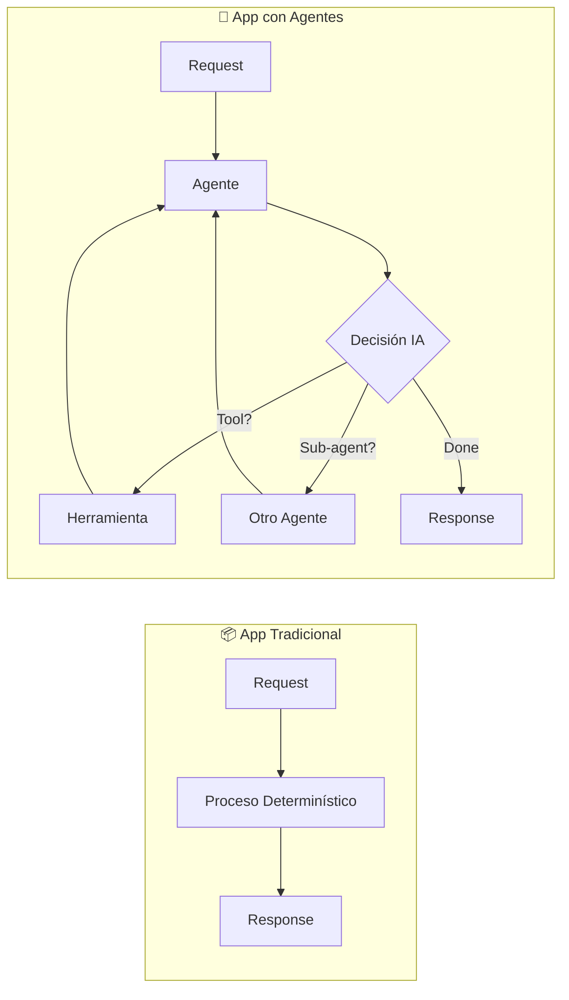
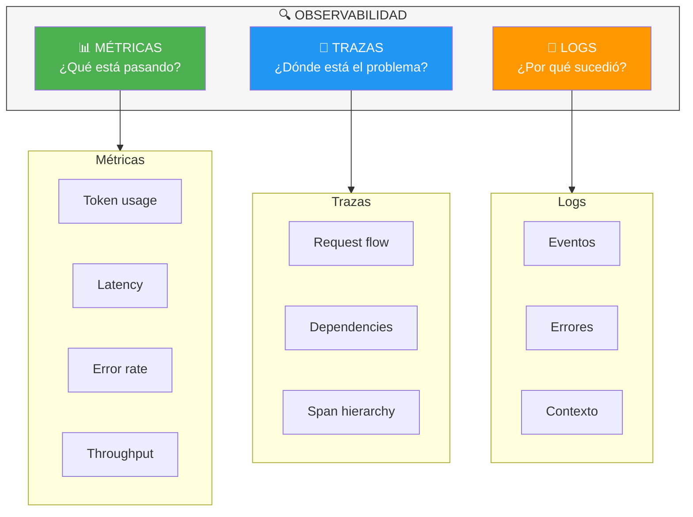
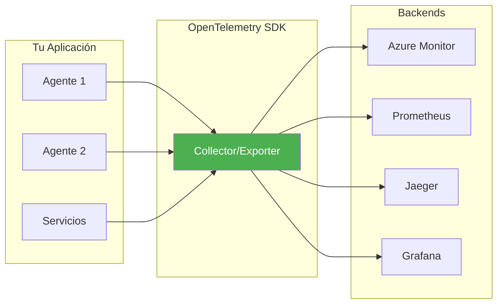

# Módulo 4: Observabilidad y Monitoreo de Agentes

**Duración**: 75 minutos (teoría 20 min + labs 55 min)  
**Nivel**: Intermedio  
**Prerequisitos**: Módulos 1-3 completados, Azure subscription con Application Insights

---

## Tabla de Contenidos

1. [Introducción a la Observabilidad](#introducción-a-la-observabilidad)
2. [Los Tres Pilares de la Observabilidad](#los-tres-pilares-de-la-observabilidad)
3. [OpenTelemetry: El Estándar Abierto](#opentelemetry-el-estándar-abierto)
4. [Integración con Azure Monitor](#integración-con-azure-monitor)
5. [Patrones de Observabilidad en Agentes IA](#patrones-de-observabilidad-en-agentes-ia)
6. [Laboratorios Prácticos](#labs-prácticos)
7. [Troubleshooting](#troubleshooting-común)

---

## Objetivos de Aprendizaje

Al completar este módulo, serás capaz de:

1. **Explicar** los tres pilares de la observabilidad y su relevancia en sistemas de agentes IA
2. **Configurar** OpenTelemetry para métricas, trazas y logs en aplicaciones .NET
3. **Implementar** métricas personalizadas para monitorear latencia, errores y consumo de tokens
4. **Crear** trazas distribuidas que visualicen el flujo de trabajo entre múltiples agentes
5. **Exportar** telemetría a Azure Monitor Application Insights
6. **Diseñar** dashboards y alertas para operaciones de producción

---

## Introducción a la Observabilidad

La **observabilidad** es la capacidad de entender el estado interno de un sistema a través de sus salidas externas. En el contexto de aplicaciones con agentes de IA, esto es especialmente crítico porque:

- **Complejidad inherente**: Los agentes toman decisiones autónomas que pueden ser difíciles de predecir
- **Costos de operación**: Las llamadas a LLMs generan costos por tokens consumidos
- **Latencia variable**: Las respuestas de Azure OpenAI pueden variar significativamente
- **Cadenas de invocación**: Un agente puede invocar múltiples herramientas y sub-agentes

### ¿Por qué es Diferente la Observabilidad en Agentes IA?

A diferencia de aplicaciones tradicionales, los sistemas de agentes presentan desafíos únicos:



**Beneficios de una buena observabilidad:**

| Beneficio | Descripción |
|-----------|-------------|
| 🔍 **Diagnóstico rápido** | Identificar por qué un agente tomó una decisión específica |
| 💰 **Optimización de costos** | Monitorear y controlar el consumo de tokens |
| 📈 **Mejora continua** | Identificar patrones de uso y oportunidades de optimización |
| 🔐 **Cumplimiento** | Auditar las interacciones para compliance y seguridad |
| ⚠️ **Alertas proactivas** | Detectar problemas antes de que afecten a los usuarios |

---

## Los Tres Pilares de la Observabilidad

La observabilidad moderna se basa en tres pilares fundamentales, cada uno proporcionando una perspectiva diferente del sistema:



### 1. Métricas (Metrics)

**Propósito**: Responder "¿cuántos?" y "¿cuánto?"

Métricas clave para agentes de IA:

| Métrica | Tipo | Descripción | Uso |
|---------|------|-------------|-----|
| `agent.invocations.total` | Counter | Invocaciones totales | Throughput |
| `agent.invocations.errors` | Counter | Errores totales | Reliability |
| `agent.latency.ms` | Histogram | Tiempo de respuesta | Performance |
| `agent.tokens.prompt` | Counter | Tokens de entrada | Costos |
| `agent.tokens.completion` | Counter | Tokens de salida | Costos |
| `agent.function_calls.total` | Counter | Llamadas a herramientas | Behavior |

**Ejemplo de implementación:**

```csharp
using System.Diagnostics.Metrics;

public class AgentMetrics
{
    private readonly Meter _meter;
    private readonly Counter<long> _invocationsCounter;
    private readonly Counter<long> _errorsCounter;
    private readonly Histogram<double> _latencyHistogram;
    private readonly Counter<long> _promptTokensCounter;
    private readonly Counter<long> _completionTokensCounter;

    public AgentMetrics()
    {
        // Crear medidor con nombre único para identificar el origen
        _meter = new Meter("Workshop.MAF.Agents", "1.0.0");

        _invocationsCounter = _meter.CreateCounter<long>(
            "agent.invocations.total",
            unit: "invocations",
            description: "Número total de invocaciones del agente");

        _errorsCounter = _meter.CreateCounter<long>(
            "agent.invocations.errors",
            description: "Invocaciones que resultaron en error");

        _latencyHistogram = _meter.CreateHistogram<double>(
            "agent.latency",
            unit: "ms",
            description: "Tiempo de respuesta en milisegundos");

        _promptTokensCounter = _meter.CreateCounter<long>(
            "agent.tokens.prompt",
            unit: "tokens",
            description: "Tokens de entrada consumidos");

        _completionTokensCounter = _meter.CreateCounter<long>(
            "agent.tokens.completion",
            unit: "tokens",
            description: "Tokens de salida generados");
    }

    public void RecordInvocation() => _invocationsCounter.Add(1);
    public void RecordError() => _errorsCounter.Add(1);
    public void RecordLatency(double ms) => _latencyHistogram.Record(ms);
    public void RecordTokens(long prompt, long completion)
    {
        _promptTokensCounter.Add(prompt);
        _completionTokensCounter.Add(completion);
    }
}
```

### 2. Trazas (Traces)

**Propósito**: Seguir el flujo de una request a través de múltiples servicios/agentes

**Estructura de una traza típica:**

```
Request: "¿Clima en Madrid y noticias de España?"
│
├─ Span: MainAgent.Invoke (300ms)
│  ├─ attribute: agent_name = "MainAgent"
│  ├─ attribute: query_length = 42
│  │
│  ├─ Span: WeatherAgent.GetWeather (120ms)
│  │  ├─ attribute: location = "Madrid"
│  │  └─ Span: Azure OpenAI Call (100ms)
│  │     ├─ attribute: model = "gpt-4"
│  │     ├─ attribute: prompt_tokens = 85
│  │     └─ attribute: completion_tokens = 32
│  │
│  └─ Span: NewsAgent.GetNews (150ms)
│     └─ Span: Azure OpenAI Call (130ms)
│        └─ attribute: completion_tokens = 128
```

**Ejemplo de implementación:**

```csharp
using System.Diagnostics;

public class AgentTracing
{
    // ActivitySource es el equivalente de OpenTelemetry Tracer en .NET
    private static readonly ActivitySource ActivitySource = 
        new("Workshop.MAF.Agents", "1.0.0");

    public async Task<string> ProcessQueryAsync(string userQuery)
    {
        // Crear span padre para toda la operación
        using var activity = ActivitySource.StartActivity(
            "MainAgent.ProcessQuery",
            ActivityKind.Server);

        // Añadir atributos contextuales (sin PII)
        activity?.SetTag("agent.name", "WeatherAssistant");
        activity?.SetTag("query.length", userQuery.Length);

        try
        {
            // Span hijo para llamada a Azure OpenAI
            using (var llmActivity = ActivitySource.StartActivity("AzureOpenAI.ChatCompletion"))
            {
                llmActivity?.SetTag("model", "gpt-4");
                var response = await CallAzureOpenAIAsync(userQuery);
                llmActivity?.SetTag("prompt_tokens", response.PromptTokens);
                llmActivity?.SetTag("completion_tokens", response.CompletionTokens);
            }

            activity?.SetStatus(ActivityStatusCode.Ok);
            return "Respuesta procesada";
        }
        catch (Exception ex)
        {
            activity?.SetStatus(ActivityStatusCode.Error, ex.Message);
            throw;
        }
    }
}
```

### 3. Logs (Registros)

**Propósito**: Contexto detallado de eventos

**Niveles recomendados:**

| Nivel | Uso | Ejemplo |
|-------|-----|---------|
| `Debug` | Desarrollo | Prompt enviado a LLM |
| `Information` | Operacional | Agente invocado |
| `Warning` | Atención | Latencia alta |
| `Error` | Problemas | Fallo en API |
| `Critical` | Fallas graves | Servicio no disponible |

**Ejemplo:**

```csharp
using Microsoft.Extensions.Logging;

public class AgentLogger
{
    private readonly ILogger<AgentLogger> _logger;

    public AgentLogger(ILogger<AgentLogger> logger)
    {
        _logger = logger;
    }

    public void LogInvocation(string agentName, string correlationId)
    {
        // Logging estructurado - los parámetros se indexan automáticamente
        _logger.LogInformation(
            "Agente {AgentName} invocado. CorrelationId: {CorrelationId}",
            agentName, correlationId);
    }

    public void LogTokenUsage(string model, long prompt, long completion)
    {
        _logger.LogInformation(
            "Tokens - Modelo: {Model}, Prompt: {PromptTokens}, " +
            "Completion: {CompletionTokens}, Total: {TotalTokens}",
            model, prompt, completion, prompt + completion);
    }

    // ⚠️ IMPORTANTE: Nunca registrar PII directamente
    public void LogUserInteraction(string userId, int queryLength)
    {
        _logger.LogInformation(
            "Interacción de usuario {UserId}. Longitud query: {QueryLength}",
            userId, queryLength);
    }
}
```

---

## OpenTelemetry: El Estándar Abierto

**OpenTelemetry (OTel)** es el estándar de industria para instrumentación de observabilidad:



**Ventajas principales:**
- ✅ **Vendor-neutral**: No te ata a un proveedor específico
- ✅ **Estándar de industria**: Amplia adopción y soporte
- ✅ **Unified API**: Una sola API para métricas, trazas y logs
- ✅ **Extensible**: Fácil de agregar exporters

### Paquetes NuGet Requeridos

| Paquete | Propósito |
|---------|-----------|
| `OpenTelemetry` | SDK base |
| `OpenTelemetry.Extensions.Hosting` | Integración con Host .NET |
| `OpenTelemetry.Instrumentation.Http` | Auto-instrumentación HTTP |
| `OpenTelemetry.Instrumentation.Runtime` | Métricas de runtime |
| `OpenTelemetry.Exporter.Console` | Exportar a consola |
| `OpenTelemetry.Exporter.Prometheus.AspNetCore` | Exportar a Prometheus |
| `Azure.Monitor.OpenTelemetry.Exporter` | Exportar a Azure Monitor |

### Configuración Básica

```csharp
using OpenTelemetry;
using OpenTelemetry.Metrics;
using OpenTelemetry.Trace;

var builder = Host.CreateApplicationBuilder(args);

// Agregar OpenTelemetry
builder.Services.AddOpenTelemetry()
    .WithMetrics(metrics =>
    {
        // Métricas de MAF (automáticas)
        metrics.AddMeter("Microsoft.Agents.AI*");
        
        // Métricas de runtime
        metrics.AddRuntimeInstrumentation();
        
        // Exportar a consola (para desarrollo)
        metrics.AddConsoleExporter();
    })
    .WithTracing(tracing =>
    {
        // Trazas de MAF
        tracing.AddSource("Microsoft.Agents.AI*");
        
        // Trazas de HTTP (Azure OpenAI calls)
        tracing.AddHttpClientInstrumentation();
        
        // Exportar a consola
        tracing.AddConsoleExporter();
    });
```

---

### Azure Monitor Integration

**Azure Monitor Application Insights** proporciona:
- Dashboards visuales
- Queries con KQL (Kusto Query Language)
- Alertas automatizadas
- Correlación entre métricas, trazas y logs

#### Exportar a Azure Monitor

```csharp
using Azure.Monitor.OpenTelemetry.Exporter;

builder.Services.AddOpenTelemetry()
    .WithMetrics(metrics =>
    {
        metrics.AddAzureMonitorMetricExporter(options =>
        {
            options.ConnectionString = "InstrumentationKey=...;IngestionEndpoint=...";
        });
    })
    .WithTracing(tracing =>
    {
        tracing.AddAzureMonitorTraceExporter(options =>
        {
            options.ConnectionString = "InstrumentationKey=...;IngestionEndpoint=...";
        });
    });
```

#### Dashboards y Queries

**Query de ejemplo** (KQL):

```kql
// Latencia promedio por agente
customMetrics
| where name == "agent.invocation.duration"
| summarize avg(value) by tostring(customDimensions.agent_name)
| render barchart
```

```kql
// Top 5 funciones más llamadas
customMetrics
| where name == "function.execution.count"
| summarize count() by tostring(customDimensions.function_name)
| top 5 by count_
```

---

### PII Redaction (Redacción de Datos Sensibles)

**Problema**: Logs pueden contener información personal (nombres, emails, IDs)

**Solución**: Redactar datos sensibles antes de exportar

```csharp
using System.Text.RegularExpressions;

public class PIIRedactionProcessor : BaseProcessor<LogRecord>
{
    private static readonly Regex EmailRegex = new Regex(@"\b[\w\.-]+@[\w\.-]+\.\w{2,}\b");
    
    public override void OnEnd(LogRecord logRecord)
    {
        if (logRecord.Body != null)
        {
            var sanitized = EmailRegex.Replace(logRecord.Body, "[EMAIL_REDACTED]");
            logRecord.Body = sanitized;
        }
        
        base.OnEnd(logRecord);
    }
}

// Registrar processor
builder.Services.AddOpenTelemetry()
    .WithLogging(logging =>
    {
        logging.AddProcessor<PIIRedactionProcessor>();
    });
```

---

## Labs Prácticos

### [Lab 01: Metrics and Tokens](labs/01-metrics-tokens/)
**Duración**: 20 minutos

Recolecta métricas de token usage y latencia de agentes

**Habilidades**:
- Configurar OpenTelemetry Metrics
- Exportar a consola y Prometheus
- Visualizar token consumption

---

### [Lab 02: Distributed Traces](labs/02-distributed-traces/)
**Duración**: 25 minutos

Implementa tracing distribuido en workflow multi-agente

**Habilidades**:
- Configurar tracing de MAF y HTTP
- Agregar spans personalizados
- Analizar request flow

---

## Checkpoint de Validación

**Criterios de éxito**:
- ✅ Métricas de tokens se muestran en consola
- ✅ Traces muestran jerarquía de llamadas (parent → child spans)

**Meta**: 75% de participantes completan los 2 labs

---

## Métricas Clave para Producción

| Métrica | Descripción | Threshold Sugerido |
|---------|-------------|-------------------|
| `agent.invocation.duration` | Latencia del agente | p95 < 5s |
| `agent.error.rate` | % de errores | < 1% |
| `llm.token.usage` | Tokens por request | Monitor para control de costos |
| `function.execution.count` | Llamadas a funciones | Detectar loops infinitos |
| `http.client.duration` | Latencia de Azure OpenAI | p95 < 3s |

---

## Troubleshooting Común

### "Métricas no aparecen en consola"

**Causa**: Falta registrar `AddConsoleExporter()`  
**Solución**: Agregar `.AddConsoleExporter()` en configuración de métricas

### "Traces no muestran Azure OpenAI calls"

**Causa**: Falta instrumentación de HTTP  
**Solución**: Agregar `.AddHttpClientInstrumentation()` en tracing

### "Azure Monitor no recibe datos"

**Causa**: Connection string incorrecto  
**Solución**: Verificar connection string de Application Insights en portal.azure.com

### "Logs contienen datos sensibles"

**Causa**: No hay redacción de PII  
**Solución**: Implementar `PIIRedactionProcessor` personalizado

---

## Recursos Adicionales

- [OpenTelemetry for .NET](https://opentelemetry.io/docs/languages/net/)
- [Azure Monitor OpenTelemetry](https://learn.microsoft.com/azure/azure-monitor/app/opentelemetry-enable)
- [KQL Query Examples](https://learn.microsoft.com/azure/data-explorer/kql-quick-reference)

---

## Siguiente Módulo

Continúa con [Módulo 5: ASP.NET y Aspire](../modulo-05-aspnet-aspire/) para integrar agentes en aplicaciones web con observabilidad completa.
