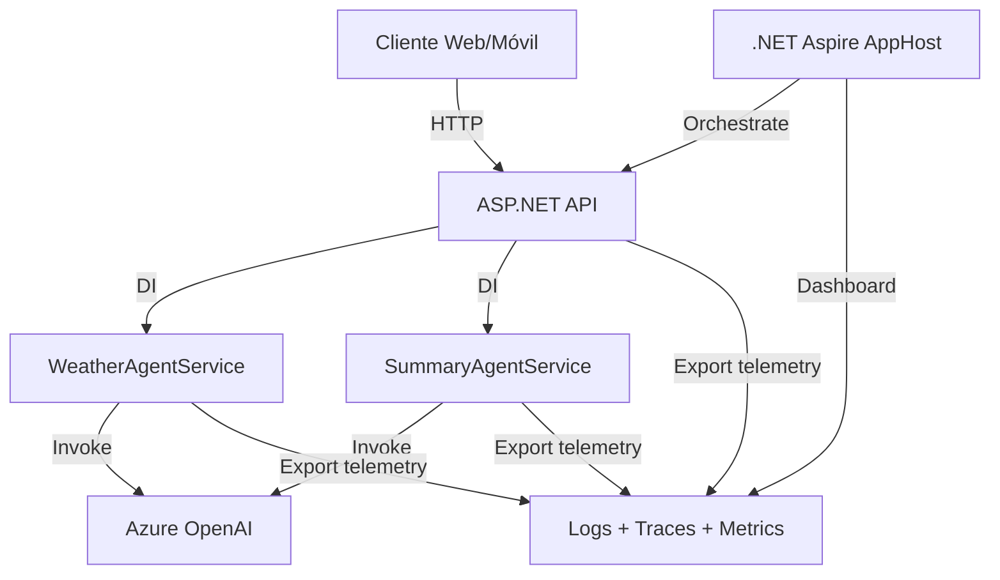

# Módulo 5: Integración con ASP.NET Core y .NET Aspire

**Duración**: 60 minutos  
**Nivel**: Avanzado  
**Prerequisitos**: Módulos 1-4

## Objetivos de Aprendizaje

Al completar este módulo, serás capaz de:

1. Exponer agentes de MAF como APIs HTTP con ASP.NET Core
2. Configurar dependency injection para servicios de agentes
3. Usar .NET Aspire para orquestar aplicaciones multi-agente
4. Aprovechar el dashboard de Aspire para observabilidad integrada

## Contenido Teórico

### ¿Por Qué ASP.NET + Aspire?

#### ASP.NET Core para APIs

**Ventajas**:
- Exponer agentes como endpoints REST para aplicaciones web/móviles
- Autenticación y autorización (JWT, Azure AD)
- Rate limiting y middleware
- Escalabilidad horizontal (múltiples instancias)

#### .NET Aspire para Orquestación

**Ventajas**:
- **Un comando para iniciar todo**: `dotnet run --project AppHost`
- **Dashboard unificado**: Logs, traces, métricas de todos los servicios
- **Service discovery automático**: Los servicios se encuentran sin configuración manual
- **Observabilidad pre-configurada**: OpenTelemetry funciona sin configuración adicional

---

### Arquitectura del Capstone Project



**Componentes**:
1. **AppHost**: Orquestador de Aspire (punto de entrada)
2. **WebApi**: API REST con minimal APIs
3. **AgentServices**: Biblioteca con implementaciones de agentes

---

### Estructura de Solución

```
01-multi-agent-web/
├── AppHost/
│   ├── AppHost.csproj
│   └── Program.cs              # Configuración de Aspire
├── WebApi/
│   ├── WebApi.csproj
│   ├── Program.cs              # Endpoints de API
│   └── appsettings.json
├── AgentServices/
│   ├── AgentServices.csproj
│   ├── WeatherAgentService.cs  # Agente especializado
│   └── SummaryAgentService.cs  # Agente especializado
└── MultiAgentWeb.sln
```

---

### Implementación: AgentServices

**WeatherAgentService.cs**:

```csharp
using Microsoft.AI.Agents;

public class WeatherAgentService
{
    private readonly ChatCompletionAgent _agent;
    
    public WeatherAgentService(Kernel kernel)
    {
        _agent = new ChatCompletionAgent()
        {
            Name = "WeatherAgent",
            Instructions = "Proporciona información del clima de manera amigable.",
            Kernel = kernel
        };
    }
    
    public async Task<string> GetWeatherAsync(string city)
    {
        var chatHistory = new ChatHistory();
        chatHistory.AddUserMessage($"¿Cómo está el clima en {city}?");
        
        var response = await _agent.InvokeAsync(chatHistory);
        return response.Content;
    }
}
```

---

### Implementación: WebApi

**Program.cs** (Minimal APIs):

```csharp
using AgentServices;
using Microsoft.AI.Agents;

var builder = WebApplication.CreateBuilder(args);

// Configurar Kernel (compartido por todos los agentes)
builder.Services.AddSingleton<Kernel>(sp =>
{
    var kernelBuilder = Kernel.CreateBuilder();
    kernelBuilder.AddAzureOpenAIChatCompletion(
        deploymentName: "gpt-5.2",
        endpoint: builder.Configuration["AzureOpenAI:Endpoint"]!,
        apiKey: builder.Configuration["AzureOpenAI:ApiKey"]!
    );
    return kernelBuilder.Build();
});

// Registrar servicios de agentes
builder.Services.AddSingleton<WeatherAgentService>();
builder.Services.AddSingleton<SummaryAgentService>();

// Agregar OpenAPI/Swagger
builder.Services.AddEndpointsApiExplorer();
builder.Services.AddSwaggerGen();

var app = builder.Build();

// Habilitar Swagger en desarrollo
if (app.Environment.IsDevelopment())
{
    app.UseSwagger();
    app.UseSwaggerUI();
}

// Endpoints
app.MapPost("/api/chat/weather", async (WeatherRequest request, WeatherAgentService service) =>
{
    var result = await service.GetWeatherAsync(request.City);
    return Results.Ok(new { response = result });
});

app.MapPost("/api/chat/summary", async (SummaryRequest request, SummaryAgentService service) =>
{
    var result = await service.SummarizeAsync(request.Text);
    return Results.Ok(new { response = result });
});

app.Run();

// DTOs
record WeatherRequest(string City);
record SummaryRequest(string Text);
```

---

### Implementación: AppHost (Aspire)

**Program.cs**:

```csharp
var builder = DistributedApplication.CreateBuilder(args);

// Agregar referencia a Azure OpenAI (configuración compartida)
var openai = builder.AddConnectionString("openai");

// Agregar proyecto de API
var api = builder.AddProject<Projects.WebApi>("webapi")
    .WithReference(openai)  // Inyectar configuración de OpenAI
    .WithExternalHttpEndpoints();  // Exponer al exterior

builder.Build().Run();
```

**¿Qué hace Aspire?**:
1. Inicia `WebApi` automáticamente
2. Configura variables de entorno (connection strings)
3. Abre dashboard en `http://localhost:15888`
4. Recolecta logs, traces, métricas de todos los servicios

---

### Aspire Dashboard

El dashboard incluye:

#### 1. Resources
- Lista de servicios corriendo
- Estado (Running, Stopped, Failed)
- Endpoints (URLs)

#### 2. Console Logs
- Logs en tiempo real de cada servicio
- Filtrado por nivel (Info, Warning, Error)

#### 3. Structured Logs
- Logs estructurados con propiedades
- Búsqueda y filtrado avanzado

#### 4. Traces
- Distributed tracing visual
- Jerarquía de spans
- Latencia por operación

#### 5. Metrics
- Gráficos de métricas en tiempo real
- Token usage, latency, request rate

---

### Deployment con `azd` (Azure Developer CLI)

Aspire incluye plantillas para desplegar a Azure:

```bash
# Inicializar proyecto para Azure
azd init

# Desplegar a Azure Container Apps
azd up
```

**Recursos creados automáticamente**:
- Azure Container Apps (para cada servicio)
- Azure Container Registry (para imágenes)
- Azure Monitor (para observabilidad)
- Networking (VNet, Load Balancer)

---

## Labs Prácticos

### [Lab 01: Multi-Agent Web API](labs/01-multi-agent-web/)
**Duración**: 60 minutos (**Capstone Project**)

Construye una aplicación web completa con múltiples agentes orquestados por Aspire.

**Componentes**:
1. **AppHost**: Orquestador de Aspire
2. **WebApi**: Endpoints REST para agentes
3. **AgentServices**: WeatherAgent y SummaryAgent

**Habilidades**:
- Estructura de solución multi-proyecto
- Dependency injection de agentes
- Configuración de Aspire
- Testing de APIs con Swagger
- Observabilidad con Aspire Dashboard

---

## Checkpoint de Validación

**Criterios de éxito**:
- ✅ API responde en `http://localhost:5000/api/chat/weather`
- ✅ Aspire dashboard muestra logs y traces
- ✅ Swagger UI documenta endpoints correctamente
- ✅ Múltiples requests simultáneos se manejan sin errores

**Meta**: 70% de participantes completan el capstone project

---

## Patrones de Producción

### 1. Error Handling

```csharp
app.MapPost("/api/chat/weather", async (WeatherRequest request, WeatherAgentService service) =>
{
    try
    {
        var result = await service.GetWeatherAsync(request.City);
        return Results.Ok(new { response = result });
    }
    catch (HttpOperationException ex) when (ex.StatusCode == 429)
    {
        return Results.StatusCode(429, new { error = "Rate limit exceeded. Try again later." });
    }
    catch (Exception ex)
    {
        // Log error (Aspire captura automáticamente)
        return Results.Problem("An error occurred processing your request.");
    }
});
```

### 2. Authentication (ejemplo con JWT)

```csharp
builder.Services.AddAuthentication(JwtBearerDefaults.AuthenticationScheme)
    .AddJwtBearer(options =>
    {
        options.Authority = "https://login.microsoftonline.com/{tenant-id}";
        options.Audience = "api://your-api-id";
    });

app.UseAuthentication();
app.UseAuthorization();

app.MapPost("/api/chat/weather", async (WeatherRequest request, WeatherAgentService service) =>
{
    // Endpoint protegido
}).RequireAuthorization();
```

### 3. Rate Limiting

```csharp
builder.Services.AddRateLimiter(options =>
{
    options.GlobalLimiter = PartitionedRateLimiter.Create<HttpContext, string>(context =>
        RateLimitPartition.GetFixedWindowLimiter(
            partitionKey: context.User.Identity?.Name ?? context.Request.Headers.Host.ToString(),
            factory: partition => new FixedWindowRateLimiterOptions
            {
                PermitLimit = 10,
                Window = TimeSpan.FromMinutes(1)
            }
        )
    );
});

app.UseRateLimiter();
```

---

## Troubleshooting Común

### "Aspire dashboard not accessible"

**Causa**: Puerto en uso  
**Solución**: Especificar puerto: `dotnet run --project AppHost --urls="http://localhost:15889"`

### "Agents not resolving in DI"

**Causa**: Kernel no registrado como Singleton  
**Solución**: `builder.Services.AddSingleton<Kernel>(...)`

### "CORS errors"

**Causa**: Frontend en diferente origen  
**Solución**: Agregar política CORS:
```csharp
builder.Services.AddCors(options =>
{
    options.AddDefaultPolicy(policy =>
    {
        policy.WithOrigins("http://localhost:3000")
              .AllowAnyHeader()
              .AllowAnyMethod();
    });
});

app.UseCors();
```

---

## Recursos Adicionales

- [.NET Aspire Documentation](https://learn.microsoft.com/dotnet/aspire)
- [ASP.NET Core Minimal APIs](https://learn.microsoft.com/aspnet/core/fundamentals/minimal-apis)
- [Azure Developer CLI](https://learn.microsoft.com/azure/developer/azure-developer-cli/)

---

## Siguiente Módulo

Continúa con [Módulo 6: DevUI](../modulo-06-devui/) para aprender herramientas de debugging especializadas para agentes.
