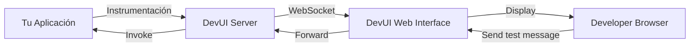

# Módulo 6: DevUI - Debugging y Testing de Agentes

**Duración**: 15 minutos  
**Nivel**: Todos los niveles  
**Prerequisitos**: Módulo 1

## Objetivos de Aprendizaje

Al completar este módulo, serás capaz de:

1. Configurar DevUI para debugging de agentes
2. Visualizar conversaciones y flujo de mensajes
3. Inspeccionar invocaciones de function tools
4. Usar DevUI para testing interactivo durante desarrollo

## Contenido Teórico

### ¿Qué es DevUI?

**DevUI** es una herramienta oficial de Microsoft Agent Framework para:
- **Debugging visual**: Ver conversaciones agente-usuario en tiempo real
- **Function inspection**: Inspeccionar qué funciones se llaman y con qué parámetros
- **State inspection**: Examinar el estado interno del agente
- **Testing interactivo**: Probar agentes sin escribir código



---

### ¿Cuándo Usar DevUI?

#### ✅ Usar DevUI para:
- Desarrollo local (debugging de agentes)
- Comprender flujos de conversación complejos
- Validar que function tools se llamen correctamente
- Testing rápido sin UI completa

#### ❌ NO usar DevUI para:
- Producción (es una herramienta de desarrollo)
- Aplicaciones de usuario final
- Performance profiling (usar OpenTelemetry en su lugar)

---

### Capacidades de DevUI

#### 1. Visualización de Conversaciones

```
┌─────────────────────────────────────┐
│ 👤 User: ¿Cómo está el clima?      │
├─────────────────────────────────────┤
│ 🔧 Function Call: get_weather()    │
│    city: "Madrid"                   │
│    country: "ES"                    │
├─────────────────────────────────────┤
│ ✅ Function Result:                 │
│    "Soleado, 22°C"                  │
├─────────────────────────────────────┤
│ 🤖 Agent: El clima en Madrid está  │
│    soleado con 22 grados.           │
└─────────────────────────────────────┘
```

#### 2. Function Tool Inspector

- Lista de funciones disponibles
- Parámetros esperados y tipos
- Historial de invocaciones
- Tiempo de ejecución de cada función

#### 3. State Inspector

- Variables del kernel
- Historial de conversación (ChatHistory)
- Configuración del agente (system prompt, temperatura, etc.)

---

### Configuración de DevUI

#### Instalación

```bash
# Instalar DevUI tool globalmente
dotnet tool install -g Microsoft.Agents.AI.DevUI
```

#### Configuración en tu Aplicación

```csharp
using Microsoft.Agents.AI.DevUI;

var builder = WebApplication.CreateBuilder(args);

// Agregar DevUI (solo en desarrollo)
if (builder.Environment.IsDevelopment())
{
    builder.Services.AddDevUI();
}

var app = builder.Build();

// Habilitar DevUI endpoint
if (app.Environment.IsDevelopment())
{
    app.MapDevUI();
}

app.Run();
```

#### Iniciar DevUI

```bash
# Terminal 1: Iniciar tu aplicación
dotnet run

# Terminal 2: Iniciar DevUI interface
devui start
```

**URL**: `http://localhost:5100` (por defecto)

---

### Flujo de Trabajo con DevUI

1. **Desarrollar**: Escribe código del agente
2. **Ejecutar**: `dotnet run` (tu app)
3. **Conectar**: `devui start` (abre navegador)
4. **Probar**: Enviar mensajes desde DevUI UI
5. **Inspeccionar**: Ver function calls, state, traces
6. **Iterar**: Modificar código, reiniciar, repetir

---

### Ejemplo de Uso

**Escenario**: Estás desarrollando un agente con function tool para clima, pero el agente no la está llamando.

**Debugging con DevUI**:

1. **Conectar DevUI** a tu aplicación
2. **Enviar mensaje**: "¿Cómo está el clima en Barcelona?"
3. **Observar en DevUI**:
   - ❌ Function call NOT invoked
   - Ver el prompt que se envió al modelo
   - Inspeccionar lista de funciones disponibles

4. **Hipótesis**: La descripción de la función es ambigua
5. **Verificar en State Inspector**: Leer `[Description]` de la función
6. **Corregir**:
   ```csharp
   // Antes:
   [Description("Get weather")]
   
   // Después:
   [Description("Get current weather conditions for a specific city and country")]
   ```

7. **Reiniciar y probar**: Ahora la función se llama correctamente ✅

---

### Comparación con Alternativas

| Herramienta | Uso | Ventaja |
|-------------|-----|---------|
| **DevUI** | Debugging visual de agentes | Especializado para MAF, UI intuitiva |
| **Console.WriteLine** | Logging básico | Simple, sin setup |
| **VS Code Debugger** | Breakpoints, step-through | Control total, pero verboso |
| **OpenTelemetry** | Observabilidad producción | Completo, pero overhead de config |

**Recomendación**: Usar DevUI durante **desarrollo** y OpenTelemetry en **producción**.

---

## Labs Prácticos

### [Lab 01: DevUI Setup](labs/01-devui-setup/)
**Duración**: 15 minutos

Configura DevUI para debugging de un agente con function tools

**Pasos**:
1. Instalar DevUI tool
2. Agregar instrumentación en aplicación de ejemplo
3. Conectar DevUI a la aplicación
4. Enviar mensajes de prueba
5. Inspeccionar function calls
6. Modificar función y verificar cambios en tiempo real

---

## Checkpoint de Validación

**Criterios de éxito**:
- ✅ DevUI se conecta a la aplicación
- ✅ Conversaciones se visualizan en tiempo real
- ✅ Function calls son visibles con parámetros
- ✅ Puedes identificar por qué una función no se llama

**Meta**: 85% de participantes completan la configuración

---

### Casos de Uso Comunes

#### 1. "¿Por qué mi función no se llama?"

**DevUI muestra**:
- La función está registrada ✅
- La descripción es: "Do weather" ❌ (muy vaga)

**Solución**: Mejorar descripción a "Get current weather for a city"

---

#### 2. "¿Qué parámetros recibe mi función?"

**DevUI muestra**:
```
Function: get_weather(city="Madrid", country="Spain")
```

**Problema detectado**: El modelo pasó "Spain" en lugar de "ES"  
**Solución**: Actualizar descripción del parámetro:
```csharp
[Description("ISO country code (e.g., ES, US, FR)")]
```

---

#### 3. "¿Por qué el agente da respuestas inconsistentes?"

**DevUI muestra el ChatHistory completo**:
- Mensaje 1: "Hola"
- Mensaje 2: "¿Clima?"
- Mensaje 3: "¿Y en Londres?"

**Problema detectado**: Falta contexto ("¿Y en Londres?" sin mencionar que es clima)  
**Solución**: El system prompt debe instruir al agente a pedir aclaración

---

## Troubleshooting Común

### "DevUI no se conecta"

**Causa**: Puerto incorrecto o firewall  
**Solución**: 
```bash
devui start --port 5101  # Cambiar puerto
```

### "Function calls no son visibles"

**Causa**: Instrumentación faltante  
**Solución**: Verificar que `app.MapDevUI()` esté presente

### "Authentication errors"

**Causa**: Token de desarrollo no configurado  
**Solución**: DevUI usa autenticación básica por defecto (no requerida en desarrollo local)

---

## Recursos Adicionales

- [DevUI Documentation](https://learn.microsoft.com/microsoft-agent-framework/tools/devui)
- [Debugging Best Practices](https://learn.microsoft.com/microsoft-agent-framework/debugging)

---

## Siguiente Módulo

Continúa con [Módulo 7: Model Context Protocol](../modulo-07-mcp/) para aprender sobre interoperabilidad entre frameworks de agentes.
