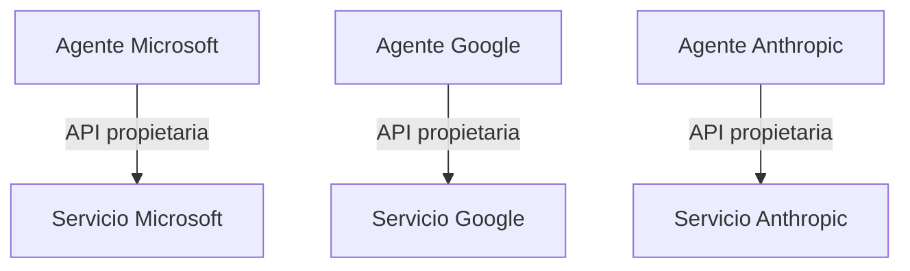
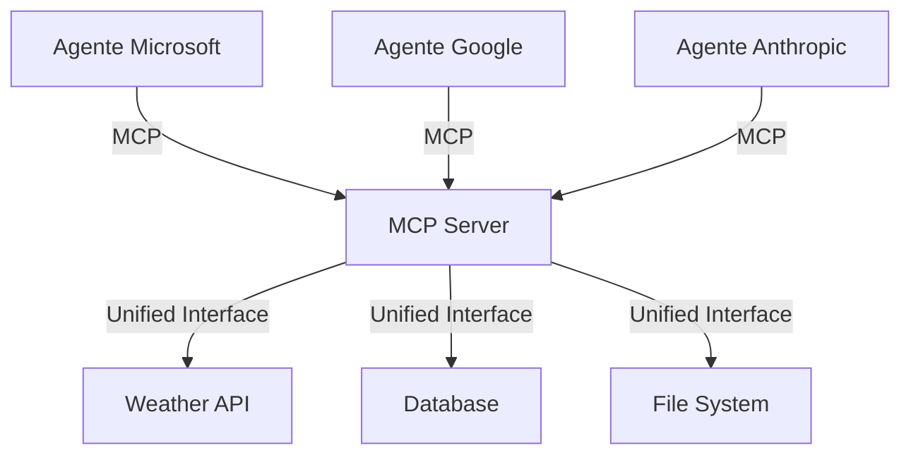

# Módulo 7: Model Context Protocol (MCP)

**Duración**: 15 minutos  
**Nivel**: Conceptual (Teoría + Demo)  
**Prerequisitos**: Módulo 1

## Objetivos de Aprendizaje

Al completar este módulo, serás capaz de:

1. Explicar qué es el Model Context Protocol (MCP)
2. Identificar casos de uso para interoperabilidad multi-vendor
3. Comprender cómo MAF puede actuar como cliente MCP
4. Evaluar cuándo usar MCP vs. integración directa

## Contenido Teórico

### ¿Qué es Model Context Protocol?

**Model Context Protocol (MCP)** es un estándar abierto para conectar aplicaciones de IA con fuentes de datos y herramientas externas de forma **interoperable**.

#### Problema que Resuelve

**Antes de MCP**:


**Cada vendor tiene su propio protocolo** → Integración costosa y duplicada

---

**Con MCP**:


**Un protocolo estándar** → Escribe una vez, úsalo en múltiples frameworks

---

### Conceptos Clave

#### 1. MCP Server

Expone **resources** (datos) y **tools** (funciones) a través del protocolo MCP.

**Ejemplo**: MCP Server de clima

```json
{
  "resources": [
    {
      "uri": "weather://madrid",
      "mimeType": "application/json",
      "description": "Weather data for Madrid"
    }
  ],
  "tools": [
    {
      "name": "get_forecast",
      "description": "Get 7-day weather forecast",
      "parameters": {
        "city": { "type": "string" },
        "days": { "type": "integer", "default": 7 }
      }
    }
  ]
}
```

#### 2. MCP Client

Aplicación que **consume** resources y tools de MCP Servers.

**Ejemplo**: Microsoft Agent Framework actuando como cliente MCP

```csharp
using Microsoft.Agents.AI.MCP;

// Conectar a MCP Server
var mcpClient = new MCPClient("http://localhost:3000/mcp");

// Descubrir tools disponibles
var tools = await mcpClient.DiscoverToolsAsync();

// Registrar tools en el agente
foreach (var tool in tools)
{
    kernel.Plugins.Add(tool.ToKernelFunction());
}

// El agente ahora puede usar tools del MCP Server
var agent = new ChatCompletionAgent()
{
    Kernel = kernel,
    Instructions = "Puedes usar herramientas de clima MCP"
};
```

---

### Beneficios de MCP

#### 1. Interoperabilidad

**Escenario**: Tienes un MCP Server de CRM que desarrollaste para Claude (Anthropic)

**Antes de MCP**:
- Reescribir integración para Copilot Studio (Microsoft)
- Reescribir integración para Gemini (Google)
- Reescribir integración para [Nuevo Framework X]

**Con MCP**:
- ✅ Funciona automáticamente en todos los frameworks que soporten MCP
- 🚀 Reducción de 70-90% en esfuerzo de integración

#### 2. Separación de Preocupaciones

- **MCP Server**: Lógica de negocio y acceso a datos
- **Agent Application**: Razonamiento y orquestación

**Ventaja**: Actualizar lógica de negocio sin modificar agentes

#### 3. Reutilización

```
MCP Server de "Gestión de Inventario"
    ├─ Usado por: Copilot de Ventas (Microsoft)
    ├─ Usado por: Asistente de Logística (Google Gemini)
    └─ Usado por: Chatbot de Soporte (Anthropic Claude)
```

---

### Comparación: MCP vs. Integración Directa

| Aspecto | MCP | Integración Directa (Function Tools) |
|---------|-----|--------------------------------------|
| **Interoperabilidad** | ✅ Multi-vendor | ❌ Vendor-specific |
| **Setup Inicial** | ⚠️ Requiere MCP Server | ✅ Más simple |
| **Latencia** | ⚠️ Red adicional (cliente ↔ server) | ✅ Local |
| **Reutilización** | ✅ Alta | ⚠️ Baja (código duplicado) |
| **Evolución** | ✅ Versionado en server | ⚠️ Requiere actualizar agentes |

**Recomendación**:
- **Usar MCP**: Ecosistemas multi-vendor, herramientas compartidas, servicios externos
- **Integración directa**: Single-vendor, baja latencia crítica, prototipos rápidos

---

### Casos de Uso Reales

#### 1. Empresa Multi-Cloud

**Escenario**: Banco con agentes en Microsoft Copilot, Google Gemini y AWS Bedrock

**Solución con MCP**:
- MCP Server para "Consulta de Saldos Bancarios"
- Todos los agentes lo consumen sin modificación

---

#### 2. Marketplace de Tools

**Escenario**: Plataforma SaaS quiere ofrecer 100+ integraciones (Salesforce, HubSpot, SAP, etc.)

**Solución con MCP**:
- Cada integración es un MCP Server
- Los clientes conectan sus agentes a los MCP Servers que necesitan
- No requiere SDK propietario

---

#### 3. Desarrollo Ágil

**Escenario**: Equipo de backend actualiza lógica de "Cálculo de Descuentos" cada semana

**Solución con MCP**:
- Backend expone lógica como MCP Server
- Agentes de frontend consumen sin necesidad de redespliegue
- Cambios en backend son inmediatamente visibles

---

### MAF como Cliente MCP

Microsoft Agent Framework incluye soporte nativo para MCP:

```csharp
using Microsoft.Agents.AI.MCP;

// Opción 1: Conectar a MCP Server HTTP
var mcpClient = new MCPClient(new Uri("https://api.example.com/mcp"));

// Opción 2: Conectar a MCP Server local (stdio)
var mcpClient = MCPClient.CreateStdioClient("python", "mcp_server.py");

// Descubrir y registrar herramientas
await mcpClient.ConnectAsync();
var tools = await mcpClient.ListToolsAsync();

foreach (var tool in tools)
{
    kernel.Plugins.Add(tool.AsKernelFunction());
}

// Ahora el agente puede usar las herramientas MCP
var agent = new ChatCompletionAgent()
{
    Kernel = kernel,
    Instructions = "Puedes usar herramientas MCP para acceder a datos externos"
};
```

---

## Labs Prácticos

### [Lab 01: MCP Integration Demo](labs/01-mcp-integration/)
**Duración**: 20 minutos (demostrativo)

**Objetivo**: Ver un ejemplo de MAF consumiendo un MCP Server público

**Pasos**:
1. Conectar a MCP Server de ejemplo (weather)
2. Descubrir tools disponibles
3. Crear agente MAF que usa tools MCP
4. Probar conversación donde el agente invoca tools MCP
5. Comparar con integración directa (function tools nativas)

**Nota**: Este lab es **demostrativo**. No se espera implementación completa por participantes.

---

## Checkpoint de Validación

**Criterios de éxito** (comprensión conceptual):
- ✅ Explica qué es MCP en 1-2 frases
- ✅ Identifica 2 ventajas de MCP sobre integración directa
- ✅ Describe un caso de uso donde MCP es preferible

**Meta**: 80% de participantes comprenden el valor de MCP

---

## Preguntas Frecuentes

### ¿MCP reemplaza a Function Tools?

**No.** Son complementarios:
- **Function Tools**: Para lógica interna de la aplicación
- **MCP**: Para integraciones externas e interoperabilidad

### ¿Necesito usar MCP en todos mis agentes?

**No.** Solo cuando:
- Necesitas interoperabilidad multi-vendor
- Quieres reutilizar integraciones existentes
- Tienes un marketplace de herramientas

### ¿MCP es un estándar oficial?

**Sí.** MCP es un protocolo abierto iniciado por Anthropic y adoptado por:
- Microsoft (MAF)
- Google (Gemini)
- OpenAI
- Otros frameworks de código abierto

---

## Recursos Adicionales

### Especificación de MCP
- [MCP Specification](https://modelcontextprotocol.io/docs)
- [GitHub: Model Context Protocol](https://github.com/modelcontextprotocol)

### Ejemplos
- [MCP Servers Gallery](https://github.com/modelcontextprotocol/servers)
- [Microsoft Agent Framework MCP Integration](https://learn.microsoft.com/microsoft-agent-framework/mcp)

### Herramientas
- [MCP Inspector](https://github.com/modelcontextprotocol/inspector) - Debug MCP Servers

---

## Conclusión del Workshop

🎉 **¡Felicidades por completar el workshop de Microsoft Agent Framework!**

### Lo que Aprendiste

1. ✅ **Fundamentos**: Crear agentes conversacionales con Azure OpenAI
2. ✅ **Function Tools**: Extender agentes con capacidades personalizadas
3. ✅ **Workflows**: Orquestar múltiples agentes (secuencial, paralelo, group chat)
4. ✅ **Observabilidad**: Monitorear agentes con OpenTelemetry y Azure Monitor
5. ✅ **Producción**: Desplegar agentes en ASP.NET con Aspire
6. ✅ **Debugging**: Usar DevUI para desarrollo eficiente
7. ✅ **Interoperabilidad**: Comprender MCP para ecosistemas multi-vendor

---

### Siguientes Pasos Sugeridos

#### 1. Proyecto Personal (1-2 semanas)

Implementa un agente para tu dominio:
- **E-commerce**: Agente de soporte con acceso a inventario y pedidos
- **Salud**: Asistente de programación de citas con validación de disponibilidad
- **Finanzas**: Analista de gastos con generación de reportes
- **Educación**: Tutor personalizado con seguimiento de progreso

#### 2. Certificación (opcional)

- **Microsoft Applied Skills**: [Build a copilot with Azure AI](https://learn.microsoft.com/credentials/)
- **Microsoft Learn Path**: Develop AI agents using Microsoft Agent Framework

#### 3. Comunidad

- **GitHub Discussions**: [microsoft/agent-framework](https://github.com/microsoft/agent-framework/discussions)
- **Stack Overflow**: Tag `microsoft-agent-framework`
- **Discord**: Microsoft AI Community

---

### Feedback del Workshop

Por favor completa la encuesta: [Encuesta Post-Workshop](../instructor-guide/post-workshop-survey.md)

Tu feedback ayuda a mejorar el workshop para futuros participantes.

---

## 🚀 ¡Ahora es tu turno de construir agentes increíbles!

**Preguntas**: Contacta al instructor o revisa la [guía de troubleshooting](../troubleshooting.md)

**Recursos**: Todos los materiales están disponibles en este repositorio

---

**¡Gracias por participar!** 🙏
