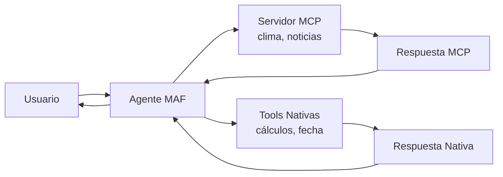

# Lab 01: Integración MCP con Microsoft Agent Framework

**Duración**: 20 minutos  
**Complejidad**: standard (demostrativo)  
**Objetivo**: Comprender cómo MAF consume herramientas MCP y las combina con function tools nativas

## Prerequisitos

### Software Requerido
- .NET 10 SDK
- Visual Studio Code
- Terminal/PowerShell

### Conocimientos Previos
- Módulo 1: Fundamentos de MAF
- Módulo 2: Function Tools (conceptos básicos)
- Lectura de la teoría de MCP (README.md del módulo)

### Configuración de Azure
- Azure OpenAI Service con deployment de gpt-5.2
- Endpoint y API Key configurados

## Visión General

Este laboratorio demuestra la **integración de Model Context Protocol (MCP)** con Microsoft Agent Framework. Verás cómo un agente MAF puede:

1. **Consumir herramientas MCP** de un servidor externo
2. **Combinar herramientas MCP con function tools nativas**
3. **Decidir automáticamente** qué herramienta usar según el contexto



> **Nota**: Este lab es **demostrativo**. El servidor MCP es una simulación local para fines educativos. En producción, conectarías a servidores MCP reales.

---

## Paso 1: Preparación del Proyecto

### 1.1 Navegar al Directorio del Lab

```bash
cd docs/modulo-07-mcp/labs/01-mcp-integration
```

### 1.2 Restaurar Paquetes

```bash
dotnet restore
```

**Salida Esperada**:
```
  Determining projects to restore...
  Restored .../MCPIntegration.csproj (in 1.5 sec).
```

---

## Paso 2: Configuración

### 2.1 Revisar appsettings.json

El archivo `appsettings.json` ya incluye la configuración necesaria:

```json
{
  "AzureOpenAI": {
    "Endpoint": "https://YOUR-RESOURCE-NAME.openai.azure.com/",
    "DeploymentName": "gpt-5.2",
    "MaxTokens": 2000,
    "Temperature": 0.7
  },
  "MCP": {
    "WeatherServerUrl": "http://localhost:3001/mcp",
    "UseLocalServer": true
  }
}
```

### 2.2 Configurar Secretos de Azure OpenAI

```bash
# Inicializar user secrets (si no existe)
dotnet user-secrets init

# Configurar endpoint y API key
dotnet user-secrets set "AzureOpenAI:Endpoint" "https://TU-RECURSO.openai.azure.com/"
dotnet user-secrets set "AzureOpenAI:ApiKey" "tu-api-key-aqui"
```

> **Importante**: Nunca incluyas API keys en archivos de código o configuración que suban a control de versiones.

---

## Paso 3: Explorar la Arquitectura

### 3.1 Estructura del Proyecto

```
01-mcp-integration/
├── MCPIntegration.csproj    # Proyecto con dependencias MCP
├── Program.cs               # Punto de entrada y orquestación
├── MCPWeatherServer.cs      # Servidor MCP simulado
├── NativeFunctions.cs       # Herramientas nativas (function tools)
├── appsettings.json         # Configuración
└── README.md                # Este archivo
```

### 3.2 Componentes Clave

**MCPWeatherServer.cs** - Simula un servidor MCP que expone:
- `get_weather`: Clima actual de ciudades
- `get_forecast`: Pronóstico del tiempo
- `get_headlines`: Titulares de noticias

**NativeFunctions.cs** - Herramientas locales del agente:
- `convert_temperature`: Conversión Celsius ↔ Fahrenheit
- `get_datetime`: Fecha y hora actual
- `calculate`: Operaciones matemáticas básicas
- `get_capabilities`: Lista de capacidades

**Program.cs** - Orquesta todo:
1. Inicia el servidor MCP local
2. Configura el kernel con Azure OpenAI
3. Registra herramientas MCP y nativas
4. Ejecuta el bucle de conversación

---

## Paso 4: Ejecución

### 4.1 Ejecutar el Proyecto

```bash
dotnet run
```

### 4.2 Salida Inicial Esperada

```
╔════════════════════════════════════════════════════════════╗
║   🔌 Lab: Integración MCP con Microsoft Agent Framework    ║
║   Módulo 7 - Model Context Protocol                        ║
╚════════════════════════════════════════════════════════════╝

📋 Configuración:
   Endpoint: https://tu-recurso.openai.azure.com/
   Deployment: gpt-5.2

🔌 Iniciando servidor MCP local de demostración...
   ✅ Servidor MCP listo con 3 herramientas:
      • get_weather: Obtiene el clima actual para una ciudad específica
      • get_forecast: Obtiene el pronóstico del clima para los próximos días
      • get_headlines: Obtiene los titulares de noticias recientes

   📦 8 recursos disponibles:
      • weather://madrid: Clima en Madrid
      • weather://barcelona: Clima en Barcelona
      • weather://sevilla: Clima en Sevilla
      • ... y 5 más

🔧 Configurando Semantic Kernel con Azure OpenAI...
   ✅ Kernel configurado con Azure OpenAI

🔧 Registrando herramientas nativas (function tools locales)...
   ✅ Herramientas nativas registradas: convert_temperature, get_datetime, calculate, get_capabilities

🔌 Registrando herramientas MCP en el kernel...
   ✅ Herramientas MCP registradas: get_weather, get_forecast, get_headlines

🤖 Creando agente con herramientas híbridas (MCP + nativas)...
   ✅ Agente listo con herramientas híbridas
```

---

## Paso 5: Prueba de Conversación

### 5.1 Probar Herramientas MCP

Escribe las siguientes preguntas para ver cómo el agente usa herramientas MCP:

```
👤 Usuario: ¿Qué clima hace en Madrid?
```

**Respuesta Esperada** (el agente usa `get_weather` MCP):
```
   📡 [MCP] Llamando get_weather(city="madrid")

🤖 Agente: El clima actual en Madrid es soleado con una temperatura de 22°C 
y una humedad del 45%. Esta información la obtuve usando la herramienta MCP 
de clima.
```

```
👤 Usuario: Dame el pronóstico de Barcelona para 5 días
```

**Respuesta Esperada** (el agente usa `get_forecast` MCP):
```
   📡 [MCP] Llamando get_forecast(city="barcelona", days=5)

🤖 Agente: Aquí está el pronóstico para Barcelona...
```

### 5.2 Probar Herramientas Nativas

```
👤 Usuario: Convierte 25 grados Celsius a Fahrenheit
```

**Respuesta Esperada** (el agente usa herramienta nativa):
```
🤖 Agente: 25°C equivale a 77°F. Esta conversión la realicé con mi 
herramienta nativa de conversión de temperatura.
```

```
👤 Usuario: ¿Qué hora es?
```

**Respuesta Esperada**:
```
🤖 Agente: La fecha y hora actual es...
```

### 5.3 Probar Combinación de Herramientas

```
👤 Usuario: ¿Qué clima hace en Bilbao y cuánto es eso en Fahrenheit?
```

**Respuesta Esperada** (el agente combina MCP + nativa):
```
   📡 [MCP] Llamando get_weather(city="bilbao")

🤖 Agente: En Bilbao está lluvioso con 15°C (59°F) y 80% de humedad. 
Usé la herramienta MCP para obtener el clima y la herramienta nativa 
para la conversión de temperatura.
```

### 5.4 Listar Capacidades

```
👤 Usuario: ¿Qué capacidades tienes?
```

**Respuesta Esperada**:
```
🤖 Agente: Tengo las siguientes capacidades...
   
   📡 HERRAMIENTAS MCP (desde servidor externo):
      • get_weather - Clima actual de ciudades
      • get_forecast - Pronóstico del tiempo
      • get_headlines - Titulares de noticias

   🔧 HERRAMIENTAS NATIVAS (locales):
      • convert_temperature - Conversión C↔F
      • get_datetime - Fecha y hora actual
      • calculate - Operaciones matemáticas
```

### 5.5 Terminar la Demostración

```
👤 Usuario: salir
```

---

## Paso 6: Validación

✅ **Checkpoint**: Verifica que has comprendido la integración MCP

Marca los siguientes puntos:

- [ ] El programa se ejecuta sin errores
- [ ] El servidor MCP local se inicializa correctamente
- [ ] Las preguntas de clima usan herramientas MCP (ves `[MCP]` en la salida)
- [ ] Las conversiones de temperatura usan herramientas nativas
- [ ] El agente puede combinar ambos tipos de herramientas
- [ ] Comprendes la diferencia entre herramientas MCP y nativas

### Preguntas de Comprensión

Responde mentalmente estas preguntas:

1. **¿Cuál es la ventaja de usar MCP sobre function tools nativas?**
   - Respuesta: Interoperabilidad - las herramientas MCP funcionan en múltiples frameworks

2. **¿Por qué usaríamos herramientas nativas además de MCP?**
   - Respuesta: Menor latencia, operaciones locales simples, sin dependencia de red

3. **¿Cómo decide el agente qué herramienta usar?**
   - Respuesta: El modelo LLM analiza la pregunta y selecciona la herramienta más apropiada

---

## Experimentación (Opcional)

Para participantes que terminan temprano:

### Tarea 1: Agregar una Nueva Ciudad

Modifica `MCPWeatherServer.cs` para agregar una nueva ciudad al diccionario `CityWeather`:

```csharp
["tokyo"] = new("Tokio", "Despejado", 18, 60),
```

Ejecuta de nuevo y pregunta por el clima en Tokio.

### Tarea 2: Probar Noticias por Categoría

```
👤 Usuario: ¿Cuáles son las noticias de tecnología?
👤 Usuario: Dame 2 titulares de economía
```

### Tarea 3: Combinar Múltiples Herramientas

```
👤 Usuario: ¿Qué clima hace en París, qué hora es allá, y hay noticias internacionales?
```

Observa cómo el agente orquesta múltiples herramientas.

---

## Solución de Problemas

### Error: "Falta configuración: AzureOpenAI:Endpoint"

**Síntoma**: El programa falla al iniciar con error de configuración.

**Causa**: No se ha configurado el endpoint de Azure OpenAI.

**Solución**:
1. Verifica que `appsettings.json` tiene el endpoint correcto
2. Configura user secrets:
   ```bash
   dotnet user-secrets set "AzureOpenAI:Endpoint" "https://TU-RECURSO.openai.azure.com/"
   ```

### Error: "401 Unauthorized"

**Síntoma**: Error de autenticación al llamar al modelo.

**Causa**: API key incorrecta o faltante.

**Solución**:
1. Verifica que la API key es correcta en Azure Portal
2. Configura el secreto:
   ```bash
   dotnet user-secrets set "AzureOpenAI:ApiKey" "tu-api-key-correcta"
   ```

### Error: "Ciudad no encontrada"

**Síntoma**: El agente responde que la ciudad no existe.

**Causa**: El servidor MCP simulado solo tiene ciudades predefinidas.

**Solución**: Usa una de las ciudades disponibles:
- Madrid, Barcelona, Sevilla, Bilbao, Valencia, París, Londres, Nueva York

### Error: "El agente no usa herramientas MCP"

**Síntoma**: El agente responde sin llamar a herramientas.

**Causa**: La pregunta puede no ser lo suficientemente específica.

**Solución**: Reformula la pregunta de forma más directa:
- ❌ "¿Hace frío?" 
- ✅ "¿Qué clima hace en Madrid?"

---

## Resumen

En este laboratorio aprendiste:

1. ✅ **Estructura de un servidor MCP**: Expone herramientas (tools) y recursos (resources)
2. ✅ **Integración MAF + MCP**: Registrar herramientas MCP como plugins del kernel
3. ✅ **Herramientas híbridas**: Combinar MCP externas con function tools nativas
4. ✅ **Selección automática**: El agente decide qué herramienta usar según contexto
5. ✅ **Valor de MCP**: Interoperabilidad entre diferentes frameworks de IA

---

## Próximos Pasos

🎉 **¡Felicidades! Has completado el Módulo 7 y todo el workshop.**

### Revisa lo Aprendido

- **Módulo 1**: Creaste tu primer agente MAF
- **Módulo 2**: Extendiste agentes con function tools
- **Módulo 3**: Orquestaste workflows de múltiples agentes
- **Módulo 4**: Implementaste observabilidad con OpenTelemetry
- **Módulo 5**: Desplegaste agentes en ASP.NET con Aspire
- **Módulo 6**: Depuraste agentes con DevUI
- **Módulo 7**: Integraste MCP para interoperabilidad

### Siguientes Pasos Sugeridos

1. **Explora servidores MCP reales**: [MCP Servers Gallery](https://github.com/modelcontextprotocol/servers)
2. **Crea tu propio servidor MCP**: Expone tus APIs como herramientas MCP
3. **Combina con otros frameworks**: Prueba tu servidor MCP con Claude o Gemini

---

## Referencias

- [MCP Specification](https://modelcontextprotocol.io/docs)
- [GitHub: Model Context Protocol](https://github.com/modelcontextprotocol)
- [Microsoft Agent Framework MCP Integration](https://learn.microsoft.com/microsoft-agent-framework/mcp)
- [MCP Inspector](https://github.com/modelcontextprotocol/inspector) - Debug MCP Servers
