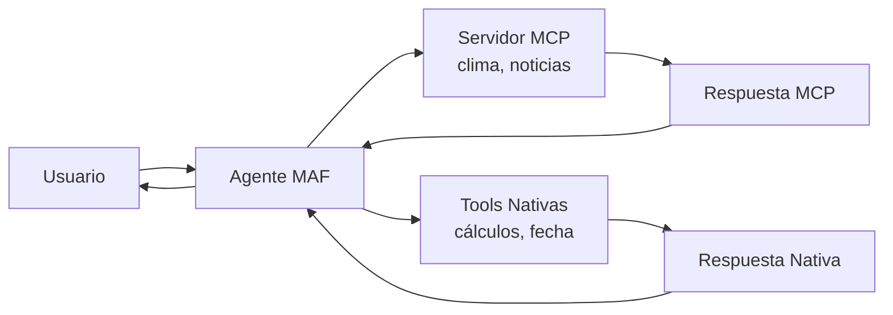

# Lab 01: Integración MCP con Microsoft Agent Framework

**Duración**: 20 minutos  
**Complejidad**: standard (demostrativo)  
**Objetivo**: Comprender cómo MAF consume herramientas MCP y las combina con function tools nativas

## Prerequisitos

### Software Requerido
- .NET 10 SDK
- Visual Studio Code
- Terminal/PowerShell

### Conocimientos Previos
- Módulo 1: Fundamentos de MAF
- Módulo 2: Function Tools (conceptos básicos)
- Lectura de la teoría de MCP (README.md del módulo)

### Configuración de Azure
- Azure OpenAI Service con deployment de gpt-5.2
- Endpoint y API Key configurados

## Visión General

Este laboratorio demuestra la **integración de Model Context Protocol (MCP)** con Microsoft Agent Framework. Verás cómo un agente MAF puede:

1. **Consumir herramientas MCP** de un servidor externo
2. **Combinar herramientas MCP con function tools nativas**
3. **Decidir automáticamente** qué herramienta usar según el contexto



> **Nota**: Este lab es **demostrativo**. El servidor MCP es una simulación local para fines educativos. En producción, conectarías a servidores MCP reales.

---

## Paso 1: Preparación del Proyecto

### 1.1 Navegar al Directorio del Lab

```bash
cd docs/modulo-07-mcp/labs/01-mcp-integration
```

### 1.2 Restaurar Paquetes

```bash
dotnet restore
```

**Salida Esperada**:
```
  Determining projects to restore...
  Restored .../MCPIntegration.csproj (in 1.5 sec).
```

---

## Paso 2: Configuración

### 2.1 Revisar appsettings.json

El archivo `appsettings.json` ya incluye la configuración necesaria:

```json
{
  "AzureOpenAI": {
    "Endpoint": "https://YOUR-RESOURCE-NAME.openai.azure.com/",
    "DeploymentName": "gpt-5.2",
    "MaxTokens": 2000,
    "Temperature": 0.7
  },
  "MCP": {
    "WeatherServerUrl": "http://localhost:3001/mcp",
    "UseLocalServer": true
  }
}
```

### 2.2 Configurar Secretos de Azure OpenAI

```bash
# Inicializar user secrets (si no existe)
dotnet user-secrets init

# Configurar endpoint y API key
dotnet user-secrets set "AzureOpenAI:Endpoint" "https://TU-RECURSO.openai.azure.com/"
dotnet user-secrets set "AzureOpenAI:ApiKey" "tu-api-key-aqui"
```

> **Importante**: Nunca incluyas API keys en archivos de código o configuración que suban a control de versiones.

---

## Paso 3: Explorar la Arquitectura

### 3.1 Estructura del Proyecto

```
01-mcp-integration/
├── MCPIntegration.csproj        # Proyecto cliente MCP
├── Program.cs                   # Cliente que consume servidor MCP
├── WeatherMCPServer/            # Servidor MCP independiente
│   ├── WeatherMCPServer.csproj  # Proyecto del servidor
│   ├── Program.cs               # Servidor MCP con SDK oficial
│   └── README.md                # Documentación del servidor
├── appsettings.json             # Configuración
└── README.md                    # Este archivo
```

### 3.2 Componentes Clave

**WeatherMCPServer/** - Servidor MCP real usando el SDK oficial:
- Implementado con `Microsoft.Extensions.Hosting` y `ModelContextProtocol.Server`
- Usa `StdioServerTransport` para comunicación stdin/stdout
- Expone 3 herramientas MCP:
  - `get_weather`: Clima actual de ciudades
  - `get_forecast`: Pronóstico del tiempo
  - `convert_temperature`: Conversión Celsius ↔ Fahrenheit

**Program.cs** (Cliente) - Orquesta todo:
1. Configura Microsoft Agent Framework con Azure OpenAI
2. Inicia el servidor MCP como subproceso usando `StdioClientTransport`
3. Conecta al servidor y descubre herramientas disponibles
4. Convierte herramientas MCP a AITool usando `AIFunctionFactory`
5. Crea el agente MAF con las herramientas MCP registradas
6. Ejecuta el bucle de conversación usando threads para mantener contexto

---

## Paso 4: Ejecución

### 4.1 Ejecutar el Proyecto

```bash
dotnet run
```

### 4.2 Salida Inicial Esperada

```
╔════════════════════════════════════════════════════════════╗
║   🔌 Lab: Integración MCP con Microsoft Agent Framework    ║
║   Módulo 7 - Model Context Protocol                        ║
╚════════════════════════════════════════════════════════════╝

📋 Configuración:
   Endpoint: https://tu-recurso.openai.azure.com/
   Deployment: gpt-5.2

🔌 Conectando a servidor MCP de Weather Service...
   (Iniciando servidor MCP automáticamente)

   ✅ Conectado al servidor MCP de Weather
   📋 3 herramientas disponibles:
      • convert_temperature: Convierte temperatura entre Celsius y Fahrenheit
      • get_forecast: Obtiene el pronóstico del clima para los próximos días
      • get_weather: Obtiene el clima actual para una ciudad específica

🤖 Creando agente MAF con herramientas MCP...
   📌 Registrando herramientas MCP en el kernel...
   ✅ Agente configurado con herramientas MCP
```

---

## Paso 5: Prueba de Conversación

### 5.1 Probar Herramientas MCP

Escribe las siguientes preguntas para ver cómo el agente usa herramientas MCP:

```
👤 Usuario: ¿Qué clima hace en Madrid?
```

**Respuesta Esperada** (el agente usa `get_weather` MCP):
```
🤖 Agente: El clima actual en Madrid es soleado con una temperatura de 22°C 
y una humedad del 45%.
```

```
👤 Usuario: Dame el pronóstico de Barcelona para 5 días
```

**Respuesta Esperada** (el agente usa `get_forecast` MCP):
```
🤖 Agente: Aquí está el pronóstico para Barcelona...
```

### 5.2 Probar Conversión de Temperatura

```
👤 Usuario: Convierte 25 grados Celsius a Fahrenheit
```

**Respuesta Esperada** (el agente usa herramienta MCP convert_temperature):
```
🤖 Agente: 25°C equivale a 77°F.
```

### 5.3 Probar Combinación de Herramientas

```
👤 Usuario: ¿Qué clima hace en Bilbao en Fahrenheit?
```

**Respuesta Esperada** (el agente usa dos llamadas MCP):
```
🤖 Agente: En Bilbao está lluvioso con 15°C (59°F) y 80% de humedad.
```

### 5.4 Listar Capacidades

```
👤 Usuario: ¿Qué puedes hacer?
```

**Respuesta Esperada**:
```
🤖 Agente: Puedo ayudarte con información del clima usando mis herramientas MCP:
   • Obtener clima actual de ciudades
   • Obtener pronóstico del tiempo para múltiples días
   • Convertir temperaturas entre Celsius y Fahrenheit
```

### 5.5 Terminar la Demostración

```
👤 Usuario: salir
```

---

## Paso 6: Validación

✅ **Checkpoint**: Verifica que has comprendido la integración MCP

Marca los siguientes puntos:

- [ ] El programa se ejecuta sin errores
- [ ] El servidor MCP local se inicializa correctamente
- [ ] Las preguntas de clima usan herramientas MCP (ves `[MCP]` en la salida)
- [ ] Las conversiones de temperatura usan herramientas nativas
- [ ] El agente puede combinar ambos tipos de herramientas
- [ ] Comprendes la diferencia entre herramientas MCP y nativas

### Preguntas de Comprensión

Responde mentalmente estas preguntas:

1. **¿Cuál es la ventaja de usar MCP sobre function tools nativas?**
   - Respuesta: Interoperabilidad - las herramientas MCP funcionan en múltiples frameworks

2. **¿Por qué usaríamos herramientas nativas además de MCP?**
   - Respuesta: Menor latencia, operaciones locales simples, sin dependencia de red

3. **¿Cómo decide el agente qué herramienta usar?**
   - Respuesta: El modelo LLM analiza la pregunta y selecciona la herramienta más apropiada

---

## Experimentación (Opcional)

Para participantes que terminan temprano:

### Tarea 1: Agregar una Nueva Ciudad

Modifica `WeatherMCPServer/Program.cs` para agregar una nueva ciudad al diccionario `CityWeather`:

```csharp
["tokyo"] = new("Tokio", "Despejado", 18, 60),
```

Ejecuta de nuevo y pregunta por el clima en Tokio.

### Tarea 2: Probar Pronósticos Extendidos

```
👤 Usuario: Dame el pronóstico de París para 7 días
```

### Tarea 3: Combinar Múltiples Herramientas

```
👤 Usuario: ¿Qué clima hace en París en Fahrenheit?
```

Observa cómo el agente orquesta dos llamadas MCP: primero `get_weather` para obtener la temperatura en Celsius, luego `convert_temperature` para convertir a Fahrenheit.

---

## Solución de Problemas

### Error: "Falta configuración: AzureOpenAI:Endpoint"

**Síntoma**: El programa falla al iniciar con error de configuración.

**Causa**: No se ha configurado el endpoint de Azure OpenAI.

**Solución**:
1. Verifica que `appsettings.json` tiene el endpoint correcto
2. Configura user secrets:
   ```bash
   dotnet user-secrets set "AzureOpenAI:Endpoint" "https://TU-RECURSO.openai.azure.com/"
   ```

### Error: "401 Unauthorized"

**Síntoma**: Error de autenticación al llamar al modelo.

**Causa**: API key incorrecta o faltante.

**Solución**:
1. Verifica que la API key es correcta en Azure Portal
2. Configura el secreto:
   ```bash
   dotnet user-secrets set "AzureOpenAI:ApiKey" "tu-api-key-correcta"
   ```

### Error: "Ciudad no encontrada"

**Síntoma**: El agente responde que la ciudad no existe.

**Causa**: El servidor MCP simulado solo tiene ciudades predefinidas.

**Solución**: Usa una de las ciudades disponibles:
- Madrid, Barcelona, Sevilla, Bilbao, Valencia, París, Londres, Nueva York

### Error: "El agente no usa herramientas MCP"

**Síntoma**: El agente responde sin llamar a herramientas MCP.

**Causa**: La pregunta puede no ser lo suficientemente específica para que el modelo LLM determine que debe usar las herramientas disponibles.

**Solución**: Reformula la pregunta de forma más directa y específica:
- ❌ "¿Hace frío?" 
- ✅ "¿Qué clima hace en Madrid?"

---

## Resumen

En este laboratorio aprendiste:

1. ✅ **Servidor MCP real**: Creaste un servidor usando el SDK oficial de ModelContextProtocol
2. ✅ **Integración MAF + MCP**: Convertiste herramientas MCP a AITool usando AIFunctionFactory
3. ✅ **Herramientas MCP**: El servidor expone tres herramientas (get_weather, get_forecast, convert_temperature)
4. ✅ **Selección automática**: El agente MAF decide qué herramienta usar según contexto mediante function calling
5. ✅ **Valor de MCP**: Comprendiste cómo MCP permite interoperabilidad entre diferentes frameworks de IA sin usar Semantic Kernel

---

## Próximos Pasos

🎉 **¡Felicidades! Has completado el Módulo 7 y todo el workshop.**

### Revisa lo Aprendido

- **Módulo 1**: Creaste tu primer agente MAF
- **Módulo 2**: Extendiste agentes con function tools
- **Módulo 3**: Orquestaste workflows de múltiples agentes
- **Módulo 4**: Implementaste observabilidad con OpenTelemetry
- **Módulo 5**: Desplegaste agentes en ASP.NET con Aspire
- **Módulo 6**: Depuraste agentes con DevUI
- **Módulo 7**: Integraste MCP para interoperabilidad

### Siguientes Pasos Sugeridos

1. **Explora servidores MCP reales**: [MCP Servers Gallery](https://github.com/modelcontextprotocol/servers)
2. **Crea tu propio servidor MCP**: Expone tus APIs como herramientas MCP
3. **Combina con otros frameworks**: Prueba tu servidor MCP con Claude o Gemini

---

## Referencias

- [MCP Specification](https://modelcontextprotocol.io/docs)
- [GitHub: Model Context Protocol](https://github.com/modelcontextprotocol)
- [Microsoft Agent Framework MCP Integration](https://learn.microsoft.com/microsoft-agent-framework/mcp)
- [MCP Inspector](https://github.com/modelcontextprotocol/inspector) - Debug MCP Servers
