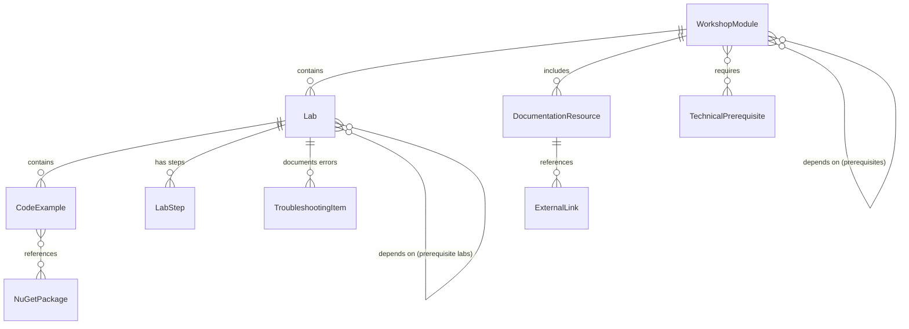

# Data Model: Workshop Microsoft Agent Framework

**Branch**: `001-maf-workshop` | **Date**: 2026-01-12  
**Phase**: 1 - Design & Contracts

## Overview

This document defines the core entities and their relationships for the Microsoft Agent Framework workshop content. These entities represent the structure of workshop materials, not runtime application data.

---

## Core Entities

### 1. WorkshopModule

Represents one of the 7 thematic learning modules that compose the workshop.

**Attributes**:

| Field | Type | Required | Description |
|-------|------|----------|-------------|
| `moduleId` | string | ✅ | Unique identifier (e.g., "modulo-01-fundamentos") |
| `moduleNumber` | integer | ✅ | Sequential order (1-7) |
| `title` | string | ✅ | Spanish title (e.g., "Fundamentos de Microsoft Agent Framework") |
| `description` | string | ✅ | Brief overview of module content (2-3 sentences) |
| `learningObjectives` | string[] | ✅ | List of specific skills/knowledge participants will gain |
| `prerequisites` | string[] | ⚠️ | IDs of modules that must be completed first (empty for Module 1) |
| `estimatedDuration` | integer | ✅ | Total time in minutes (theory + labs + checkpoints) |
| `theoryDuration` | integer | ✅ | Time for conceptual explanation in minutes |
| `labsDuration` | integer | ✅ | Time for hands-on exercises in minutes |
| `checkpointCriteria` | string | ✅ | Clear success criteria for instructor validation |
| `targetSuccessRate` | integer | ✅ | Expected % of participants completing successfully (e.g., 90) |
| `contentPath` | string | ✅ | Relative path to module documentation (e.g., "docs/modulo-01-fundamentos/") |
| `hasTheoryDoc` | boolean | ✅ | Whether module includes README.md with theory |
| `labs` | Lab[] | ✅ | Array of hands-on lab exercises |
| `keyTechnologies` | string[] | ✅ | Main technologies/concepts introduced (e.g., ["ChatCompletionAgent", "Azure OpenAI"]) |

**Validation Rules**:
- `moduleNumber` must be 1-7 (spec defines 7 modules)
- `estimatedDuration = theoryDuration + labsDuration + 5-10 min buffer`
- `targetSuccessRate` must be 70-95% (realistic for instructor-led format)
- Module 1 must have empty `prerequisites`

**Relationships**:
- **Has Many** → Lab (one module contains multiple labs)
- **Depends On** → WorkshopModule (prerequisites are other modules)

**Example**:
```json
{
  "moduleId": "modulo-02-function-tools",
  "moduleNumber": 2,
  "title": "Function Tools y Composición de Agentes",
  "description": "Aprende a extender las capacidades de los agentes mediante function tools personalizadas y composición de agentes.",
  "learningObjectives": [
    "Definir y registrar function tools en C#",
    "Usar un agente como herramienta dentro de otro agente"
  ],
  "prerequisites": ["modulo-01-fundamentos"],
  "estimatedDuration": 55,
  "theoryDuration": 10,
  "labsDuration": 45,
  "checkpointCriteria": "85% de participantes ejecutan correctamente una function tool personalizada",
  "targetSuccessRate": 85,
  "contentPath": "docs/modulo-02-function-tools/",
  "hasTheoryDoc": true,
  "labs": [
    { "labId": "01-custom-tool", ... },
    { "labId": "02-agent-as-tool", ... }
  ],
  "keyTechnologies": ["KernelFunction", "Function Calling", "Agent Composition"]
}
```

---

### 2. Lab

Represents a single hands-on exercise within a module.

**Attributes**:

| Field | Type | Required | Description |
|-------|------|----------|-------------|
| `labId` | string | ✅ | Unique identifier within module (e.g., "01-hello-agent") |
| `labNumber` | integer | ✅ | Sequential order within module |
| `title` | string | ✅ | Descriptive Spanish title (e.g., "Crear tu Primer Agente") |
| `objective` | string | ✅ | Single clear learning goal for this lab |
| `estimatedTime` | integer | ✅ | Time in minutes (10-60) |
| `complexity` | enum | ✅ | One of: "simple", "standard", "complex", "capstone" |
| `labType` | enum | ✅ | One of: "demo", "guided", "challenge" |
| `prerequisiteSoftware` | string[] | ✅ | Required installations (e.g., [".NET 10 SDK", "VS Code"]) |
| `prerequisiteLabs` | string[] | ⚠️ | IDs of labs that must be completed first |
| `hasCompleteSolution` | boolean | ✅ | Always true (spec requires pre-written code) |
| `solutionPath` | string | ✅ | Path to complete C# project (e.g., "docs/modulo-01/labs/01-hello-agent/") |
| `steps` | LabStep[] | ✅ | Ordered array of execution steps |
| `validationCriteria` | string | ✅ | How to verify successful completion |
| `expectedOutput` | string | ✅ | What participants should see (console output, file, etc.) |
| `commonErrors` | TroubleshootingItem[] | ✅ | Frequent mistakes and solutions |
| `experimentalTasks` | string[] | ⚠️ | Optional modifications for early finishers |

**Validation Rules**:
- `complexity` determines `estimatedTime`: simple=10-15, standard=20-25, complex=30-40, capstone=45-60
- `labType="demo"` means instructor shows only (participants observe)
- `labType="guided"` means participants copy-paste and execute
- `labType="challenge"` means optional extension task
- First lab in Module 1 should be `complexity="simple"`

**Relationships**:
- **Belongs To** → WorkshopModule (parent module)
- **Contains** → CodeExample (multiple code files)
- **Has Many** → LabStep (ordered execution steps)

**Example**:
```json
{
  "labId": "01-custom-tool",
  "labNumber": 1,
  "title": "Implementar una Function Tool Personalizada",
  "objective": "Crear un agente que use una función de C# para obtener información del clima",
  "estimatedTime": 20,
  "complexity": "standard",
  "labType": "guided",
  "prerequisiteSoftware": [".NET 10 SDK", "VS Code", "Azure OpenAI deployment"],
  "prerequisiteLabs": ["modulo-01/01-hello-agent"],
  "hasCompleteSolution": true,
  "solutionPath": "docs/modulo-02-function-tools/labs/01-custom-tool/",
  "steps": [
    {
      "stepNumber": 1,
      "title": "Crear proyecto y agregar paquetes",
      "instructions": "...",
      "commands": ["dotnet new console -n WeatherAgent", "..."]
    }
  ],
  "validationCriteria": "El agente llama automáticamente a GetWeather() cuando se pregunta sobre el clima",
  "expectedOutput": "Function call: GetWeather(city=\"Madrid\", country=\"ES\")\nOutput: El clima en Madrid: Soleado, 22°C",
  "commonErrors": [
    {
      "symptom": "El agente no llama la función",
      "cause": "Falta el atributo [KernelFunction] o la descripción es ambigua",
      "solution": "Verificar que el método tenga [KernelFunction] y [Description] claros"
    }
  ],
  "experimentalTasks": [
    "Agregar parámetro 'units' para Celsius/Fahrenheit",
    "Implementar caché para evitar llamadas repetidas"
  ]
}
```

---

### 3. CodeExample

Represents a complete C# code file or project that participants will use.

**Attributes**:

| Field | Type | Required | Description |
|-------|------|----------|-------------|
| `exampleId` | string | ✅ | Unique identifier (e.g., "weather-agent-program") |
| `fileName` | string | ✅ | File name (e.g., "Program.cs", "WeatherService.cs") |
| `relativePath` | string | ✅ | Path within lab folder |
| `language` | string | ✅ | Always "csharp" for this workshop |
| `framework` | string | ✅ | Target framework (e.g., "net10.0") |
| `codeType` | enum | ✅ | One of: "console-app", "library", "aspnet-api", "aspire-apphost" |
| `lineCount` | integer | ✅ | Approximate lines of code |
| `hasComments` | boolean | ✅ | Always true (spec requires Spanish comments) |
| `commentLanguage` | string | ✅ | Always "es" (Spanish) |
| `nugetPackages` | NuGetPackage[] | ✅ | Required dependencies |
| `configurationFiles` | string[] | ⚠️ | Associated configs (e.g., ["appsettings.json", "launchSettings.json"]) |
| `isEntryPoint` | boolean | ✅ | Whether this is the main executable file |
| `concepts` | string[] | ✅ | Key programming concepts demonstrated |

**Validation Rules**:
- `language="csharp"` and `framework="net10.0"` for all examples
- `hasComments=true` and `commentLanguage="es"` mandatory (spec requirement)
- Console apps must have `isEntryPoint=true` for Program.cs
- `lineCount` should be ≤200 for "simple" labs, ≤500 for "standard", no limit for "capstone"

**Relationships**:
- **Belongs To** → Lab (part of a lab exercise)
- **References** → NuGetPackage (dependencies)

**Example**:
```json
{
  "exampleId": "weather-agent-program",
  "fileName": "Program.cs",
  "relativePath": "Program.cs",
  "language": "csharp",
  "framework": "net10.0",
  "codeType": "console-app",
  "lineCount": 85,
  "hasComments": true,
  "commentLanguage": "es",
  "nugetPackages": [
    {
      "name": "Microsoft.Agents.AI",
      "version": "1.0.0-preview.260108.1"
    },
    {
      "name": "Azure.AI.OpenAI",
      "version": "2.0.0"
    }
  ],
  "configurationFiles": ["appsettings.json"],
  "isEntryPoint": true,
  "concepts": [
    "KernelFunction attribute",
    "Function calling",
    "ChatHistory management",
    "Azure OpenAI client configuration"
  ]
}
```

---

### 4. DocumentationResource

Represents theoretical/conceptual documentation (markdown files).

**Attributes**:

| Field | Type | Required | Description |
|-------|------|----------|-------------|
| `docId` | string | ✅ | Unique identifier (e.g., "modulo-01-theory") |
| `fileName` | string | ✅ | File name (e.g., "README.md", "instalacion.md") |
| `relativePath` | string | ✅ | Path within module folder |
| `docType` | enum | ✅ | One of: "theory", "setup", "reference", "troubleshooting", "instructor-guide" |
| `language` | string | ✅ | Always "es" (Spanish) |
| `format` | string | ✅ | Always "markdown" |
| `estimatedReadTime` | integer | ✅ | Minutes to read/present (5-30) |
| `sections` | string[] | ✅ | H2-level section titles |
| `includesDiagrams` | boolean | ✅ | Whether contains architecture/flow diagrams |
| `diagramFormat` | string | ⚠️ | If diagrams: "mermaid", "image", or "ascii" |
| `referencesExternalDocs` | boolean | ✅ | Whether links to Microsoft Learn, etc. |
| `externalLinks` | ExternalLink[] | ⚠️ | Array of external documentation references |

**Validation Rules**:
- `language="es"` and `format="markdown"` for all docs
- Theory docs should have `estimatedReadTime` of 10-20 minutes
- Setup/installation docs should have step-by-step numbered instructions

**Relationships**:
- **Belongs To** → WorkshopModule (part of module content)

**Example**:
```json
{
  "docId": "modulo-02-theory",
  "fileName": "README.md",
  "relativePath": "docs/modulo-02-function-tools/README.md",
  "docType": "theory",
  "language": "es",
  "format": "markdown",
  "estimatedReadTime": 15,
  "sections": [
    "¿Qué son las Function Tools?",
    "Definir Funciones en C#",
    "Registrar Funciones en el Kernel",
    "Composición de Agentes",
    "Human-in-the-Loop Approval"
  ],
  "includesDiagrams": true,
  "diagramFormat": "mermaid",
  "referencesExternalDocs": true,
  "externalLinks": [
    {
      "title": "Microsoft Agent Framework Function Calling",
      "url": "https://learn.microsoft.com/microsoft-agent-framework/agents/function-calling",
      "language": "en"
    }
  ]
}
```

---

### 5. TechnicalPrerequisite

Represents software, configuration, or knowledge required before starting.

**Attributes**:

| Field | Type | Required | Description |
|-------|------|----------|-------------|
| `prereqId` | string | ✅ | Unique identifier (e.g., "dotnet-sdk-10") |
| `name` | string | ✅ | Display name (e.g., ".NET 10 SDK") |
| `type` | enum | ✅ | One of: "software", "azure-resource", "configuration", "knowledge" |
| `isMandatory` | boolean | ✅ | Whether required (true) or optional (false) |
| `requiredFor` | string[] | ✅ | Module IDs that need this prerequisite |
| `description` | string | ✅ | Spanish explanation of what it is and why needed |
| `installationInstructions` | string | ⚠️ | Markdown text with setup steps (for software/configuration) |
| `verificationCommand` | string | ⚠️ | CLI command to verify installation (e.g., "dotnet --version") |
| `expectedOutput` | string | ⚠️ | What verification command should display |
| `downloadUrl` | string | ⚠️ | Official download link (for software) |
| `estimatedSetupTime` | integer | ⚠️ | Minutes to install/configure (for instructor planning) |
| `azureResourceType` | string | ⚠️ | If type="azure-resource": "OpenAI", "AI Agent Service", etc. |
| `estimatedMonthlyCost` | string | ⚠️ | For Azure resources: cost estimate (e.g., "$10-20") |

**Validation Rules**:
- Azure OpenAI must have `isMandatory=true` (spec requirement)
- All software prerequisites must include `verificationCommand`
- Azure resources must include `estimatedMonthlyCost` and `azureResourceType`

**Relationships**:
- **Required By** → WorkshopModule (modules depend on prerequisites)

**Example**:
```json
{
  "prereqId": "azure-openai-service",
  "name": "Azure OpenAI Service",
  "type": "azure-resource",
  "isMandatory": true,
  "requiredFor": ["modulo-01-fundamentos", "modulo-02-function-tools", "modulo-03-workflows", "modulo-04-observability", "modulo-05-aspnet-aspire", "modulo-06-devui"],
  "description": "Servicio de Azure que proporciona acceso a modelos de lenguaje como GPT-5.2. Obligatorio para todos los módulos del workshop.",
  "installationInstructions": "1. Ir a portal.azure.com\n2. Crear recurso 'Azure OpenAI'\n3. Desplegar modelo 'gpt-5.2'\n4. Copiar endpoint y API key",
  "verificationCommand": "curl https://YOUR-RESOURCE.openai.azure.com/openai/deployments?api-version=2024-10-01-preview -H \"api-key: YOUR-KEY\"",
  "expectedOutput": "JSON con lista de deployments incluyendo gpt-5.2",
  "downloadUrl": "https://portal.azure.com",
  "estimatedSetupTime": 15,
  "azureResourceType": "Azure OpenAI Service",
  "estimatedMonthlyCost": "$5-10 por participante (workshop de 7 horas)"
}
```

---

## Supporting Types

### LabStep

Individual step within a lab exercise.

| Field | Type | Required | Description |
|-------|------|----------|-------------|
| `stepNumber` | integer | ✅ | Sequential order (1, 2, 3...) |
| `title` | string | ✅ | Brief Spanish title |
| `instructions` | string | ✅ | Detailed explanation in Spanish |
| `commands` | string[] | ⚠️ | CLI commands to execute (if applicable) |
| `codeSnippet` | string | ⚠️ | Code to copy-paste (if applicable) |
| `expectedResult` | string | ⚠️ | What should happen after this step |

---

### NuGetPackage

.NET package dependency.

| Field | Type | Required | Description |
|-------|------|----------|-------------|
| `name` | string | ✅ | Package name (e.g., "Microsoft.Agents.AI") |
| `version` | string | ✅ | Version string (e.g., "1.35.0") |
| `isPreview` | boolean | ✅ | Whether version is preview/alpha |
| `purpose` | string | ✅ | Why this package is needed (Spanish) |

---

### TroubleshootingItem

Common error and its solution.

| Field | Type | Required | Description |
|-------|------|----------|-------------|
| `symptom` | string | ✅ | What participant sees (error message or behavior) |
| `cause` | string | ✅ | Root cause explanation |
| `solution` | string | ✅ | Step-by-step fix |
| `preventionTip` | string | ⚠️ | How to avoid this error in future |

---

### ExternalLink

Reference to external documentation.

| Field | Type | Required | Description |
|-------|------|----------|-------------|
| `title` | string | ✅ | Link text (e.g., "Documentación oficial de Microsoft Agent Framework") |
| `url` | string | ✅ | Full URL |
| `language` | string | ✅ | "es" or "en" |
| `resourceType` | enum | ✅ | One of: "docs", "video", "blog", "github", "sample" |

---

## Entity Relationships Diagram



---

## Data Validation Summary

### Cross-Entity Constraints

1. **Progressive Prerequisites**: Module N can only depend on modules 1 through N-1
2. **Time Consistency**: Sum of all lab `estimatedTime` in a module must equal module's `labsDuration`
3. **Mandatory Azure**: At least one prerequisite with `type="azure-resource"` and `name="Azure OpenAI Service"` must exist
4. **Spanish Content**: All text fields in `language="es"` contexts must be in Spanish
5. **Complete Solutions**: All labs must have `hasCompleteSolution=true` (spec requirement)
6. **Pre-written Code**: All `CodeExample` must have `hasComments=true` with `commentLanguage="es"`

### Content Completeness Checklist

For each module:
- [x] Theory documentation exists (`docType="theory"`)
- [x] At least one lab with `complexity="simple"` for early success
- [x] Checkpoint criteria defined with realistic `targetSuccessRate`
- [x] All labs have complete solutions and troubleshooting guides
- [x] Timing estimates sum to workshop schedule (7-9 hours total)

---

## Usage Examples

### Querying All Module Timings

```typescript
// Calculate total workshop duration
const totalMinutes = modules
  .map(m => m.estimatedDuration)
  .reduce((sum, dur) => sum + dur, 0);
  
console.log(`Workshop duration: ${totalMinutes / 60} hours`);
```

### Generating Prerequisites Checklist

```typescript
// Extract all unique mandatory prerequisites
const mandatoryPrereqs = prerequisites
  .filter(p => p.isMandatory)
  .map(p => ({
    name: p.name,
    setupTime: p.estimatedSetupTime,
    verification: p.verificationCommand
  }));
```

### Finding Labs for a Specific Technology

```typescript
// Find all labs demonstrating "Function Calling"
const functionCallingLabs = modules
  .flatMap(m => m.labs)
  .flatMap(lab => lab.codeExamples)
  .filter(code => code.concepts.includes("Function calling"));
```

---

## Next Steps

With this data model defined:

1. ✅ **Phase 1a**: Generate contracts/ with JSON schemas or TypeScript interfaces
2. ✅ **Phase 1b**: Generate quickstart.md for instructor setup
3. ⏭️ **Phase 2**: Use `/speckit.tasks` to break down implementation into actionable tasks

---

**Document Version**: 1.0  
**Last Updated**: 2026-01-12
